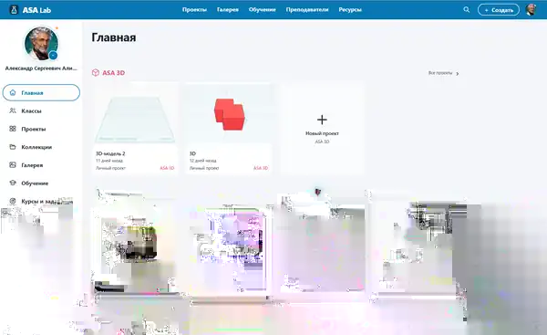
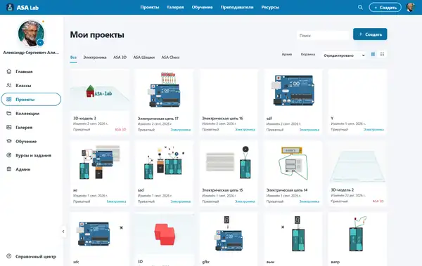
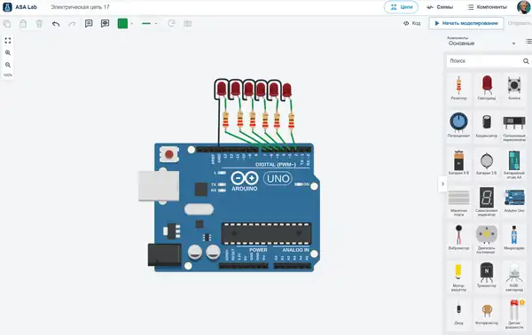
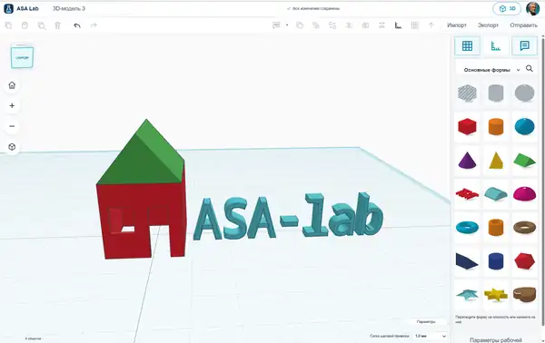
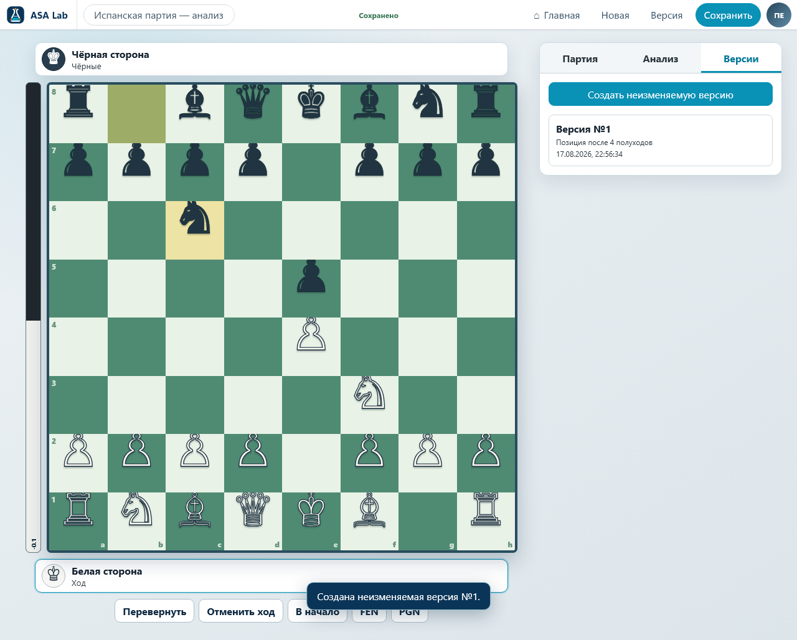
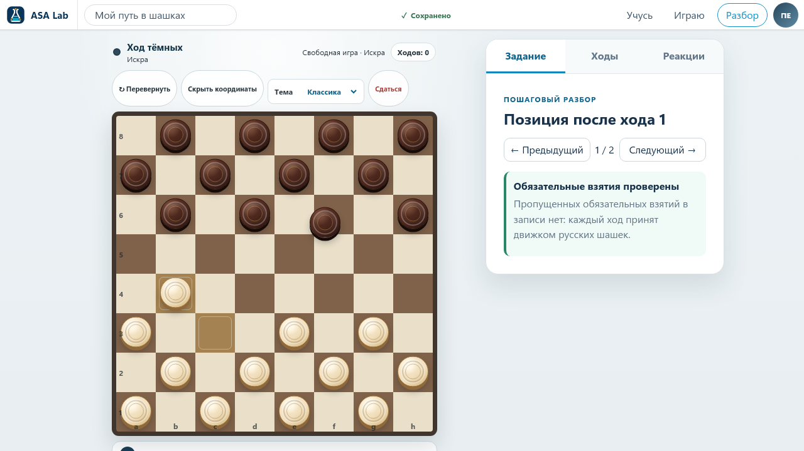
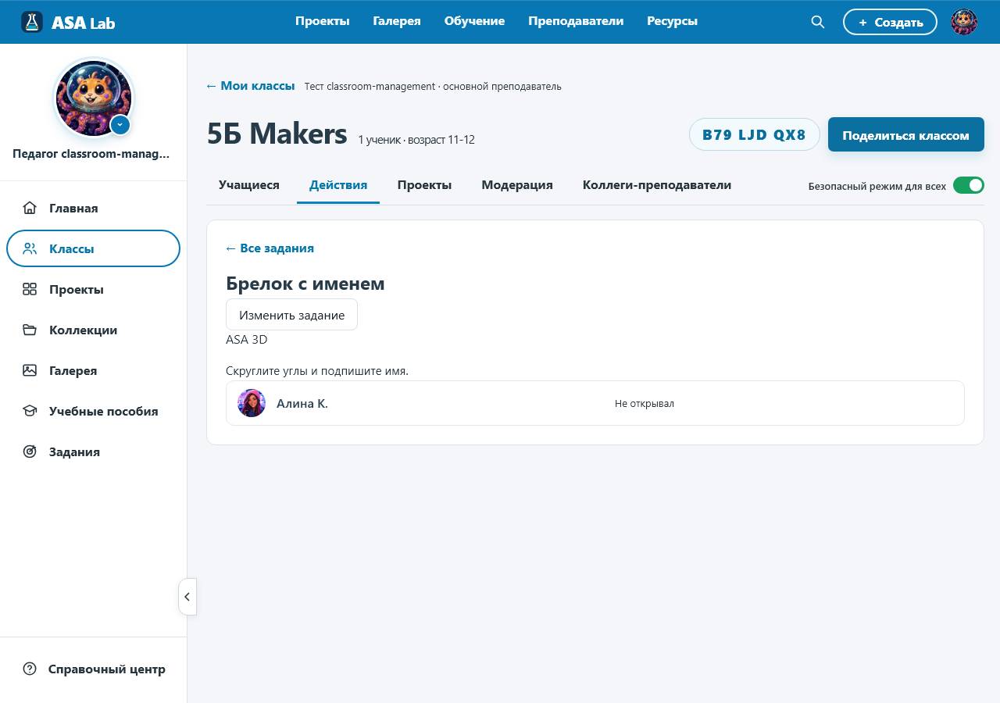
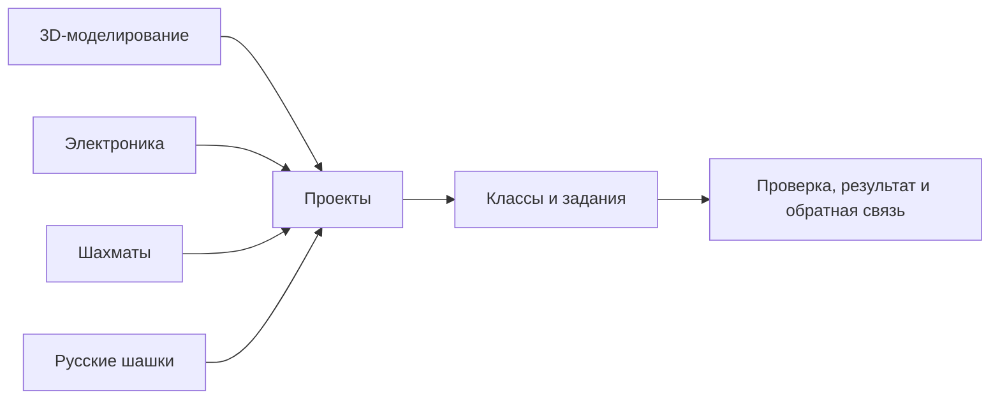

<p align="center">
  
</p>

<h1 align="center">ASA Lab</h1>

<p align="center"><strong>От идеи — к работающему проекту.</strong></p>

<p align="center">
  Цифровая лаборатория для 3D-моделирования, виртуальной электроники,<br />
  шахмат, русских шашек, учебных проектов, классов и заданий.
</p>

<p align="center">
  <a href="https://asa-lab.ru/"><strong>Открыть ASA Lab</strong></a>
  ·
  <a href="https://asa-lab.ru/for-teachers/">Преподавателям</a>
  ·
  <a href="https://asa-lab.ru/for-schools/">Школам</a>
  ·
  <a href="docs/deployment/QUICK_START.md">Локальный запуск</a>
</p>

<p align="center">
  <a href="LICENSE"></a>
  <a href="ASSETS-LICENSE.md"></a>
  <a href="https://asa-lab.ru/"></a>
  
</p>


---

## Что такое ASA Lab

**ASA Lab** — открытая по программному коду цифровая платформа для проектирования,
экспериментов и практического обучения. Пользователь создаёт собственный
результат в предметной среде, сохраняет проект, проверяет гипотезу и улучшает
решение.

Платформа объединяет два уровня:

- **предметные среды** — 3D, электроника, шахматы и русские шашки;
- **образовательный контур** — проекты, классы, задания, результаты и обратная
  связь преподавателя.

Именно эта связь отличает ASA Lab от набора отдельных тренажёров: модель, схема,
позиция или партия остаются частью проекта и могут быть связаны с учебным
заданием.

> **Практика важнее демонстрации:** придумать → сделать → проверить → исправить → объяснить.

---

## Что уже работает

| Направление | Что доступно | Статус |
|---|---|:---:|
| [3D-моделирование](https://asa-lab.ru/features/3d-modeling/) | базовые формы, рабочая плоскость, преобразования, размеры и сохранение проектов | **Доступно** |
| [Виртуальная электроника](https://asa-lab.ru/features/electronics/) | компоненты, соединения, моделирование цепей, измерения и диагностика | **Доступно** |
| [Шахматы](https://asa-lab.ru/features/chess-and-checkers/) | партии, задачи, анализ позиций, история ходов и учебные сценарии | **Доступно** |
| [Русские шашки](https://asa-lab.ru/features/chess-and-checkers/) | учебная игра, позиции, варианты ходов и безопасная работа в классе | **Доступно** |
| [Проекты, классы и задания](https://asa-lab.ru/for-teachers/) | сохранение работ, подключение по коду, выдача заданий, статусы и обратная связь | **Доступно** |
| [Блочное программирование](https://asa-lab.ru/features/block-programming/) | визуальные алгоритмы, условия, циклы и переменные | **В разработке** |
| [Рисование и визуальные проекты](https://asa-lab.ru/features/drawing/) | форма, цвет, композиция, эскизы и чертежи | **В разработке** |

Актуальное состояние выполнения хранится в
[`docs/execution/current.yaml`](docs/execution/current.yaml); продуктовая
программа — в
[`docs/delivery/EXECUTION_MANIFEST.yaml`](docs/delivery/EXECUTION_MANIFEST.yaml).

---

## Реальные интерфейсы

Ниже показаны актуальные экраны ASA Lab: общее рабочее пространство, личные проекты и предметные редакторы.

### Рабочее пространство и проекты

<table>
  <tr>
    <td width="50%" valign="top">
      
      <br />
      <strong>Главная</strong><br />
      Единая стартовая страница с последними 3D-, электронными и игровыми проектами.
    </td>
    <td width="50%" valign="top">
      
      <br />
      <strong>Мои проекты</strong><br />
      Поиск, фильтры и общая галерея личных проектов из разных предметных сред.
    </td>
  </tr>
</table>

### Предметные редакторы

<table>
  <tr>
    <td width="50%" valign="top">
      
      <br />
      <strong>Виртуальная электроника</strong><br />
      Arduino, компоненты, соединения, моделирование и диагностика внутри проекта.
    </td>
    <td width="50%" valign="top">
      
      <br />
      <strong>3D-моделирование</strong><br />
      Рабочая плоскость, библиотека форм, прямое редактирование и экспорт моделей.
    </td>
  </tr>
  <tr>
    <td width="50%" valign="top">
      
      <br />
      <strong>Шахматы</strong><br />
      Партии, задачи, варианты и разбор решения в отдельном учебном модуле.
    </td>
    <td width="50%" valign="top">
      
      <br />
      <strong>Русские шашки</strong><br />
      Позиционная игра, история ходов и сценарии работы ученика и преподавателя.
    </td>
  </tr>
</table>

### Блочное управление и сгенерированный код

В редакторе электроники визуальная программа связана со схемой, а рядом отображается сгенерированный C++-код.


### Классы, задания и прогресс

Преподаватель создаёт класс, выдаёт задание, получает работу ученика и возвращает
обратную связь в том же контексте, где был создан проект.



---

## Как устроен продукт



- **Project Core** хранит пользовательские проекты и их жизненный цикл.
- **Предметные модули** изолируют доменную логику и используют общий контракт
  платформы.
- **Classroom и Learning** связывают проект с классом, заданием и проверкой.
- **Identity и Authorization** разделяют права владельца аккаунта, преподавателя,
  ученика и администратора.
- **PostgreSQL + RLS** обеспечивают изоляцию данных на уровне базы.

---

## Для кого создаётся ASA Lab

- **Для самостоятельной работы** — придумать и сохранить собственный проект.
- **Для учеников** — выполнять задания, возвращаться к работам и улучшать решения.
- **Для преподавателей** — организовывать классы, выдавать задания и видеть
  подтверждённый результат.
- **Для школ, кружков и центров творчества** — использовать несколько
  практических направлений в одном браузерном сервисе.
- **Для разработчиков и исследователей** — изучать открытую архитектуру,
  контракты, тесты и инженерные решения проекта.

---

## Создатель проекта

<table>
  <tr>
    <td width="180" align="center" valign="top">
      
    </td>
    <td valign="top">
      <h3>Александр Аликин</h3>
      <p><strong>Создатель и руководитель ASA Lab</strong></p>
      <p>
        Преподаватель информатики, технологии и робототехники, инженер-практик
        и предприниматель. Работает с радиоэлектроникой, программированием и
        проектно-исследовательским обучением.
      </p>
      <p>
        Опыт разработки образовательных программ, подготовки учеников к
        инженерным соревнованиям и создания собственных образовательных
        проектов лёг в основу ASA Lab — среды, где идея должна пройти путь до
        проверяемого результата.
      </p>
      <p>
        <a href="CREATOR.md"><strong>Подробнее о создателе и истории проекта →</strong></a>
      </p>
    </td>
  </tr>
</table>

---

## Принципы проекта

- **Практика важнее демонстрации.** Каждый модуль должен приводить к
  самостоятельному действию и проверяемому результату.
- **Прогресс подтверждается результатом.** Вывод опирается на проект, попытку,
  позицию, ход, измерение или иной наблюдаемый результат.
- **Безопасность встроена в архитектуру.** Роли, классы, минимизация данных и
  отсутствие открытого детского чата являются продуктовыми требованиями.
- **Предметная логика не смешивается.** Электроника, 3D, шахматы и шашки имеют
  независимые доменные контексты.
- **Ошибки не маскируются.** Неподдерживаемые состояния и конфликты должны
  завершаться честной диагностикой.
- **Качество доказывается тестами.** Контракты, авторизация, данные и браузерные
  пользовательские сценарии входят в проверяемую поставку.

---

## Технологический стек

| Слой | Технологии |
|---|---|
| Web | TypeScript, React, Vite |
| API | NestJS, Fastify |
| Данные | PostgreSQL, Row-Level Security |
| Monorepo | Nx, pnpm workspace |
| Тестирование | Vitest, Playwright, axe-core |
| Инфраструктура | Docker Compose |
| Вычислительные модули | Rust/WASM — там, где это оправдано |

<details>
<summary><strong>Структура репозитория</strong></summary>

```text
apps/        web-клиент и API
contexts/    предметные и платформенные bounded contexts
packages/    общие библиотеки и контракты
migrations/  миграции PostgreSQL
schemas/     схемы данных и публичные контракты
tests/       интеграционные тесты и тесты безопасности
e2e/         браузерные journeys и визуальные артефакты
docs/        архитектура, продуктовые документы и эксплуатация
tools/       запуск, миграции, проверки и governance
```

</details>

---

## Локальный запуск

Для обычного запуска нужны Git и Docker Desktop/Engine с Compose. Локальный
скрипт создаёт необходимые секреты в игнорируемом `.env`, поднимает PostgreSQL,
API и web-приложение и выполняет проверку готовности.

### Windows 11

```powershell
git clone https://github.com/spikeal8-maker/asa-lab.git
cd asa-lab
powershell -ExecutionPolicy Bypass -File .\tools\asa-lab.ps1 up
```

### Linux / WSL2

```bash
git clone https://github.com/spikeal8-maker/asa-lab.git
cd asa-lab
./tools/asa-lab.sh up
```

После запуска:

```text
Web  http://127.0.0.1:4610
API  http://127.0.0.1:4611
```

Подробная инструкция:
[`docs/deployment/QUICK_START.md`](docs/deployment/QUICK_START.md).

---

## Разработка и проверки

```bash
corepack pnpm install --frozen-lockfile
NX_SKIP_NX_CACHE=true corepack pnpm gate:repository
```

Перед изменениями прочитайте:

- [`START_HERE_FOR_AI.md`](START_HERE_FOR_AI.md) — точка входа в проект;
- [`AGENTS.md`](AGENTS.md) — правила работы с репозиторием;
- [`CONTRIBUTING.md`](CONTRIBUTING.md) — процесс внешнего вклада;
- [`docs/execution/current.yaml`](docs/execution/current.yaml) — единственный
  источник текущего execution-state.

Идеи и ошибки обсуждаются через
[GitHub Issues](https://github.com/spikeal8-maker/asa-lab/issues). Уязвимости
нельзя публиковать в обычной Issue — используйте процесс из
[`SECURITY.md`](SECURITY.md).

---

## Лицензирование и правообладатель

**Создатель проекта и правообладатель бренда ASA Lab:**  
**Аликин Александр Сергеевич (Alexander Alikin).**

- Оригинальный программный код распространяется по
  [`AGPL-3.0-only`](LICENSE).
- Название, знак, логотипы и фирменное оформление регулируются
  [`TRADEMARKS.md`](TRADEMARKS.md).
- Графические, учебные, эталонные материалы и screenshots регулируются
  [`ASSETS-LICENSE.md`](ASSETS-LICENSE.md).
- Полная граница между открытым кодом и защищёнными материалами описана в
  [`LICENSING.md`](LICENSING.md).
- Внешние программные вклады принимаются по [`CLA.md`](CLA.md); авторство
  участников сохраняется.

Публичность репозитория не переводит бренд, интерфейсные screenshots и учебные
материалы под AGPL, если для конкретного файла прямо не указано обратное.

---

<p align="center">
  <strong>ASA Lab</strong><br />
  Учиться через действие. Создавать, проверять и объяснять результат.
</p>
