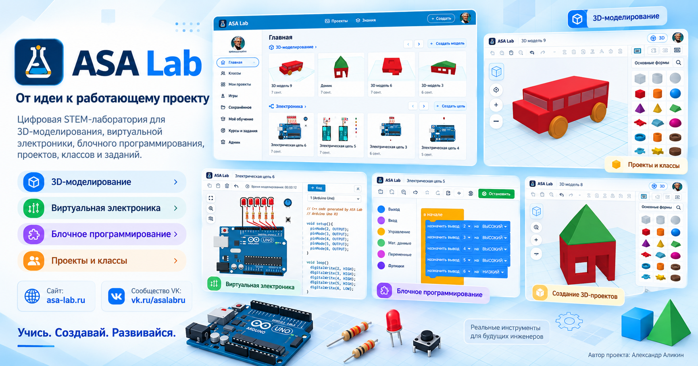
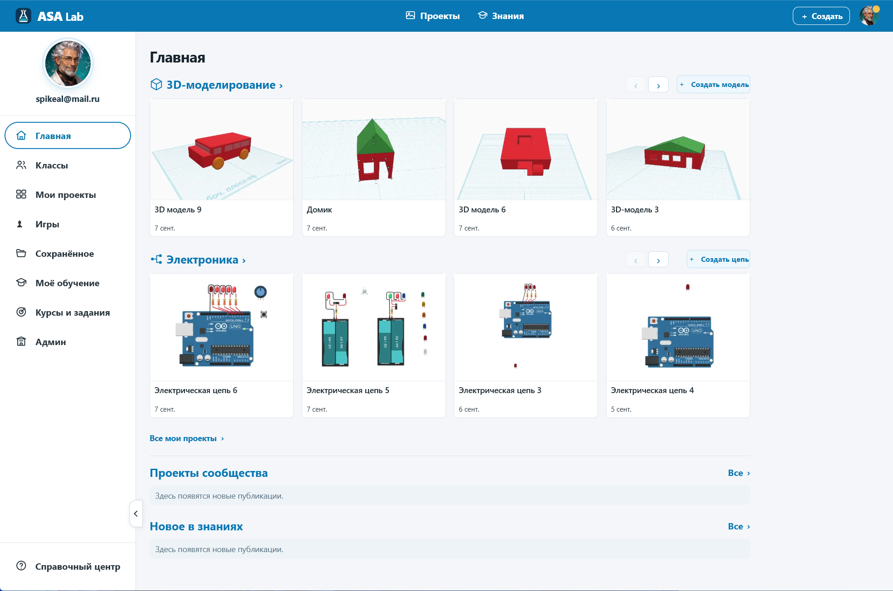
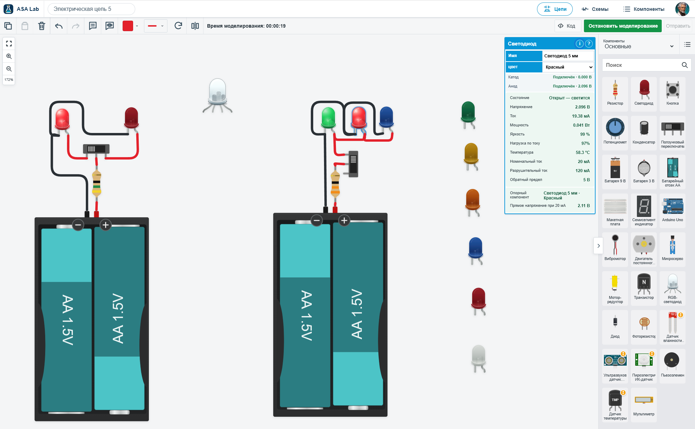
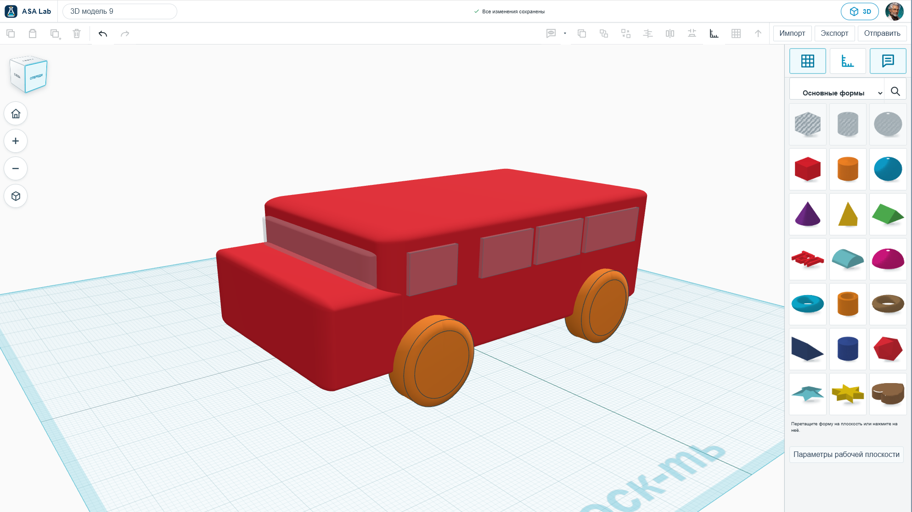
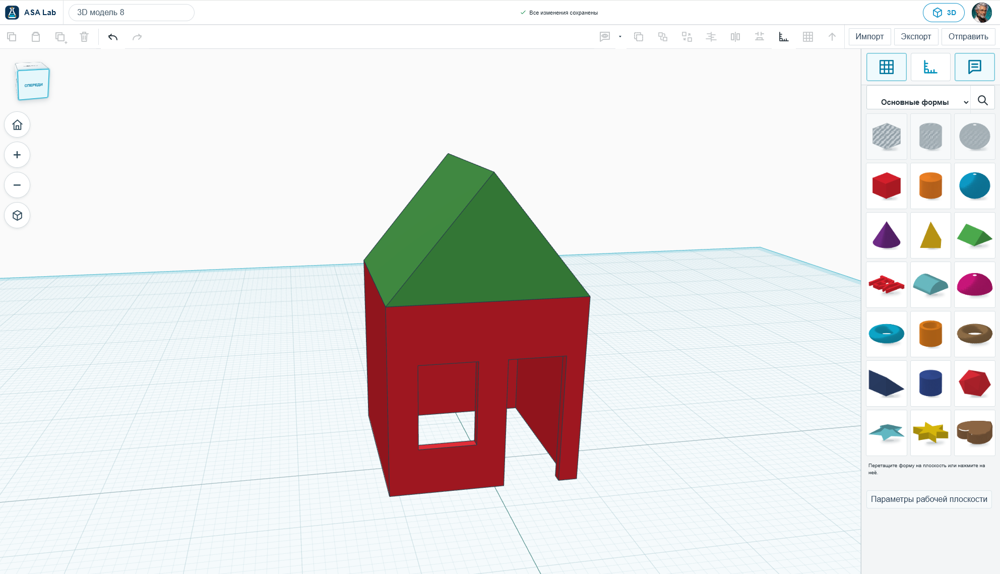
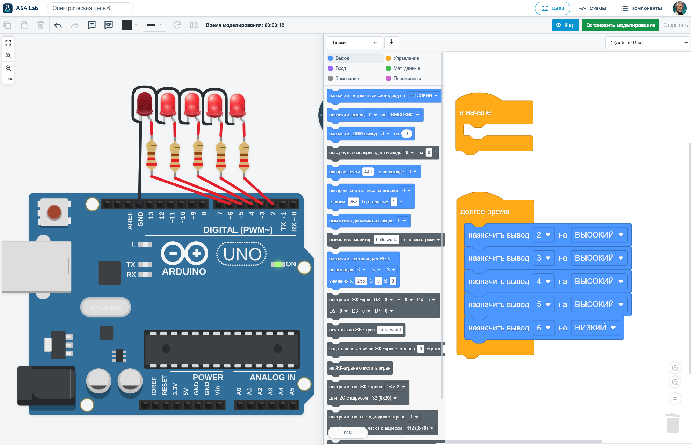
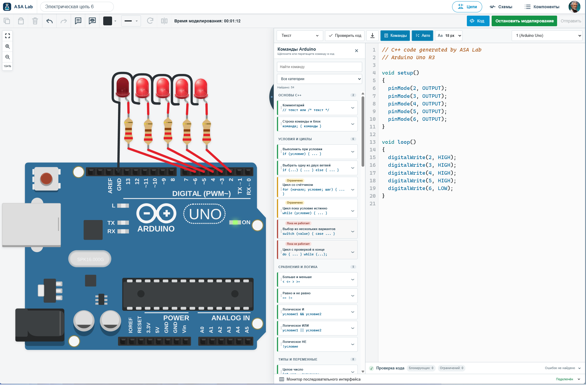
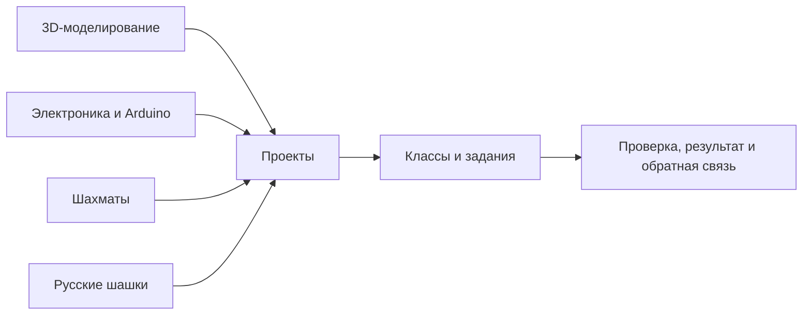

<p align="center">
  
</p>

<h1 align="center">ASA Lab</h1>

<p align="center"><strong>От идеи — к работающему проекту.</strong></p>

<p align="center">
  Цифровая лаборатория для проектирования и практического обучения.<br />
  3D-модели, электронные схемы, Arduino, визуальные блоки и C++ — в браузере.<br />
  Собственные проекты, классы, задания, шахматы и русские шашки — в одной среде.
</p>

<p align="center">
  <a href="https://asa-lab.ru/"><strong>Открыть сайт</strong></a>
  &nbsp;·&nbsp;
  <a href="https://vk.ru/asalabru"><strong>Сообщество ВКонтакте</strong></a>
  &nbsp;·&nbsp;
  <a href="#реальные-интерфейсы">Скриншоты</a>
  &nbsp;·&nbsp;
  <a href="CREATOR.md">Создатель проекта</a>
  &nbsp;·&nbsp;
  <a href="#локальный-запуск">Локальный запуск</a>
</p>

<p align="center">
  <a href="LICENSE"></a>
  <a href="ASSETS-LICENSE.md"></a>
  <a href="https://asa-lab.ru/"></a>
  <a href="https://vk.ru/asalabru"></a>
</p>

<p align="center">
  <a href="https://asa-lab.ru/">
    
  </a>
  <br />
  <sub>Промо-обложка проекта. Оригинальные снимки интерфейса — в разделе ниже.</sub>
</p>

---

## Что такое ASA Lab

**ASA Lab — цифровая лаборатория, в которой идею можно превратить в собственный проект:** собрать трёхмерную модель, соединить электронные компоненты, запрограммировать Arduino и посмотреть, как меняется результат.

Здесь важен не только готовый ответ, но и путь к нему: первая попытка, проверка, найденная ошибка и следующее решение. Можно заниматься самостоятельно, использовать платформу на уроке или вести проектную работу в кружке.

Платформа объединяет **предметные инструменты** и **образовательную организацию работы**. Модели и схемы сохраняются как проекты; классы, задания и обратная связь помогают преподавателю организовать практику. Шахматы и русские шашки добавляют задачи на логику, анализ и выбор стратегии.

> **Придумать → создать → проверить → исправить → объяснить.**

**Работа с инструментами начинается после входа.** На публичной странице можно познакомиться с платформой, зарегистрироваться, войти в аккаунт или подключиться по коду класса.

| Официальный ресурс | Для чего |
|---|---|
| **[asa-lab.ru](https://asa-lab.ru/)** | Опубликованная веб-версия ASA Lab, вход и работа с проектами. |
| **[ВКонтакте · ASA Lab](https://vk.ru/asalabru)** | Сообщество проекта: следить за развитием, обсуждать идеи и знакомиться с материалами. |
| **[GitHub Issues](https://github.com/spikeal8-maker/asa-lab/issues)** | Сообщить о воспроизводимой ошибке или предложить улучшение. |

---

## Возможности

| Направление | Что можно делать |
|---|---|
| **[3D-моделирование](https://asa-lab.ru/features/3d-modeling/)** | Создавать объекты из базовых форм, менять размеры, положение и ориентацию, собирать модели и сохранять проекты. На новых скриншотах — автобус и домик, созданные в редакторе. |
| **[Виртуальная электроника](https://asa-lab.ru/features/electronics/)** | Размещать компоненты, соединять их проводами, запускать моделирование и изучать параметры элементов. На примере светодиодов видны напряжение, ток, мощность и состояние компонента. |
| **Программирование Arduino** | Работать с визуальными блоками и текстовым C++ в редакторе электроники: управлять выводами, пользоваться справочником команд, проверять программу и наблюдать результат на схеме. |
| **Личные проекты** | Возвращаться к своим моделям и схемам из общего рабочего пространства; продолжать работу, а не начинать каждый раз заново. |
| **[Классы и задания](https://asa-lab.ru/for-teachers/)** | Организовывать учебную работу: подключать участников, назначать задания, отслеживать выполнение и давать обратную связь. |
| **[Шахматы и русские шашки](https://asa-lab.ru/features/chess-and-checkers/)** | Работать с партиями, позициями и учебными задачами; разбирать ходы и варианты решений. |

**О программировании:** визуальные блоки для Arduino уже реализованы внутри электроники. Это не то же самое, что самостоятельный модуль блочного программирования. Поддержка команд, устройств и конструкций C++ имеет ограничения; справочник и диагностика в редакторе показывают их отдельно.

**В развитии:** самостоятельная среда блочного программирования и рисование/черчение. Их не следует путать с уже показанным редактором программ Arduino.

Техническое состояние разработки и проверок описано в [`docs/execution/current.yaml`](docs/execution/current.yaml), программа развития — в [`docs/delivery/EXECUTION_MANIFEST.yaml`](docs/delivery/EXECUTION_MANIFEST.yaml).

---

## Реальные интерфейсы

**Интерфейс от 7 сентября 2026 года.** Шесть новых оригинальных скриншотов. Нажмите на изображение, чтобы открыть его в полном разрешении.

<table>
  <tr>
    <td width="50%" valign="top">
      <h3>Рабочее пространство</h3>
      <a href="e2e/artifacts/readme-2026-09-07/home-dashboard.png?raw=1"></a>
      <p>Модели и электронные схемы на одной главной странице. Из бокового меню доступны классы, личные проекты, игры и обучение.</p>
    </td>
    <td width="50%" valign="top">
      <h3>Электроника и измерения</h3>
      <a href="e2e/artifacts/readme-2026-09-07/electronics-simulation.png?raw=1"></a>
      <p>Схемы с источниками питания, резисторами и светодиодами. Панель выбранного компонента показывает его состояние и расчётные параметры.</p>
    </td>
  </tr>
  <tr>
    <td width="50%" valign="top">
      <h3>3D: модель автобуса</h3>
      <a href="e2e/artifacts/readme-2026-09-07/three-d-bus.png?raw=1"></a>
      <p>Пример составной модели из геометрических форм: кузов, окна и колёса. В кадре видны рабочая плоскость и инструменты самого редактора.</p>
    </td>
    <td width="50%" valign="top">
      <h3>3D: модель домика</h3>
      <a href="e2e/artifacts/readme-2026-09-07/three-d-house.png?raw=1"></a>
      <p>Другой проект в той же среде: стены, крыша и проёмы. Такой пример помогает перейти от отдельных фигур к осмысленному объекту.</p>
    </td>
  </tr>
  <tr>
    <td width="50%" valign="top">
      <h3>Arduino: визуальные блоки</h3>
      <a href="e2e/artifacts/readme-2026-09-07/electronics-blocks.png?raw=1"></a>
      <p>Программа собирается из блоков рядом со схемой. На примере показано управление цифровыми выводами Arduino и состоянием светодиодов.</p>
    </td>
    <td width="50%" valign="top">
      <h3>Arduino: текстовый C++</h3>
      <a href="e2e/artifacts/readme-2026-09-07/electronics-cpp.png?raw=1"></a>
      <p>Та же задача в текстовом представлении: <code>setup()</code>, <code>loop()</code>, <code>pinMode()</code> и <code>digitalWrite()</code>. Рядом — справочник и диагностика программы.</p>
    </td>
  </tr>
</table>

[Открыть все оригиналы](e2e/artifacts/readme-2026-09-07/) · [Происхождение файлов и контрольные суммы](e2e/artifacts/readme-2026-09-07/README.md)

---

## Классы, задания и обратная связь

**Самостоятельный проект остаётся основой; класс добавляет организацию учебной работы.** Преподаватель может использовать модель или схему как часть занятия, а ученик — возвращаться к работе и улучшать её после проверки.

| Участник | Сценарий |
|---|---|
| **Ученик** | Войти, открыть назначенное задание, выполнить работу в предметной среде и передать результат на проверку. |
| **Преподаватель** | Создать класс, назначить задание, посмотреть выполнение и дать обратную связь. |
| **Школа или кружок** | Организовать несколько практических направлений в одном пространстве с разделением ролей и доступа. |

[Преподавателям](https://asa-lab.ru/for-teachers/) · [Для школ](https://asa-lab.ru/for-schools/) · [О безопасности](https://asa-lab.ru/safety/)

---

## Как устроен продукт



**Project Core** отвечает за пользовательские проекты; предметные модули — за работу со своей областью. **Classroom и Learning** связывают практику с заданиями и проверкой. **Identity и Authorization** задают роли и права доступа, PostgreSQL и RLS участвуют в изоляции данных.

---

## Для кого создаётся ASA Lab

**Для самостоятельных авторов проектов и учеников:** начать с простой модели или схемы, увидеть результат и постепенно усложнять работу.

**Для преподавателей, школ, кружков и центров творчества:** связать технические инструменты с проектными заданиями и обратной связью.

**Для разработчиков и исследователей:** изучать код, предметные модели, контракты, тесты и инженерные решения платформы.

---

## Создатель проекта

<table>
  <tr>
    <td width="180" align="center" valign="top">
      <a href="CREATOR.md"></a>
    </td>
    <td valign="top">
      <h3>Александр Аликин</h3>
      <p><strong>Создатель ASA Lab</strong><br />Педагог · инженер-практик · предприниматель</p>
      <p>Преподаёт информатику, технологию и робототехнику, разрабатывает образовательные программы и проектные задания. Работает с радиоэлектроникой, программированием и проектно-исследовательским обучением.</p>
      <p>ASA Lab объединяет этот опыт в продукт, где можно не только изучать инструменты, но и доводить собственную идею до результата. Александр определяет образовательную концепцию, пользовательские сценарии и направление развития платформы.</p>
      <p><a href="CREATOR.md"><strong>О создателе и истории ASA Lab →</strong></a><br /><a href="https://vk.ru/asalabru">Сообщество проекта во ВКонтакте</a></p>
    </td>
  </tr>
</table>

---

## Принципы проекта

- **Учиться через действие.** Создавать собственный результат, а не только смотреть готовый пример.
- **Проверять и исправлять.** Связывать выводы с моделью, схемой, программой, измерением или ходом.
- **Сохранять контекст.** Не терять связь между проектом, заданием и обратной связью.
- **Показывать ограничения.** Неподдерживаемые команды и состояния должны сопровождаться диагностикой, а не вымышленным результатом.
- **Развивать открыто.** Хранить программный код, тесты и документацию в репозитории; отдельно описывать условия использования бренда и материалов.

---

## Технологический стек

| Слой | Технологии |
|---|---|
| Web | TypeScript, React, Vite |
| API | NestJS, Fastify |
| Данные | PostgreSQL, Row-Level Security |
| Monorepo | Nx, pnpm workspace |
| Блоки Arduino | Scratch Blocks, генерация C++ |
| Тестирование | Vitest, Playwright, axe-core |
| Инфраструктура | Docker Compose |
| Вычислительные модули | Rust/WASM — в соответствующих модулях |

<details>
<summary><strong>Структура репозитория</strong></summary>

```text
apps/        web-клиент и API
contexts/    предметные и платформенные контексты
packages/    общие библиотеки и контракты
migrations/  миграции PostgreSQL
schemas/     схемы данных и публичные контракты
tests/       интеграционные тесты и тесты безопасности
e2e/         браузерные сценарии и визуальные материалы
docs/        архитектура, продуктовые документы и эксплуатация
tools/       запуск, миграции и проверки
```

</details>

---

## Локальный запуск

Для нового локального развёртывания нужны **Git и работающий Docker с Compose**. На Windows Docker Desktop должен использовать Linux containers. Согласно инструкции запуска, рекомендуется 8 ГБ оперативной памяти и не менее 10 ГБ свободного места для образов и первой сборки.

### Windows 11

```powershell
git clone https://github.com/spikeal8-maker/asa-lab.git
cd asa-lab
powershell -ExecutionPolicy Bypass -File .\tools\asa-lab.ps1 up
```

### Linux / WSL2

```bash
git clone https://github.com/spikeal8-maker/asa-lab.git
cd asa-lab
./tools/asa-lab.sh up
```

```text
Web  http://127.0.0.1:4610
API  http://127.0.0.1:4611
```

Скрипт создаёт локальный `.env`, собирает контейнеры, запускает сервисы и проверяет готовность. Первая сборка требует загрузки образов и зависимостей. Node.js, pnpm и PostgreSQL отдельно на хост устанавливать не нужно.

**Это инструкция нового локального запуска, а не обновления действующего сервера.** Для работающей установки используйте защищённый updater из документации; не заменяйте каталог данных и не удаляйте PostgreSQL volume.

[Полная инструкция](docs/deployment/QUICK_START.md) · [Обновление установки](docs/deployment/GUARDED_UPDATE.md) · [Решение проблем](docs/deployment/DOCKER_TROUBLESHOOTING.md)

---

## Разработка и участие

Перед изменениями прочитайте [`START_HERE_FOR_AI.md`](START_HERE_FOR_AI.md), [`AGENTS.md`](AGENTS.md) и [`CONTRIBUTING.md`](CONTRIBUTING.md).

Для подготовленного окружения разработки:

```bash
corepack pnpm install --frozen-lockfile
NX_SKIP_NX_CACHE=true corepack pnpm gate:repository
```

Полный `gate:repository` включает проверки данных и требует PostgreSQL. Его нельзя считать пройденным только по успешной сборке или проверке документации.

**Ошибки и предложения:** [GitHub Issues](https://github.com/spikeal8-maker/asa-lab/issues). В отчёте полезны шаги воспроизведения, ожидаемый и фактический результат, версия приложения и скриншот без посторонних персональных данных.

**Уязвимости:** следуйте [`SECURITY.md`](SECURITY.md), не размещайте чувствительные сведения в публичной Issue.

**Внешние вклады:** процесс и условия описаны в [`CONTRIBUTING.md`](CONTRIBUTING.md) и [`CLA.md`](CLA.md).

---

## Лицензирование и авторство

**Создатель проекта — Аликин Александр Сергеевич (Alexander Alikin).**

Условия использования определяются файлами репозитория:

- оригинальный программный код — [`AGPL-3.0-only`](LICENSE);
- границы лицензирования — [`LICENSING.md`](LICENSING.md);
- название, логотип и фирменные обозначения — [`TRADEMARKS.md`](TRADEMARKS.md);
- графические, учебные и эталонные материалы, включая эти скриншоты, — [`ASSETS-LICENSE.md`](ASSETS-LICENSE.md);
- уведомления об авторстве и внешних вкладах — [`COPYRIGHT`](COPYRIGHT) и [`CLA.md`](CLA.md).

Публичный репозиторий не означает, что на весь его контент автоматически распространяется одна лицензия. Сторонние компоненты и материалы сохраняют собственные условия и уведомления.

---

<p align="center">
  <strong>ASA Lab — учиться через действие.</strong><br />
  <a href="https://asa-lab.ru/">asa-lab.ru</a> &nbsp;·&nbsp;
  <a href="https://vk.ru/asalabru">ВКонтакте</a> &nbsp;·&nbsp;
  <a href="CREATOR.md">Создатель проекта — Александр Аликин</a>
</p>
