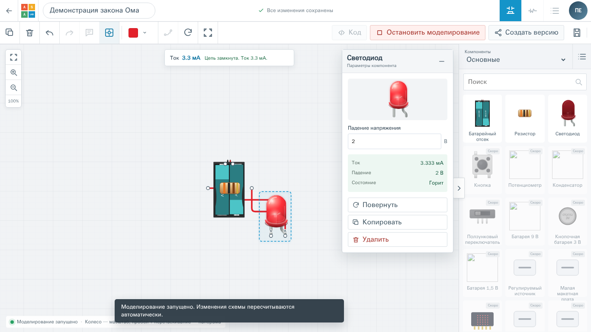
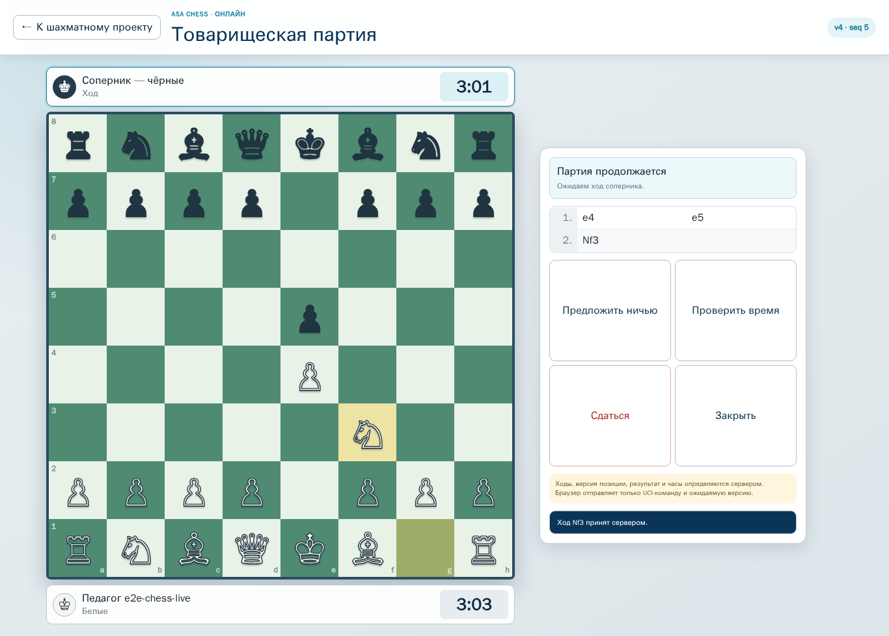
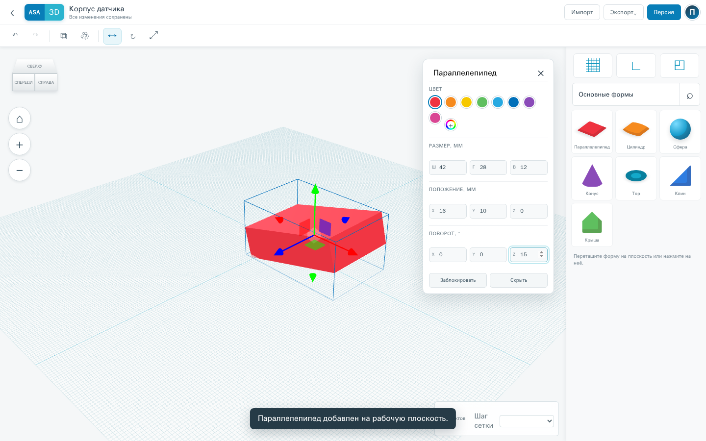

# ASA Lab

[](LICENSE)

> Учиться не по инструкции, а через действие.

ASA Lab — образовательная платформа, в которой ученик исследует идеи руками:
собирает электронные схемы, создаёт 3D-модели, играет и разбирает партии, а
педагог видит не формальную отметку, а реальный путь решения.

Мы строим безопасную цифровую мастерскую для школы: один аккаунт, проекты с
историей версий, предметные лаборатории, классы и доказуемый прогресс — без
рекламы, манипулятивных механик и открытого общения детей с незнакомыми людьми.

Проект находится в активной разработке. Репозиторий открыт, чтобы архитектура,
решения и качество реализации были прозрачными.

## Что уже можно увидеть

### Виртуальная электроника

Редактор схем с физически осмысленной симуляцией, диагностикой, сохранением и
повторным открытием проекта.



### Шахматы

Отдельный учебный модуль и серверно подтверждаемая онлайн-партия с историей
ходов, временем и восстановлением состояния.



### 3D-моделирование

Первая версия предметного 3D-редактора: рабочая плоскость, базовые формы,
преобразования и жизненный цикл проекта.



Кроме предметных модулей уже существуют аккаунты и рабочие пространства,
Project Core, базовые классы педагога, PostgreSQL/RLS, Docker-окружение,
миграции, резервное копирование и восстановление.

## Что развивается

- образовательная система русских шашек: уроки, задачи, боты, задания педагога
  и безопасная игра внутри класса;
- более глубокий учебный цикл: назначение, попытка, evidence, разбор и повторение;
- развитие 3D-инструментов и предметных лабораторий;
- доступность, мобильные сценарии и эксплуатационная готовность.

Точное текущее состояние не дублируется в README и всегда читается из
[`docs/execution/current.yaml`](docs/execution/current.yaml). Продуктовая
программа находится в
[`docs/delivery/EXECUTION_MANIFEST.yaml`](docs/delivery/EXECUTION_MANIFEST.yaml).

## Принципы ASA Lab

- **Практика важнее демонстрации.** Каждый модуль должен приводить ученика к
  самостоятельному действию и проверяемому результату.
- **Прогресс подтверждается evidence.** Педагог видит проект, попытку, позицию,
  ход или измерение, на которых основан вывод.
- **Безопасность детей встроена в архитектуру.** Tenant isolation, минимизация
  данных и отсутствие свободного публичного детского чата — продуктовые
  требования, а не дополнения после запуска.
- **Предметные модули независимы.** Электроника, шахматы, шашки и 3D используют
  общую платформу, но не смешивают доменную логику.
- **Ошибки не маскируются.** Неподдерживаемая модель, конфликт сохранения или
  непроверенный результат завершаются честной диагностикой.
- **Качество доказывается одинаково локально и в CI.** Контракты, границы,
  авторизация, данные и браузерные journeys входят в проверяемую поставку.

## Технологии

- TypeScript, React и Vite;
- NestJS/Fastify;
- PostgreSQL с Row-Level Security;
- Nx и pnpm workspace;
- Vitest и Playwright;
- Docker Compose;
- Rust/WASM предусмотрены для вычислительных модулей, где это оправдано.

## Локальный запуск

Требуются Docker с Linux containers, Node.js и Corepack.

```bash
cp .env.docker.example .env
./tools/docker-up.sh dev
./tools/docker-healthcheck.sh dev
```

После запуска:

```text
Web  http://127.0.0.1:4610
API  http://127.0.0.1:4611
E2E  http://127.0.0.1:4612
```

Локальный `.env`, сгенерированные credentials, данные PostgreSQL и backup-файлы
не должны попадать в Git.

## Проверки

```bash
corepack pnpm install --frozen-lockfile
NX_SKIP_NX_CACHE=true corepack pnpm gate:repository
```

Полный repository gate требует изолированную тестовую PostgreSQL. Focused и
браузерные команды конкретной задачи указаны в
[`docs/execution/current.yaml`](docs/execution/current.yaml).

## Участие в проекте

ASA Lab развивается вертикальными пользовательскими результатами, а не
несвязанными наборами функций. Перед изменениями прочитайте
[`CONTRIBUTING.md`](CONTRIBUTING.md), [`AGENTS.md`](AGENTS.md) и актуальное
состояние выполнения.

Идеи и предложения можно обсуждать через
[GitHub Issues](https://github.com/spikeal8-maker/asa-lab/issues). Сведения об
уязвимостях нельзя публиковать в обычной Issue — используйте процесс из
[`SECURITY.md`](SECURITY.md).

## Лицензирование

Оригинальный программный код ASA Lab открыт по лицензии
[GNU AGPL v3](LICENSE) (`AGPL-3.0-only`). Её сильный copyleft сохраняет код и
сетевые производные версии открытыми: пользователи изменённого сетевого сервиса
должны иметь возможность получить соответствующий исходный код этой версии.

AGPL не предоставляет прав на название и знак ASA Lab, фирменное оформление,
owner-supplied/owner-audit материалы электроники, снимки интерфейса и
продуктовые или учебные материалы. Точные границы и правила описаны в:

- [`LICENSING.md`](LICENSING.md) — что входит в AGPL и что исключено;
- [`TRADEMARKS.md`](TRADEMARKS.md) — правила бренда и независимых форков;
- [`ASSETS-LICENSE.md`](ASSETS-LICENSE.md) — права на графику, учебные и
  эталонные материалы.

Закрытая производная версия, официальный бренд или использование исключённых
материалов требуют отдельного письменного коммерческого соглашения.
