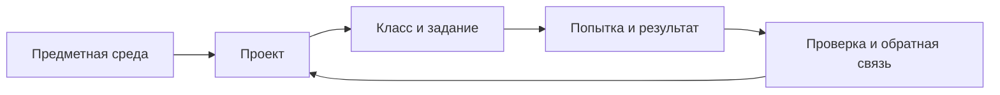

<p align="center">
  
</p>

<h1 align="center">ASA Lab</h1>

<p align="center"><strong>От идеи — к работающему проекту.</strong></p>

<p align="center">
  Цифровая лаборатория для 3D-моделирования, виртуальной электроники,<br />
  программирования, рисования, шахмат, русских шашек и проектного обучения.
</p>

<p align="center">
  <a href="https://asa-lab.ru/"><strong>Открыть ASA Lab</strong></a>
  ·
  <a href="https://asa-lab.ru/features/">Возможности</a>
  ·
  <a href="https://asa-lab.ru/for-teachers/">Преподавателям</a>
  ·
  <a href="https://asa-lab.ru/for-schools/">Школам</a>
</p>

<p align="center">
  <a href="LICENSE"></a>
  <a href="ASSETS-LICENSE.md"></a>
  <a href="https://asa-lab.ru/"></a>
  
</p>


<p align="center">
  <sub>Работающие предметные среды и образовательный контур развиваются в одном продукте; актуальное состояние фиксируется в репозитории.</sub>
</p>

---

## Что такое ASA Lab

**ASA Lab** — цифровая платформа для проектирования, экспериментов и практического обучения. Программный код проекта открыт по `AGPL-3.0-only`; бренд, интерфейсные материалы и часть учебного контента имеют отдельные условия использования.

Платформа соединяет два уровня:

- **предметные среды** — 3D, электроника, программирование, рисование, шахматы и русские шашки;
- **образовательный контур** — проекты, классы, задания, результаты и обратная связь.

Модель, схема, рисунок, алгоритм, позиция или партия не остаются отдельной демонстрацией: результат можно сохранить как проект, связать с заданием и продолжить улучшать.

> **Практика важнее демонстрации:** придумать → сделать → проверить → исправить → объяснить.

---

## Возможности

| Направление | Что доступно | Статус |
|---|---|:---:|
| [3D-моделирование](https://asa-lab.ru/features/3d-modeling/) | формы, рабочая плоскость, размеры, преобразования и проекты | **Доступно** |
| [Виртуальная электроника](https://asa-lab.ru/features/electronics/) | компоненты, соединения, моделирование цепей, измерения и диагностика | **Доступно** |
| [Блочное программирование](https://asa-lab.ru/features/block-programming/) | визуальные алгоритмы, условия, циклы и переменные | **Доступно** |
| [Рисование и визуальные проекты](https://asa-lab.ru/features/drawing/) | линии, формы, цвет, композиция, эскизы и чертежи | **Доступно** |
| [Шахматы](https://asa-lab.ru/features/chess-and-checkers/) | партии, задачи, анализ позиций, история ходов и учебные сценарии | **Доступно** |
| [Русские шашки](https://asa-lab.ru/features/chess-and-checkers/) | позиции, варианты ходов, партии и работа в классе | **Доступно** |
| [Проекты, классы и задания](https://asa-lab.ru/for-teachers/) | сохранение работ, подключение по коду, выдача заданий, статусы и обратная связь | **Доступно** |

Текущее execution-state: [`docs/execution/current.yaml`](docs/execution/current.yaml). Продуктовая программа: [`docs/delivery/EXECUTION_MANIFEST.yaml`](docs/delivery/EXECUTION_MANIFEST.yaml).

---

## Быстрый запуск

Для обычного локального запуска нужны **Git** и **Docker Desktop / Docker Engine с Compose**.

### Windows 11

```powershell
git clone https://github.com/spikeal8-maker/asa-lab.git
cd asa-lab
powershell -ExecutionPolicy Bypass -File .\tools\asa-lab.ps1 up
```

### Linux / WSL2

```bash
git clone https://github.com/spikeal8-maker/asa-lab.git
cd asa-lab
./tools/asa-lab.sh up
```

После готовности:

```text
Web  http://127.0.0.1:4610
API  http://127.0.0.1:4611
```

Подробности: [`docs/deployment/QUICK_START.md`](docs/deployment/QUICK_START.md).

---

## Реальные интерфейсы

Ниже — **реальные браузерные артефакты ASA Lab из E2E-проверок**, а не рекламные макеты.

### Виртуальная электроника

Сборка схем, библиотека компонентов, симуляция и диагностика внутри проекта.


### 3D-моделирование

Рабочая плоскость, базовые формы, прямое редактирование и жизненный цикл модели.


### Шахматы

Партии, задачи, варианты и анализ позиции в отдельном учебном модуле.


### Русские шашки

Позиционная игра, история ходов и сценарии ученика и преподавателя.


### Классы, задания и прогресс

Преподаватель создаёт класс, выдаёт задание, получает работу и возвращает обратную связь в том же контексте, где ученик выполнял проект.


---

## Единый путь проекта



ASA Lab строится не как коллекция несвязанных тренажёров. Предметные модули используют общий проектный контур, но сохраняют собственную доменную логику.

- **Project Core** — проекты и их жизненный цикл.
- **Classroom / Learning** — классы, задания, попытки и проверка.
- **Identity / Authorization** — роли и границы доступа.
- **PostgreSQL + RLS** — изоляция пользовательских и учебных данных.

---

## Для кого

- **Самостоятельным авторам** — создавать и сохранять собственные проекты.
- **Ученикам** — выполнять задания, возвращаться к работам и улучшать решения.
- **Преподавателям** — организовывать классы, выдавать задания и видеть результат.
- **Школам, кружкам и центрам творчества** — использовать несколько практических направлений в одной браузерной среде.
- **Разработчикам** — изучать открытую архитектуру, контракты, тесты и инженерные решения проекта.

---

## Создатель ASA Lab

<p align="center">
  
</p>

<h3 align="center">Александр Аликин</h3>
<p align="center"><strong>Создатель и руководитель ASA Lab</strong></p>
<p align="center">Педагог · инженер-практик · предприниматель</p>

Александр работает с информатикой, технологией, робототехникой, радиоэлектроникой, программированием и проектно-исследовательским обучением. Опыт разработки образовательных программ, подготовки учеников к инженерным соревнованиям и создания собственных образовательных проектов лёг в основу ASA Lab.

В проекте он определяет продуктовую и образовательную концепцию, требования к предметным модулям, пользовательские сценарии, визуальное направление и приоритеты развития.

<p align="center">
  <a href="CREATOR.md"><strong>О создателе и истории ASA Lab →</strong></a>
  ·
  <a href="https://asa-lab.ru/about/">О проекте на сайте</a>
</p>

---

## Разработка и качество

Основной стек:

`TypeScript` · `React` · `Vite` · `NestJS` · `Fastify` · `PostgreSQL` · `RLS` · `Nx` · `pnpm` · `Vitest` · `Playwright` · `Docker Compose`

Проверка репозитория:

```bash
corepack pnpm install --frozen-lockfile
NX_SKIP_NX_CACHE=true corepack pnpm gate:repository
```

Перед изменениями:

- [`START_HERE_FOR_AI.md`](START_HERE_FOR_AI.md) — точка входа в инженерный workflow;
- [`AGENTS.md`](AGENTS.md) — правила работы с репозиторием;
- [`CONTRIBUTING.md`](CONTRIBUTING.md) — внешний вклад;
- [`docs/execution/current.yaml`](docs/execution/current.yaml) — единственный источник текущего execution-state.

<details>
<summary><strong>Принципы и структура репозитория</strong></summary>

### Принципы

- Практика важнее демонстрации.
- Прогресс подтверждается наблюдаемым результатом.
- Безопасность и роли встроены в архитектуру.
- Предметные контексты не смешивают доменную логику.
- Ошибки не маскируются и должны диагностироваться честно.
- Качество подтверждается одинаковыми локальными и CI-проверками.

### Структура

```text
apps/        web-клиент и API
contexts/    предметные и платформенные bounded contexts
packages/    общие библиотеки и контракты
migrations/  миграции PostgreSQL
schemas/     схемы данных и публичные контракты
tests/       интеграционные тесты и тесты безопасности
e2e/         браузерные journeys и визуальные артефакты
docs/        архитектура, продуктовые документы и эксплуатация
tools/       запуск, миграции, проверки и governance
```

</details>

---

## Участие в проекте

Идеи и ошибки можно обсуждать через [GitHub Issues](https://github.com/spikeal8-maker/asa-lab/issues).

Перед программным вкладом прочитайте [`CONTRIBUTING.md`](CONTRIBUTING.md) и [`CLA.md`](CLA.md). Уязвимости нельзя публиковать в обычной Issue — используйте процесс из [`SECURITY.md`](SECURITY.md).

---

## Лицензирование и права

**Создатель проекта и правообладатель бренда ASA Lab:**  
**Аликин Александр Сергеевич (Alexander Alikin).**

- оригинальный программный код — [`AGPL-3.0-only`](LICENSE);
- бренд и официальные обозначения — [`TRADEMARKS.md`](TRADEMARKS.md);
- screenshots, графические, учебные и эталонные материалы — [`ASSETS-LICENSE.md`](ASSETS-LICENSE.md);
- полная граница лицензирования — [`LICENSING.md`](LICENSING.md);
- внешние участники сохраняют авторство своих вкладов; условия вклада — [`CLA.md`](CLA.md).

Публичность репозитория не переводит бренд, интерфейсные screenshots и исключённые учебные материалы под AGPL, если для конкретного файла прямо не указано обратное.

---

<p align="center">
  <strong>ASA Lab</strong><br />
  Учиться через действие. Создавать, проверять и объяснять результат.
</p>
