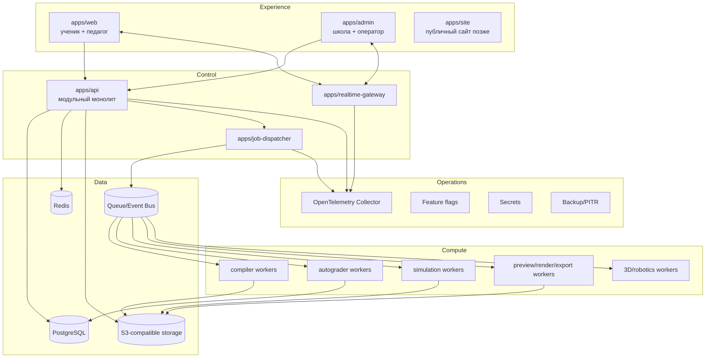

# ASA Lab — архитектурный фундамент платформы

**Статус:** принято как baseline.  
**Версия:** 2.0.  
**Дата:** 17 июля 2026 года.  
**Область:** Classroom Core, электронная лаборатория, будущие 3D-, робототехнические, шахматные, графические и иные учебные модули.

## 1. Решение

ASA Lab строится как **модульная образовательная платформа**, а не как один редактор электроники.

Архитектура разделяется на пять контуров:

1. **Experience Plane** — ученическое, педагогическое и административное web-приложения.
2. **Control Plane** — Classroom Core, организации, школы, пользователи, классы, проекты, задания, права, тарифные возможности и аудит.
3. **Compute Plane** — изолированные вычисления: компиляция, автопроверка, серверная симуляция, preview/render/export, будущий 3D-slicing и виртуальная робототехника.
4. **Data Plane** — PostgreSQL, S3-совместимое object storage, Redis, очередь событий и позднее аналитическое хранилище.
5. **Operations Plane** — CI/CD, наблюдаемость, резервное копирование, секреты, feature flags и эксплуатационная админка.

Главное серверное ядро на первом этапе реализуется как **строгий модульный монолит**. Ресурсоёмкие и опасные вычисления с первого дня выполняются отдельными worker-процессами.

```text
Modular Monolith Control Plane
+ Isolated and Horizontally Scalable Compute Plane
+ Contract-first Module SDK
+ Shared PostgreSQL Multi-tenancy with RLS defense-in-depth
+ Immutable Project Versions
+ Transactional Outbox and Idempotent Consumers
+ Browser-first Simulation with a Rust/WASM Core
+ Entitlement-based Commercial Model
+ Strict AI Development Governance
```

## 2. Почему не набор микросервисов с первого дня

Отдельный сервис для каждого CRUD-контекста создаст больше сетевых отказов, распределённых транзакций, DevOps-нагрузки и сложностей для AI-агентов, но не даст пользы школьному пилоту.

Модульный монолит сохраняет:

- одну транзакционную границу для классов, заданий и сдач;
- простую локальную разработку;
- единые миграции;
- понятный debugging;
- меньший эксплуатационный бюджет;
- автоматически проверяемые доменные границы.

При этом Compute Plane отделяется сразу, потому что компиляторы, симуляторы, 3D-конвертеры и пользовательский код требуют иных лимитов, sandbox и независимого масштабирования.

## 3. Основные цели

Архитектура обязана:

- выдержать школьный пилот при 300–500 одновременно активных пользователях;
- не требовать переделки модели данных при подключении новых школ;
- иметь измеримый путь к десяткам тысяч и далее к сотням тысяч одновременных пользователей;
- исключать смешение данных школ и организаций;
- не терять работу после серверного подтверждения «Сохранено»;
- поддерживать нестабильную школьную сеть;
- позволять ученику входить без электронной почты;
- давать педагогу self-service управление классом без системного администратора;
- подключать разные предметные редакторы к одному Classroom Core;
- вводить платные функции и квоты без изменения предметной логики;
- быть пригодной для последовательной разработки Codex и другими AI-агентами.

## 4. Не-цели первого этапа

На первом этапе не требуются:

- отдельный микросервис для каждого домена;
- Kubernetes в локальной разработке;
- Kafka, service mesh, OpenSearch и ClickHouse до подтверждённой нагрузки;
- распределённые транзакции;
- динамическая загрузка произвольного стороннего backend-кода;
- одновременная реализация всех предметных модулей;
- публичная социальная сеть детей;
- полный snapshot проекта при каждом движении мыши.

## 5. Главный доменный инвариант

`Classroom Core` знает только универсальные образовательные сущности:

```text
Tenant
Organization
School
AcademicPeriod
Classroom
Membership
StudentSeat
ModuleRegistration
Project
ProjectVersion
Template
Activity
Assignment
Submission
Review
Comment
Notification
Entitlement
AuditEvent
```

Он **не знает**, что такое резистор, Arduino, шахматная ладья, 3D-меш, робот или чертёжный примитив.

Предметные данные находятся в версионированном payload проекта и обрабатываются зарегистрированным модулем через Module SDK.

## 6. Bounded contexts Control Plane

| Контекст | Владеет | Не должен знать |
|---|---|---|
| Identity & Access | взрослые аккаунты, StudentSeat, сессии, MFA, federation | электронные компоненты и учебное содержание |
| Organization & Tenancy | tenants, школы, здания, учебные периоды, placement | редакторы проектов |
| Classroom | классы, группы, membership, co-teacher grants | формат предметного проекта |
| Module Catalog | регистрации модулей, версии, capabilities | данные конкретного класса |
| Content & Curriculum | шаблоны, активности, инструкции | внутреннее устройство редактора |
| Projects & Versions | project metadata, immutable versions, digests | семантика payload конкретного модуля |
| Assignments & Assessment | назначения, попытки, сдачи, review, rubric | внутренние таблицы Classroom |
| Safety & Moderation | Safe Mode, incidents, публикации | billing provider |
| Notifications | inbox и внешняя доставка | источник истины бизнес-состояния |
| Billing & Entitlements | планы, entitlement, quota, usage ledger | предметные типы данных |
| Support & Admin | support access, tenant operations | пароли и открытые student codes |
| Compliance & Audit | immutable audit, retention, export/delete workflows | UI-реализация модулей |

Каждый контекст имеет собственные `domain`, `application`, `infrastructure`, `presentation`, `testing` и один публичный entry point.

Прямой импорт внутренних файлов другого контекста и прямая запись в его таблицы запрещены.

## 7. Контейнерная архитектура



## 8. Синхронные и асинхронные связи

Синхронный application port используется, когда ответ нужен в той же пользовательской операции и транзакции. Например, Assignment проверяет существование Classroom через публичный Classroom query port.

Асинхронное событие используется, когда допустима eventual consistency. Например:

```text
ProjectVersionCreated.v1
SubmissionCreated.v1
ReviewCompleted.v1
StudentSeatReset.v1
EntitlementChanged.v1
TenantSuspended.v1
```

Критическое событие записывается в `outbox_events` в той же PostgreSQL-транзакции, что и бизнес-изменение. Publisher доставляет его как минимум один раз; consumer обязан быть идемпотентным и фиксировать обработку в inbox/idempotency storage.

Redis и брокер не являются источником истины для классов, прав, подписок или сдач.

## 9. Мультитенантность

Основная модель — shared schema PostgreSQL с явным `tenant_id`.

Обязательные правила:

- каждая tenant-owned таблица содержит `tenant_id uuid NOT NULL`;
- tenant берётся только из валидированной сессии/request context;
- `tenantId` из body или query не считается доверенным;
- каждый repository method содержит tenant predicate;
- дочерние связи используют composite `(tenant_id, parent_id)` foreign key;
- критические таблицы защищаются PostgreSQL RLS как второй рубеж;
- runtime database role не имеет `BYPASSRLS` и не владеет таблицами;
- каждый use case имеет отрицательный cross-tenant тест;
- support access ограничен временем, scope и неизменяемым аудитом.

Отдельная сущность `TenantPlacement` заранее позволяет перевести крупный tenant в выделенную базу, регион или on-premise контур без изменения доменного API.

```text
SHARED_CLUSTER
DEDICATED_DATABASE
DEDICATED_REGION
ON_PREMISE
```

## 10. Проекты и неизменяемые версии

`Project` — изменяемый рабочий контейнер. `ProjectVersion` — неизменяемый снимок.

Каждая версия содержит:

```text
projectId
tenantId
moduleKey
moduleVersion
schemaVersion
payloadLocation или inline payload
payloadDigest
createdBy
createdAt
engineVersion при вычислении
```

`Submission` всегда ссылается на точную `ProjectVersion`. Возврат на доработку создаёт новую попытку и новую версию, не меняя предыдущую сдачу.

Несовместимое изменение формата проекта требует:

- повышения `schemaVersion`;
- JSON Schema;
- migrator;
- backward-compatibility fixture;
- contract test открытия старой версии;
- документированной стратегии rollback/forward-fix.

## 11. Сохранение при слабой сети

Редактор не отправляет полный JSON на каждое действие.

```text
UI action
→ operation journal in IndexedDB
→ coalescing и batching
→ idempotent operation batch
→ server acknowledgement
→ periodic immutable checkpoint
```

Полный checkpoint создаётся при первой версии, перед сдачей, экспортом, миграцией и периодически по политике модуля.

Интерфейс различает:

- `Сохранено на устройстве`;
- `Синхронизация`;
- `Сохранено на сервере`;
- `Конфликт`;
- `Требуется повторная отправка`.

Надпись `Сохранено на сервере` допустима только после durable commit metadata и подтверждения object storage, если оно участвует в операции.

## 12. Module SDK

Каждый предметный модуль регистрирует версионированный manifest:

```text
moduleKey
moduleVersion
supportedProjectSchemas
editorRoute
viewerRoute
capabilities
validator
migrator
diffProvider
previewProvider
autograderProvider
exportProviders
workerProfiles
safeModeCompatibility
analyticsAllowlist
```

Classroom Core вызывает только стабильные Module SDK ports.

Запрещено:

- добавлять `if module === electronics` в Classroom Core;
- давать модулю прямой доступ к таблицам классов и сдач;
- загружать произвольный backend-код непроверенного автора;
- включать новую версию всем школам без compatibility report, feature flag и canary.

Первый модуль — `electronics`. Второй контрольный модуль рекомендуется сделать простым, например шахматным, чтобы доказать независимость Classroom Core от электроники.

## 13. Электронная лаборатория

Первый вертикальный продукт включает:

- 2D-редактор компонентов и проводов;
- breadboard с внутренней топологией;
- структурированный circuit document;
- каталог компонентов и manifest;
- Arduino blocks/text workflow;
- browser simulation;
- мультиметр и serial monitor;
- immutable project versions;
- стартовые проекты;
- задания, сдачу и review;
- topology/behavior autograder.

Электрическая модель, визуальная сцена и педагогические метаданные являются разными слоями. Перемещение элемента на экране не должно автоматически менять электрическую эквивалентность.

## 14. Compute Plane

Пользовательский код, compiler toolchains и тяжёлые конвертеры не выполняются в Core API.

Каждая задача имеет:

```text
jobId
tenantId
jobType
inputDigest
idempotencyKey
resourceProfile
runtimeVersion
timeout
outputLimit
status
attempt
```

Worker обязан:

- выполняться без исходящего интернета по умолчанию;
- работать non-root;
- использовать read-only image и временный workspace;
- иметь ограничения CPU, RAM, PIDs, времени и размера вывода;
- не получать общие production credentials;
- не иметь writable mount другого tenant;
- закреплять image digest и toolchain version;
- безопасно обрабатывать повторную доставку.

Для симуляции принимается общий Rust core, собираемый в WASM для браузера и native binary для серверных golden tests/autograder. Это уменьшает расхождение между клиентским и серверным поведением.

## 15. Идентичность и доступ

Взрослые пользователи:

- локальная учётная запись;
- OIDC;
- SAML для крупных организаций;
- MFA для platform admin и чувствительных ролей.

Ученик может использовать `StudentSeat` без email:

```text
classLink + personalCode
или revocable QR token
```

Открытый код показывается только при выдаче, хранится как Argon2id hash, защищён rate limiting и lockout. Сброс кода отзывает старые сессии.

Роли и права проверяются policy engine на сервере. RBAC дополняется атрибутами tenant, школы, класса, ownership, co-teacher grants, Safe Mode, статуса объекта и entitlement.

## 16. Административный контур

`apps/admin` — отдельное приложение и bundle, а не скрытая вкладка ученического интерфейса.

Уровни администрирования:

- platform operator;
- tenant/organization admin;
- school admin;
- teacher self-service;
- time-limited support access.

Обязательные функции:

- tenants, школы, здания, учебные периоды;
- педагоги, приглашения, SSO;
- классы, импорт учеников, StudentSeat cards;
- модули, версии и feature flags;
- тарифные entitlement и quota;
- usage и compute consumption;
- incidents, moderation и audit;
- backup/restore status;
- exports, retention и deletion workflows.

Административная мутация всегда создаёт audit event. Bulk export требует reason, повторной аутентификации и ограниченного signed URL.

## 17. Коммерческий фундамент

Запрещены флаги `isPaid`, `hasPro`, `canUse3d` в таблицах пользователей, школ и классов.

Используются:

```text
Plan
PlanVersion
EntitlementDefinition
PlanEntitlement
Subscription
TenantEntitlementOverride
QuotaDefinition
UsageLedger
BillingAccount
ProviderCustomerReference
InvoiceReference
```

Предметный код спрашивает `EntitlementService`, а не знает тариф или платёжного провайдера.

Истечение подписки не удаляет учебные данные. Предусматриваются grace period, read-only режим и экспорт. Webhook платёжного провайдера идемпотентен. Usage ledger append-only и не восстанавливается только из аналитики.

## 18. Наблюдаемость

Используется OpenTelemetry для traces, metrics и logs.

Каждый request/job/event несёт:

```text
traceId
spanId
correlationId
technicalTenantId
actorType
operationName
```

В telemetry запрещены пароли, токены, открытые student codes, содержимое проектов, исходный пользовательский код, детские комментарии, платёжные данные и signed URLs.

Обязательные метрики:

- HTTP RED;
- infrastructure USE;
- save success/failure/conflict;
- queue depth и oldest job age;
- worker duration и failure code;
- cross-tenant denials;
- auth lockout;
- outbox lag;
- backup age и restore verification;
- module/schema migration failures.

## 19. Деградация

| Сбой | Продолжает работать | Временно недоступно |
|---|---|---|
| Analytics | вход, классы, проекты, сохранение | отчёты |
| Email/SMS | учебный процесс | внешние уведомления |
| Preview worker | редактирование и сохранение | новые превью |
| Compile worker | редактор и черновики | новая компиляция |
| Realtime gateway | REST API и сохранение | presence/live updates |
| Redis | PostgreSQL и проекты | часть cache/rate-limit/realtime по fail-safe policy |
| PostgreSQL | локальный draft | серверные операции до восстановления |

Сбой необязательной подсистемы не должен блокировать урок.

## 20. Технологический baseline

```text
Monorepo: pnpm workspaces + Nx
Frontend: React, Vite, PWA, IndexedDB, Web Workers, WebAssembly
Backend: Node.js active LTS, NestJS + Fastify, REST, OpenAPI 3.1
Domain: framework-independent TypeScript
Database: PostgreSQL 16+, explicit SQL migrations, typed repositories
Ephemeral/cache: Redis
Blob: S3-compatible object storage
Compute kernels: Rust stable, WASM + native workers
Observability: OpenTelemetry
Local/pilot: Docker Compose
Regional/national: Kubernetes only after operational need is proven
```

Версии фиксируются lockfile и tool-version files. Замена базовой технологии требует ADR.

## 21. Эволюция масштаба

### L1 — школа

- 1–2 web replicas;
- 2 API replicas;
- 1 realtime replica;
- 1 dispatcher;
- worker pools по типам;
- PostgreSQL primary;
- Redis;
- S3-compatible storage;
- browser-first simulation.

### L2 — сеть школ

- managed PostgreSQL/PITR;
- read replicas для отчётов;
- отдельный realtime gateway;
- broker;
- autoscaling workers;
- partitioning горячих event/usage tables;
- CDN только для публичных assets без персональных данных.

### L3 — регион

При измеренной необходимости могут быть выделены Identity Gateway, Realtime, Job Orchestration, Notification и Analytics Pipeline. Classroom и Assignments остаются вместе, пока транзакционная нагрузка не требует иного.

### L4 — федеральный контур

- несколько регионов размещения;
- tenant placement;
- отдельные database и compute clusters;
- geo-aware routing;
- региональные object-storage buckets;
- disaster-recovery region;
- централизованный каталог модулей без централизации детского контента.

Active-active запись одной classroom aggregate в разных регионах запрещена без отдельной ADR и формальной модели конфликтов.

## 22. Когда разрешено выделить микросервис

Контекст выделяется только при наличии измеримого основания:

1. независимый профиль масштабирования;
2. отдельная security boundary;
3. другой runtime или hardware;
4. независимый release cadence;
5. отдельная команда-владелец;
6. подтверждённый bottleneck;
7. необходимость изоляции отказа;
8. другое регуляторное размещение.

До выделения должны существовать public port, versioned events, ясное владение таблицами, отсутствие cross-context writes, нагрузочный тест и ADR с rollback plan.

## 23. Запрещённые решения

Без новой ADR запрещено:

- создавать микросервис для простого CRUD;
- давать модулю прямой доступ к Classroom tables;
- выполнять пользовательский код в API pod;
- использовать Redis как источник прав или подписок;
- редактировать immutable ProjectVersion;
- отправлять критическое событие после commit без outbox;
- делать cross-tenant запрос без tenant predicate;
- менять формат проекта без version и migrator;
- логировать детский контент;
- включать новую module version всем школам без canary;
- добавлять платные boolean-флаги в предметную модель;
- скрывать архитектурное изменение внутри feature PR.

## 24. Quality gates

Pull Request блокируется, если:

- нарушена dependency matrix;
- изменён API без OpenAPI и contract tests;
- изменена БД без migration test;
- добавлена tenant-owned таблица без `tenant_id`;
- мутация не имеет authorization и cross-tenant test;
- admin mutation не имеет audit event;
- job не имеет idempotency key, timeout и resource profile;
- module payload не имеет JSON Schema;
- несовместимое изменение не повышает version;
- старая версия проекта не открывается;
- имеется незакрытая high/critical security finding;
- отсутствует ADR для изменения границы;
- в критическом пути остались placeholder, fake adapter или TODO.

## 25. Нормативные ссылки

- PostgreSQL Row Security: https://www.postgresql.org/docs/current/ddl-rowsecurity.html
- PostgreSQL Partitioning: https://www.postgresql.org/docs/current/ddl-partitioning.html
- Kubernetes Horizontal Pod Autoscaling: https://kubernetes.io/docs/concepts/workloads/autoscaling/horizontal-pod-autoscale/
- OpenTelemetry: https://opentelemetry.io/docs/
- OpenAPI Specification: https://spec.openapis.org/oas/latest.html
- Nx module boundaries: https://nx.dev/docs/features/enforce-module-boundaries
- Keycloak documentation: https://www.keycloak.org/docs/latest/server_admin/
- NATS JetStream: https://docs.nats.io/nats-concepts/jetstream
