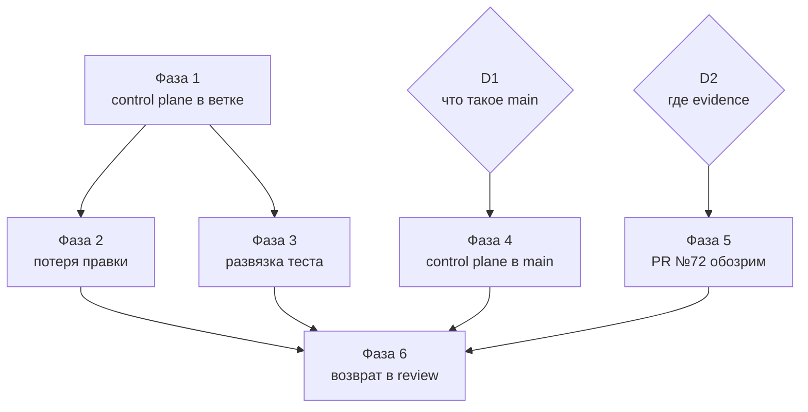

# План стабилизации ASA Lab

Спецификация. Определяет, что считается стабилизированным проектом, как
состояние переходит из одного проверенного положения в другое, в каком порядке
это делается и чем каждый шаг подтверждается.

Родительский документ. Детали доставки control plane в `main` — фаза 4, вынесена
в [`CONTROL_PLANE_DELIVERY.md`](CONTROL_PLANE_DELIVERY.md).

Фактическое состояние живёт в [`current.yaml`](current.yaml). Здесь не
дублируются задача, ветка, PR и статус — только последовательность работ.

---

## 1. Что считать стабилизированным

Не «зелёный CI». Стабилизация достигнута, когда одновременно выполняются семь
условий, каждое из которых проверяется командой.

| # | Условие | Проверка |
|---|---|---|
| S1 | Свежий clone `main` ведёт агента к актуальной задаче | `grep -c "agent/r2-creator-portal" START_HERE_FOR_AI.md` → `0` |
| S2 | Состояние согласовано с Git и GitHub на `main` и на продуктовой ветке | `pnpm control-plane:check` → PASS в обеих |
| S3 | Каждый записанный результат gate подтверждён прогоном на названной ревизии | входит в S2 |
| S4 | Оба gate зелёные **на текущей голове** продуктовой ветки | `verified_sha` каждого gate равен голове, статус `PASS` |
| S5 | Открытых блокеров нет, либо каждый имеет решение владельца | `blocking` в `current.yaml` |
| S6 | PR продуктовой задачи является единицей ревью | код и evidence разделены |
| S7 | Каждая команда gate существует и определена ровно один раз | `validate_test_catalog.py` |

S3 и S4 разделены намеренно. S3 — историческая правда: «результат наблюдался
там-то». S4 — актуальность: «наблюдался именно на голове». Смешение этих двух
вопросов было конструктивным дефектом первой версии control plane: проверка
требовала завершённого прогона на текущей голове, а первый прогон новой головы
сам задаёт этот вопрос — и блокировал бы каждый push после merge.

## 2. Протокол перехода состояния

Ядро плана. Каждая фаза, меняющая голову продуктовой ветки, выполняет одинаковую
последовательность. Отступление от неё возвращает ровно ту болезнь, ради которой
всё делалось.

### Почему нужен протокол

Результат gate записан парой: `status` и `verified_sha` — что наблюдалось и на
какой ревизии. Merge меняет голову, и старая пара немедленно перестаёт описывать
её. Она не становится ложью — она становится историей, и это разные вещи.

Валидатор намеренно **не** требует завершённого прогона на текущей голове.
Привязка к голове проверяется только там, где на неё опираются: при переводе
задачи в `in_review`.

### Последовательность

```text
1. merge в продуктовую ветку

2. тело PR продуктовой ветки привести к новой голове
   Немедленно, до первого push: голова сменилась, и описание обязано
   следовать за ней. Отложить этот шаг нельзя — валидатор справедливо
   не даст запушить состояние, в котором тело PR описывает ревизию,
   которой больше нет, а подтверждённых результатов ещё нет

3. current.yaml: каждый gate
     status: NOT_RUN
     verified_sha: null
   Не формальность: прежний результат описывает предыдущую ревизию

4. commit + push
   → первый CI на новой голове
   → валидатор проходит: NOT_RUN не требует прогона

5. дождаться завершения обоих workflow

6. current.yaml: записать фактические результаты
     status: PASS | FAIL
     verified_sha: <новая голова>

7. закрыть блокеры, чьи условия выполнены

8. commit + push
   → второй CI подтверждает, что запись соответствует наблюдению
```

Порядок шагов 2 и 3 установлен исполнением, а не рассуждением: при обратном
порядке валидатор останавливает переход с сообщением, что тело PR не описывает
ни голову, ни какую-либо подтверждённую ревизию. Это правильное поведение, и
протокол приведён в соответствие с ним.

Два прогона CI на переход — цена честной записи, а не накладные расходы. Первый
производит факт, второй подтверждает, что факт записан верно.

### Что произойдёт, если пропустить шаги 5–8

Ничего немедленного, и в этом опасность. Записанное состояние продолжит
описывать предыдущую ревизию. Валидатор не упадёт: пара остаётся исторически
верной. Упадёт он в момент попытки объявить задачу готовой к ревью, потому что
голова не подтверждена. Протокол не наказывает за забывчивость сразу, но не даёт
на её основе заявить результат.

## 3. Чего этот план не делает

- не начинает продуктовых работ, включая Tinkercad-паритет и R4-M2;
- не сливает PR №72 в `main`;
- не трогает PR №29 и ветку `assistant/map-ux-owner-view`;
- не исправляет инженерные риски вне пути стабилизации: обусловленность
  MNA-матрицы, клиентские `internalConnections` как будущая граница доверия
  автогрейдинга, семантика `totalSourceCurrent`, отсутствие off-состояния у
  каталожного SPDT. Они зарегистрированы и ждут отдельной задачи;
- не меняет tenant/RLS-модель и не выполняет destructive-миграции.

## 4. Корень проблемы

Стабилизировать надо не код. Код работоспособен: солвер честный, fail-closed,
инварианты симуляции выполняются, серверная перепроверка существует.

Разъехалось управление. Состояние выполнения было продублировано минимум в пяти
местах, и каждая задача обновляла своё подмножество. Валидатор, обязанный ловить
рассинхрон, содержал шестую копию константой. Отсюда все симптомы: точка входа
уводила в завершённую ветку, тело PR описывало устаревшую голову, локальный gate
и CI проверяли разное, статус `in_review` стоял при красном общем gate.

Поэтому порядок фаз: сначала механизм, затем продукт.

## 5. Решения владельца

Фазы 4 и 5 не начинаются, пока не приняты соответствующие решения.

### D1 — что такое `main`

| Вариант | Следствие |
|---|---|
| **A. `main` знает о работе в полёте** | В манифест и карту `main` добавляются governance-записи задач R3A и M1: id, Issue, ветка, статус. Кода R4 не добавляется. `current.yaml` на `main` непротиворечив, S1 и S2 достижимы сразу |
| **B. `main` — только снимок влитого** | `current.yaml` на `main` не может назвать активную задачу без противоречия манифесту. S1 решается иначе: `START_HERE_FOR_AI.md` сообщает, что активной задачи в этой ветке нет и её надо узнать у владельца |

Рекомендация — **A**. Отсутствие ответа на вопрос «что сейчас делается» и уводило
агентов не туда.

### D2 — где живёт evidence

| Вариант | Следствие |
|---|---|
| **A. Артефакты сборки** | Скриншоты, contact sheets, hash-инвентари и генерируемые манифесты уезжают в GitHub Actions artifacts или release evidence. В diff остаются код и минимальный runtime-манифест |
| **B. Отдельная ветка evidence** | Артефакты остаются в Git, но вне продуктового PR |
| **C. Оставить как есть** | PR №72 остаётся 810-файловым; S6 недостижим |

Рекомендация — **A**. Из 810 файлов 733 — SVG и PNG; около 110 000 строк вставок
приходится на четыре генерируемых JSON-манифеста; рукописного кода порядка
двадцати файлов.

### D3 — порядок фаз 1 и 2

Рекомендация — сначала фаза 1. Обоснование в самой фазе 2: оно не такое прямое,
как кажется.

## 6. Фазы

Фаза выполнена, когда прошла её проверка, — не когда изменения влиты.

### Фаза 1 — control plane в продуктовой ветке

**Что.** Merge PR №73 в `agent/r4-electronics-m1`, затем переход состояния по
разделу 2.

**Зачем.** Продуктовая ветка сейчас внутренне противоречива: тело PR №72 уже
ссылается на `current.yaml`, которого в ветке нет, а её `AGENTS.md` объявляет
статус `in_review`, снятый ещё в первом проходе.

**Ожидаемый первый CI после merge.** Зелёный. Это проверено на смоделированной
после-merge голове: gates в состоянии `NOT_RUN` валидатор не блокируют. Если он
всё-таки упадёт — это дефект, который надо чинить, а не обходить.

**Проверка.**

```bash
NX_SKIP_NX_CACHE=true pnpm gate:repository
pnpm control-plane:check          # с авторизованным gh
```

и по завершении перехода: `verified_sha` обоих gate равен новой голове.

**Откат.** Revert merge-коммита. Ветка возвращается к `5314aad`, PR №73 остаётся
открытым.

**Риск.** Низкий. Продуктового кода — три строки в `netlist.ts`, покрытые
существующими тестами детерминизма.

---

### Фаза 2 — устранение потери правки

**Что.** Merge PR №74, затем переход состояния, затем закрытие
`BLOCK-E2E-AUTOSAVE-RACE`.

**Зачем.** Единственный известный дефект, при котором пользователь теряет работу:
завершившееся сохранение могло поручиться за более новый документ, и checkpoint
сразу после правки сохранял предыдущий, пока редактор показывал «Все изменения
сохранены».

**Про порядок и «само позеленеет».** Общий gate PR №74 красный из-за устаревшего
LED-теста, унаследованного из базы и исправленного в PR №73. После merge PR №73
дефект исчезает **по коду**, но не в отчёте: старый красный прогон привязан к
своему SHA и merge-ref, а GitHub не обязан перезапускать проверки при движении
базовой ветки. Нужен явный новый прогон на объединённом состоянии. Формулировка
«станет зелёным само» неверна.

**Проверка.**

```bash
NX_SKIP_NX_CACHE=true pnpm gate:electronics-m1
pnpm gate:electronics-m1:browser   # пять прогонов подряд
NX_SKIP_NX_CACHE=true pnpm gate:repository
```

Пять прогонов, а не один: дефект был гонкой, и единственный зелёный прогон её не
опровергает.

**Откат.** Revert merge-коммита; блокер возвращается в `current.yaml`.

**Риск.** Средний — переписан путь сохранения, от которого зависят все
persistence-тесты. Смягчение: полный набор Vitest уже прошёл на этой ветке
(417 из 418, единственное падение унаследовано и снимается фазой 1), путь защищён
от исключения `saveDraft` и от ответа, пришедшего после смены проекта, а контракт
иммутабельного обновления документа теперь выражен тестом.

---

### Фаза 3 — развязка persistence-теста и физики солвера

**Что.** `tests/portal/projects-api.spec.ts` перестаёт проверять численную модель
LED и проверяет то, ради чего написан:

```text
saved result == reloaded result
документ переживает перезагрузку без изменений
```

Численная правильность остаётся в `contexts/electronics/testing/solver.spec.ts`.

**Зачем.** За одну неделю изменение физики LED дважды остановило общий gate через
тест, который физику проверять не должен. Именованные константы, внесённые в
фазе 1, делают падение понятным, но причину не устраняют.

**Проверка.**

```bash
NX_SKIP_NX_CACHE=true pnpm gate:data
```

и целевая: временно изменить `LED_KNEE_VOLTAGE.red` — `solver.spec.ts` обязан
упасть, `projects-api.spec.ts` обязан остаться зелёным. Изменение откатывается.

**Откат.** Тривиальный, изменение изолировано в одном тесте.

**Риск.** Низкий.

---

### Фаза 4 — control plane в `main`

**Что.** Repo-wide слой доставляется в `main` отдельной веткой от `main`.
Пошагово — в [`CONTROL_PLANE_DELIVERY.md`](CONTROL_PLANE_DELIVERY.md).

**Предусловие.** Решение **D1**.

**Зачем.** Единственная фаза, закрывающая S1. Пока она не выполнена, свежий clone
`main` отправляет агента в завершённую R2-ветку, какими бы зелёными ни были
остальные ветки.

**Ограничение, определяющее форму решения.** Реестр тестов активной задачи
ссылается на спеки, лежащие в ветке задачи. Положить его на `main` без кода R4
нельзя — проверка исполнимости упадёт справедливо. Отсюда двухслойная модель:
`main` несёт постоянный вход, политику, валидаторы, gate-скрипты, стабильный и
плановый каталоги и `current.yaml`; ветка задачи несёт свой реестр, workflow и
evidence.

**Проверка.**

```bash
git clone <repo> /tmp/fresh && cd /tmp/fresh
grep -c "agent/r2-creator-portal" START_HERE_FOR_AI.md   # 0
pnpm control-plane:check                                  # PASS
```

Именно на свежем clone: симптом состоял в том, что видит новый агент.

**Откат.** Revert PR; `main` возвращается к `67b4f8e`.

**Риск.** Средний — затрагивает каноническую ветку. Смягчение: продуктовый код не
переносится вовсе.

---

### Фаза 5 — PR №72 как единица ревью

**Что.** Разделение кода и evidence в продуктовом PR.

**Предусловие.** Решение **D2**.

**Зачем.** 810 файлов и почти 400 000 вставок нельзя отревьюить. Пока это так,
owner acceptance опирается не на ревью, а на доверие, — а замена ревью доверием и
привела к тому, что release candidate был объявлен на красном gate.

**Проверка.**

```text
changed files в PR №72   < 100
рукописный код виден в diff без фильтров
evidence доступен по ссылке и воспроизводим
```

**Откат.** Evidence перемещается, а не удаляется; при откате возвращается.

**Риск.** Средний. Требует аккуратности с `owner-supplied/**` и `owner-audit/**` —
неприкосновенны согласно `AGENTS.md` §3.

---

### Фаза 6 — возврат задачи в review

**Что.** Перевод `TASK-ELECTRONICS-M1-001` в `in_review` одним явным переходом.

**Предусловие.** S1–S7 выполнены.

**Зачем.** `in_review` означает «результат готов к решению владельца». Ранее
статус был выставлен при красном общем gate и устаревшем теле PR. Валидатор
теперь не даст это повторить: перевод в `in_review` при неподтверждённой голове
или при теле PR, не описывающем голову, — отказ.

**Проверка.** Все семь условий раздела 1 подряд, с `NX_SKIP_NX_CACHE=true`,
приложенные к переходу как evidence.

**Откат.** Возврат в `in_progress` — штатный переход, а не авария.

## 7. Сквозное требование: один писатель

Не фаза, а условие выполнения всех фаз.

Во время этой работы два агента одновременно писали в одно рабочее дерево на
одной ветке. Ущерба не возникло только потому, что один коммитил по явному списку
путей. Один `git add .` смешал бы две несвязанные работы в одном коммите.

`execution_lease` валидирует запись о том, кто имеет право писать. Запретить
запись на диск он не может. Механическое решение одно:

```bash
git worktree add ../asa-lab-<задача> -b <ветка>
```

Каждый параллельный исполнитель работает в своём каталоге. Общее рабочее дерево
принадлежит держателю лиза.

## 8. Порядок и зависимости



Фазы 4 и 5 не зависят от 1–3 и могут идти параллельно, как только приняты
решения. Фаза 6 требует всех.

## 9. Как понять, что план провалился

Признаки, при которых нужно остановиться и пересобрать план:

- `control-plane:check` начинает пропускать проверку вместо того, чтобы падать;
- появляется второе место, где записана активная задача;
- gate объявлен пройденным по кэшированному результату;
- в `blocking` появляется запись без проверяемого условия выхода;
- переход состояния выполнен частично: голова изменилась, `verified_sha` остался
  прежним, и никого это не остановило;
- продуктовая работа начата до фазы 6.

Каждый из них уже случался в этом проекте, и ни один не был дефектом кода.
