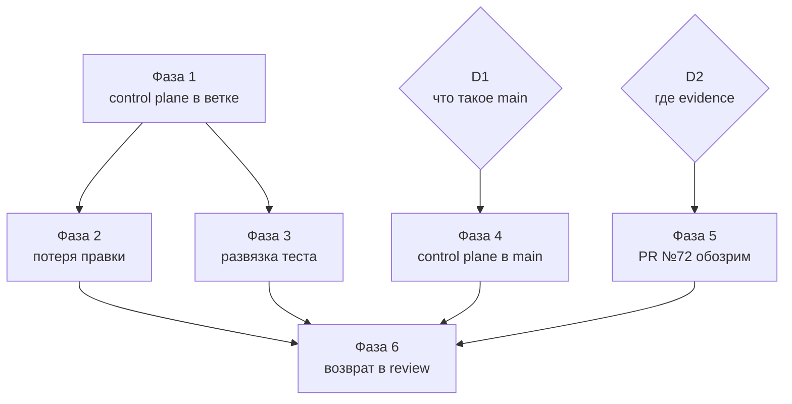

# План стабилизации ASA Lab

Спецификация. Определяет, что считается стабилизированным проектом, в каком
порядке это достигается, чем каждый шаг проверяется и что откатывается при
неудаче.

Этот документ — родительский. Детали доставки control plane в `main` вынесены в
[`CONTROL_PLANE_DELIVERY.md`](CONTROL_PLANE_DELIVERY.md) как фаза 4.

Фактическое состояние живёт в [`current.yaml`](current.yaml). Здесь не
дублируются задача, ветка, PR и статус — только последовательность работ.

---

## 1. Что считать стабилизированным

Не «зелёный CI». Стабилизация достигнута, когда одновременно выполняются семь
условий, каждое из которых проверяется командой, а не мнением.

| # | Условие | Проверка |
|---|---|---|
| S1 | Свежий clone `main` направляет агента к актуальной задаче | `grep -c "agent/r2-creator-portal" START_HERE_FOR_AI.md` → `0` |
| S2 | Состояние согласовано с Git и GitHub на `main` и на продуктовой ветке | `pnpm control-plane:check` → PASS в обеих |
| S3 | Записанные результаты gates соответствуют фактическим | входит в S2; расхождение даёт FAIL |
| S4 | Оба gate зелёные на голове продуктовой ветки | `gate:repository`, `gate:electronics-m1`, `gate:electronics-m1:browser` |
| S5 | Открытых блокеров нет, либо каждый имеет решение владельца | `blocking` в `current.yaml` |
| S6 | PR продуктовой задачи является единицей ревью | код и evidence разделены |
| S7 | Каждая зарегистрированная команда gate существует и определена один раз | `validate_test_catalog.py` |

Пока хотя бы одно не выполнено, заявлять release candidate нельзя независимо от
цвета CI.

## 2. Чего этот план не делает

- не начинает продуктовых работ, включая Tinkercad-паритет и R4-M2;
- не сливает PR №72 в `main`;
- не трогает PR №29 и ветку `assistant/map-ux-owner-view`;
- не исправляет инженерные риски вне пути стабилизации: обусловленность
  MNA-матрицы, клиентские `internalConnections` как граница доверия автогрейдинга,
  семантика `totalSourceCurrent`, отсутствие off-состояния у SPDT. Они
  зарегистрированы и ждут отдельной задачи;
- не меняет tenant/RLS-модель и не выполняет destructive-миграции.

## 3. Корень проблемы

Стабилизировать надо не код. Код работоспособен: солвер честный, fail-closed,
инварианты симуляции выполняются, серверная перепроверка существует.

Разъехалось управление. Состояние выполнения было продублировано минимум в пяти
местах, и каждая задача обновляла своё подмножество. Валидатор, обязанный
ловить рассинхрон, содержал шестую копию константой. Из этого следовали все
наблюдаемые симптомы: точка входа уводила в завершённую ветку, тело PR описывало
устаревшую голову, локальный gate и CI проверяли разные вещи, статус `in_review`
не соответствовал красному gate.

Поэтому порядок фаз таков: сначала механизм, затем продукт. Обратный порядок
уже приводил к тому, что исправления накапливались в ветке, состояние которой
никто не мог достоверно назвать.

## 4. Решения владельца

Фазы 4 и 5 не начинаются, пока не приняты соответствующие решения.

### D1 — что такое `main`

Нужно для фазы 4.

| Вариант | Следствие |
|---|---|
| **A. `main` знает о работе в полёте** | В манифест и карту `main` добавляются governance-записи задач R3A и M1: id, Issue, ветка, статус. Кода R4 не добавляется. `current.yaml` на `main` становится непротиворечивым, S1 и S2 достижимы сразу |
| **B. `main` — только снимок влитого** | `current.yaml` на `main` не может назвать активную задачу без противоречия манифесту. Тогда S1 решается иначе: `START_HERE_FOR_AI.md` на `main` говорит «активной задачи в этой ветке нет, спроси владельца», а полный control plane приходит только с merge продуктовой ветки |

Рекомендация — **A**. Вариант B оставляет `main` без ответа на вопрос «что сейчас
делается», а именно отсутствие этого ответа и уводило агентов не туда.

### D2 — где живёт evidence

Нужно для фазы 5.

| Вариант | Следствие |
|---|---|
| **A. Артефакты сборки** | Скриншоты, contact sheets, полные hash-инвентари и генерируемые манифесты уезжают в GitHub Actions artifacts или в release evidence. В diff остаются код и минимальный runtime-манифест |
| **B. Отдельная ветка evidence** | Артефакты хранятся в Git, но вне продуктового PR |
| **C. Оставить как есть** | PR №72 остаётся 810-файловым; S6 недостижим |

Рекомендация — **A**. Из 810 файлов PR №72 733 — SVG и PNG, а из непроходящих в
ассеты вставок около 110 000 строк приходится на четыре генерируемых JSON-манифеста.
Рукописного кода порядка двадцати файлов.

### D3 — порядок merge фаз 1 и 2

Технически независимы. Рекомендация — сначала фаза 1: после неё общий gate ветки
фазы 2 становится зелёным сам, без изменений в ней.

## 5. Фазы

Каждая фаза завершается проверкой. Фаза считается выполненной только когда её
проверка прошла, а не когда изменения влиты.

### Фаза 1 — control plane в продуктовой ветке

**Что.** Merge PR №73 в `agent/r4-electronics-m1`.

**Зачем.** Пока control plane живёт только в recovery-ветке, продуктовая ветка
продолжает нести старый `AGENTS.md` со статусом `in_review` и не имеет
`current.yaml`, на который уже ссылается тело PR №72. Это внутреннее
противоречие ветки.

**После merge — обязательный transition-коммит.** Merge создаёт условие, но не
меняет состояние. Требуется отдельное изменение:

```text
current.yaml  gates.general.last_known: FAIL → PASS
current.yaml  удалить BLOCK-GENERAL-GATE
PR №72 body   новый head
```

Забыть его нельзя: сверка `gates.last_known` с фактическим conclusion workflow
превратит устаревшую запись в FAIL, а не в незамеченную ложь.

**Проверка.**

```bash
NX_SKIP_NX_CACHE=true pnpm gate:repository
pnpm control-plane:check          # с авторизованным gh
```

**Откат.** Revert merge-коммита. Ветка возвращается к `5314aad`; PR №73 остаётся
открытым.

**Риск.** Низкий. 24 файла, продуктового кода — три строки в `netlist.ts`,
покрытые существующими тестами детерминизма.

---

### Фаза 2 — устранение потери правки

**Что.** Merge PR №74 в `agent/r4-electronics-m1`, затем transition-коммит,
закрывающий `BLOCK-E2E-AUTOSAVE-RACE`.

**Зачем.** Это единственный известный дефект, при котором пользователь теряет
работу: завершившееся сохранение могло поручиться за более новый документ, и
checkpoint сразу после правки сохранял предыдущий. Редактор при этом показывал
«Все изменения сохранены».

**Проверка.**

```bash
NX_SKIP_NX_CACHE=true pnpm gate:electronics-m1
pnpm gate:electronics-m1:browser   # пять прогонов подряд
NX_SKIP_NX_CACHE=true pnpm gate:repository
```

Пять прогонов, а не один: дефект проявлялся как гонка, и единственный зелёный
прогон её не опровергает.

**Откат.** Revert merge-коммита; блокер возвращается в `current.yaml`.

**Риск.** Средний. Переписан путь сохранения, от которого зависят все
persistence-тесты. Смягчение: полный набор Vitest уже прошёл на этой ветке —
417 из 418, единственное падение унаследовано из базы и устраняется фазой 1.

---

### Фаза 3 — развязка persistence-теста и физики солвера

**Что.** `tests/portal/projects-api.spec.ts` перестаёт проверять численную
модель LED. Тест сохранения проверяет:

```text
saved result == reloaded result
документ переживает перезагрузку без изменений
```

Численная правильность остаётся в `contexts/electronics/testing/solver.spec.ts`.

**Зачем.** Дважды за одну неделю изменение физики LED ломало тест, который
физику проверять не должен. Пока связанность сохраняется, следующее изменение
модели снова остановит общий gate по ложной причине. Именованные константы,
внесённые в фазе 1, делают падение понятным, но не устраняют его причину.

**Проверка.**

```bash
NX_SKIP_NX_CACHE=true pnpm gate:data
```

и целевая проверка: изменить `LED_KNEE_VOLTAGE.red` локально — `solver.spec.ts`
обязан упасть, `projects-api.spec.ts` обязан остаться зелёным. Изменение
откатывается.

**Откат.** Тривиальный, изменение изолировано в одном тесте.

**Риск.** Низкий.

---

### Фаза 4 — control plane в `main`

**Что.** Repo-wide слой доставляется в `main` отдельной веткой от `main`.
Пошагово — в [`CONTROL_PLANE_DELIVERY.md`](CONTROL_PLANE_DELIVERY.md).

**Предусловие.** Решение **D1**.

**Зачем.** Это единственная фаза, закрывающая S1. Пока она не выполнена, свежий
clone `main` продолжает отправлять агента в завершённую R2-ветку, и проект
нельзя называть стабилизированным целиком, какими бы зелёными ни были ветки.

**Ключевое ограничение, определяющее форму решения.** Реестр тестов активной
задачи ссылается на спеки, лежащие в ветке задачи. Положить его на `main` без
кода R4 нельзя — проверка исполнимости упадёт справедливо. Отсюда двухслойная
модель: `main` несёт постоянный вход, политику, валидаторы, gate-скрипты,
стабильный и плановый каталоги и `current.yaml`; ветка задачи несёт свой реестр,
workflow и evidence.

**Проверка.**

```bash
git clone <repo> /tmp/fresh && cd /tmp/fresh
grep -c "agent/r2-creator-portal" START_HERE_FOR_AI.md   # 0
pnpm control-plane:check                                  # PASS
```

Проверять именно на свежем clone, а не в рабочей копии: симптом состоял в том,
что видит новый агент.

**Откат.** Revert PR. `main` возвращается к `67b4f8e`.

**Риск.** Средний — затрагивает каноническую ветку. Смягчение: продуктового кода
не переносится вовсе.

---

### Фаза 5 — PR №72 как единица ревью

**Что.** Разделение code и evidence в продуктовом PR.

**Предусловие.** Решение **D2**.

**Зачем.** 810 файлов и почти 400 000 вставок нельзя отревьюить. Несколько тысяч
строк содержательной работы утоплены в ассетах и генерируемых манифестах. Пока
это так, S6 недостижим, а owner acceptance опирается не на ревью, а на доверие.

**Проверка.**

```text
changed files в PR №72   < 100
рукописный код виден в diff без фильтров
evidence доступен по ссылке и воспроизводим
```

**Откат.** Evidence не удаляется, а перемещается; при откате возвращается на
место.

**Риск.** Средний. Требует аккуратности с `owner-supplied/**` и
`owner-audit/**` — эти каталоги неприкосновенны согласно `AGENTS.md` §3.

---

### Фаза 6 — возврат задачи в review

**Что.** Перевод `TASK-ELECTRONICS-M1-001` в `in_review` одним явным переходом.

**Предусловие.** S1–S7 выполнены.

**Зачем.** Статус `in_review` означает «результат готов к решению владельца».
Ранее он был выставлен при красном общем gate и устаревшем теле PR, то есть не
соответствовал действительности. Возврат допустим только когда каждое условие
из раздела 1 проверено командой.

**Проверка.** Все семь условий раздела 1, выполненные подряд и приложенные к
переходу как evidence, с `NX_SKIP_NX_CACHE=true`.

**Откат.** Возврат в `in_progress` — это штатный переход, а не авария.

## 6. Сквозное требование: один писатель

Не фаза, а условие выполнения всех фаз.

Во время этой работы два агента одновременно писали в одно рабочее дерево на
одной ветке. Ущерба не возникло только потому, что один из них коммитил по
явному списку путей. Один `git add .` смешал бы две несвязанные работы в одном
коммите.

`execution_lease` валидирует запись о том, кто имеет право писать. Он не может
запретить запись на диск. Механическое решение одно:

```bash
git worktree add ../asa-lab-<задача> -b <ветка>
```

Каждый параллельный исполнитель работает в своём каталоге. Общее рабочее дерево
принадлежит держателю лиза.

## 7. Порядок и зависимости



Фазы 4 и 5 не зависят от 1–3 и могут идти параллельно, как только приняты
решения. Фаза 6 требует всех.

## 8. Как понять, что план провалился

Признаки, при которых нужно остановиться и пересобрать план, а не продолжать:

- `control-plane:check` начинает пропускать проверки вместо того, чтобы падать;
- появляется второе место, где записана активная задача;
- gate объявляется пройденным по кэшированному результату;
- в `blocking` появляется запись без проверяемого условия выхода;
- продуктовая работа начинается до фазы 6.

Каждый из них уже случался в этом проекте. Именно они, а не дефекты кода,
привели к состоянию, потребовавшему стабилизации.
