# ASA Lab — Capability Map

Человекочитаемое представление [`CAPABILITY_MAP.yaml`](CAPABILITY_MAP.yaml). YAML является источником capability IDs, dependencies и release slices. Практическая task-очередь находится в [`../delivery/DEVELOPMENT_PROGRAM_V1.md`](../delivery/DEVELOPMENT_PROGRAM_V1.md).

## 1. Главное определение

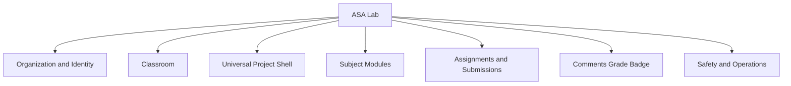

> Один Classroom Core, один Project lifecycle и один Submission/Review lifecycle — множество независимых предметных модулей.

## 2. Исполнимая последовательность возможностей

```mermaid
flowchart LR
    R0[RELEASE-0 Foundation]
    R1[RELEASE-1 Teacher Portal]
    R2[RELEASE-2 Project Shell]
    R3[RELEASE-3 Checkers Lite]
    R4[RELEASE-4 Electronics Alpha]
    R5[RELEASE-5 Child Access]
    R6[RELEASE-6 Assignment Submission]
    R7[RELEASE-7 Review Grade Badge]
    R8[RELEASE-8 Electronics Classroom]
    R9[RELEASE-9 Product Expansion]
    R10[RELEASE-10 Additional Modules]
    R11[RELEASE-11 Multi-school Scale]

    R0 --> R1 --> R2 --> R3 --> R4 --> R5 --> R6 --> R7 --> R8 --> R9 --> R10 --> R11
```

Dependency capability обязана находиться в том же или более раннем release. Это проверяет `tools/validate_capability_map.py`.

## 3. RELEASE-0 — Foundation

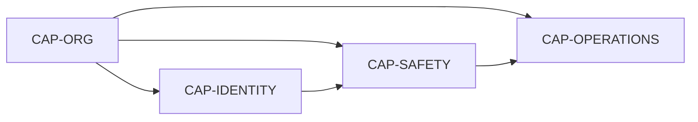

Результат:

- organizations/tenants;
- adult identity;
- session and tenant context;
- safety/audit baseline;
- reproducible local operation.

## 4. RELEASE-1 — Teacher Portal

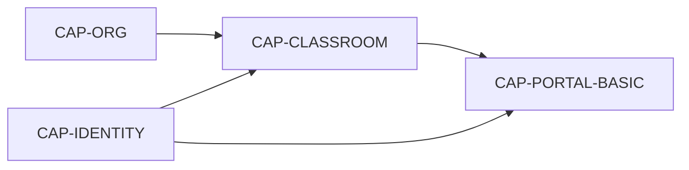

Flow:

```text
teacher login
→ «Мои классы»
→ create classroom
→ reload
→ logout
```

`CAP-PORTAL-BASIC` не зависит от Assignments или Review. Расширенный dashboard находится в более позднем release.

## 5. RELEASE-2 — Universal Project Shell

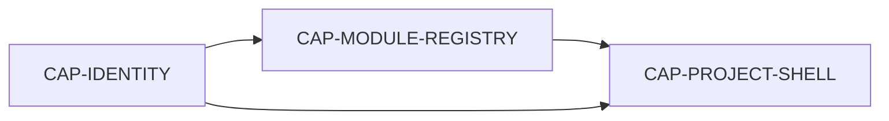

Flow:

```text
create project
→ select module
→ save ProjectDraft
→ reload
→ immutable ProjectVersion checkpoint
```

Минимальный Module Registry содержит manifest, schemas, editor/viewer routes, validator и preview provider. Worker infrastructure, export и general autograding не требуются.

## 6. RELEASE-3 — Checkers Lite Reference Module

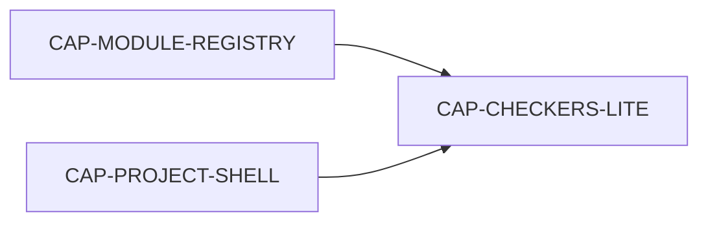

Checkers Lite доказывает расширяемость:

```text
8×8 board
→ one legal move
→ validation
→ save/reload
→ preview
```

Это не приоритетный предметный продукт и не полный chess engine.

## 7. RELEASE-4 — Electronics Alpha

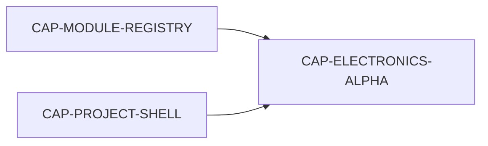

Flow:

```text
source + resistor + LED + wire
→ connectivity/netlist
→ simple deterministic DC calculation
→ diagnostics
→ save/reload
```

Electronics Alpha не зависит от general Autograding. Breadboard, transient, Arduino и instruments относятся к `CAP-ELECTRONICS-ADVANCED`.

## 8. RELEASE-5 — Child Access

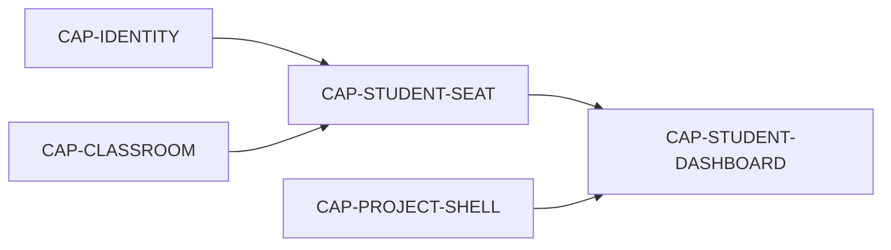

Flow:

```text
teacher issues card
→ child login without email
→ own class and project
→ credential reset
→ old session denied
```

## 9. RELEASE-6 — Assignment and Submission

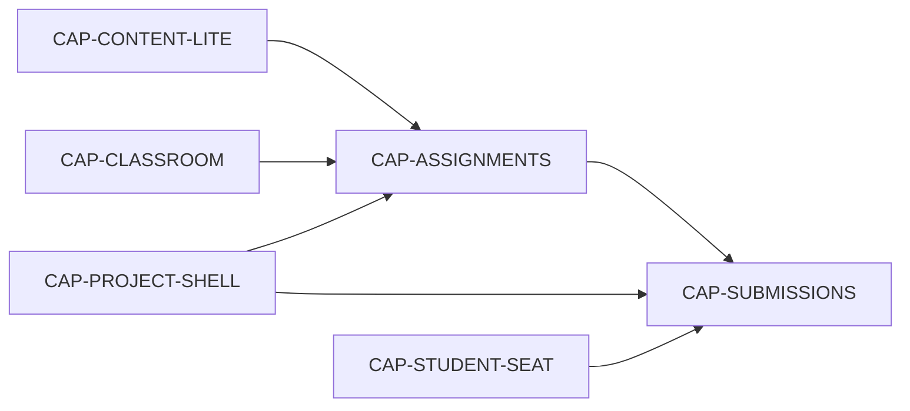

`CAP-CONTENT-LITE` содержит только:

```text
ActivityTemplate
→ immutable ActivityVersion
```

Full Program/Course/Unit/Lesson authoring относится к `CAP-CONTENT-ADVANCED`.

## 10. RELEASE-7 — Review, Grade and Badge

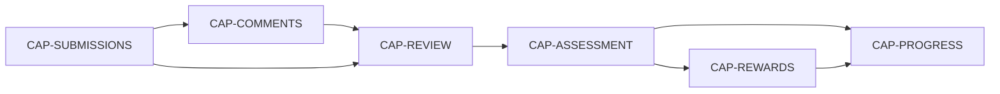

Flow:

```text
anchored comment
→ request changes
→ resubmit
→ compare
→ accept
→ rubric/grade
→ badge/progress
```

## 11. RELEASE-8 — Full Electronics Classroom Cycle

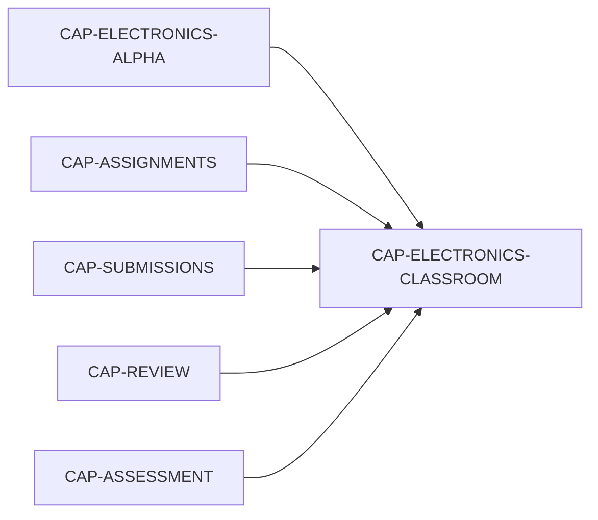

Flow:

```text
teacher assigns circuit
→ child builds and submits
→ teacher comments
→ child corrects
→ accept/grade/badge
```

## 12. Expansion after the first pilot

### Product Expansion

- `CAP-NOTIFICATIONS`;
- `CAP-TEACHER-DASHBOARD`;
- `CAP-CONTENT-ADVANCED`;
- `CAP-AUTOGRADING`;
- `CAP-ELECTRONICS-ADVANCED`;
- `CAP-BLOCK-CODING`;
- `CAP-ANALYTICS`;
- `CAP-ADMIN`.

### Additional Modules

- `CAP-THREE-D`;
- `CAP-ROBOTICS`;
- `CAP-CHESS`;
- `CAP-DRAWING`.

### Scale

- `CAP-ENTITLEMENTS`.

Эти capabilities не добавляются в задачи Product Alpha/School Pilot через чат.

## 13. Teacher and Child experiences

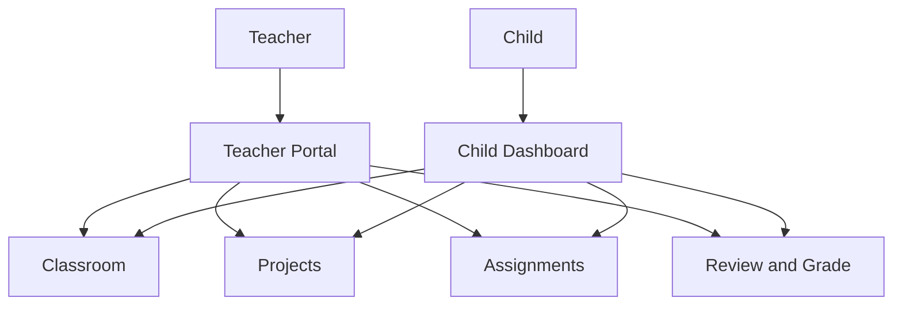

## 14. Module boundary

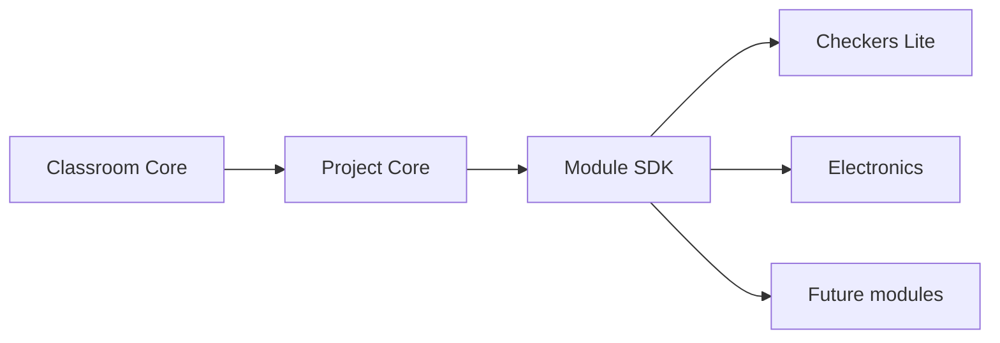

Core знает universal envelope и lifecycle. Subject payload остаётся внутри модуля.

## 15. Правило для Issues и PR

Каждая executable Issue перечисляет:

```text
CAPABILITIES
USER_FLOW
DEPENDENCIES
SCOPE
NON_GOALS
PORTS
TEST IDs
ACCEPTANCE
```

Каждый PR указывает:

- какие capabilities реализованы;
- какой flow доказан;
- какие non-goals отсутствуют;
- какие dependencies подтверждены;
- какие карты и contracts обновлены;
- какие тесты фактически PASS.

Новый capability сначала добавляется в YAML и Development Program, затем в Issue. Чат не создаёт новый scope.