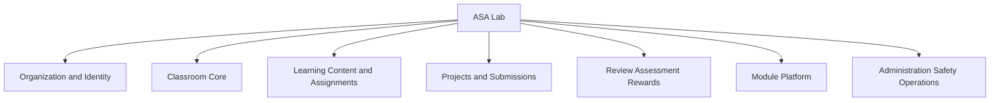
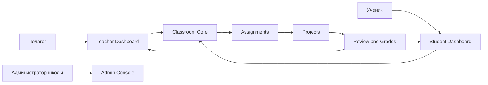
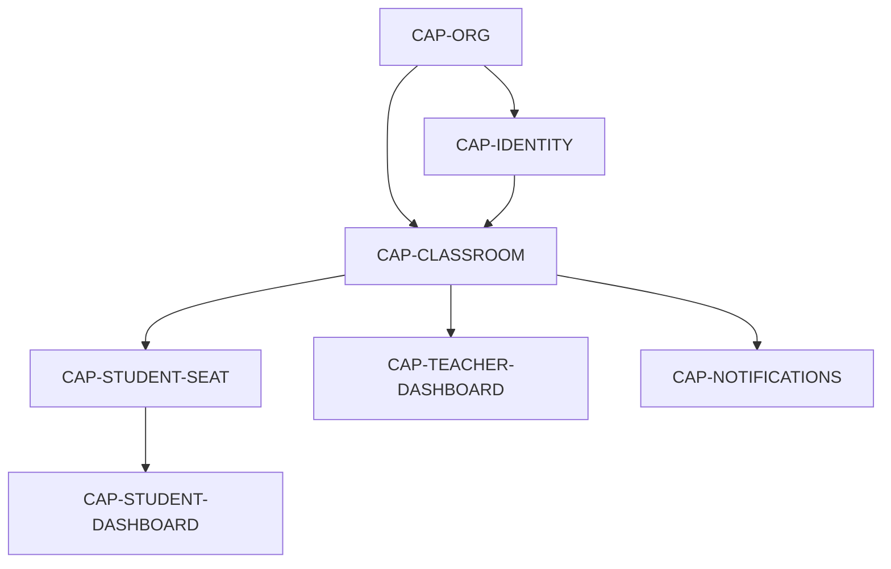
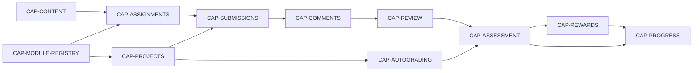
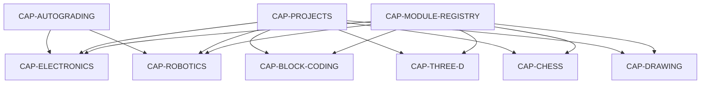
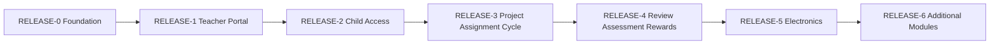
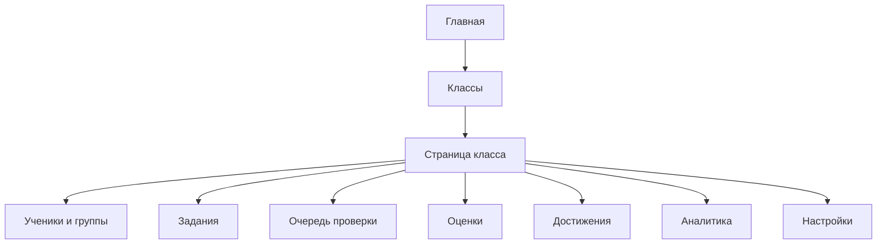
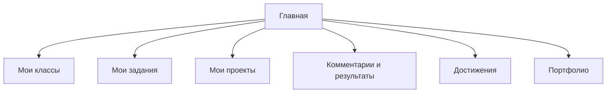
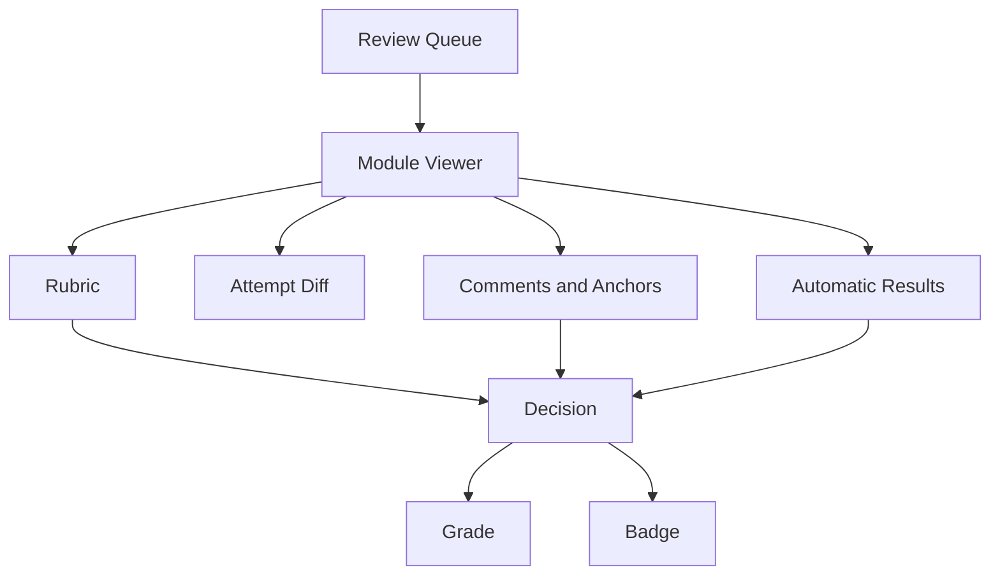

# ASA Lab — Capability Map

Человекочитаемое представление [`CAPABILITY_MAP.yaml`](CAPABILITY_MAP.yaml). Машиночитаемый YAML является источником истины для capability IDs, зависимостей и целевых релизов.

## 1. Определение системы



ASA Lab — это образовательная workspace platform. Классы, задания, версии, комментарии, оценки и достижения принадлежат платформе. Электроника, блочное программирование, 3D, робототехника и шахматы являются подключаемыми предметными средами.

## 2. Пользовательский контур



## 3. Жизненный цикл обучения

```mermaid
flowchart LR
    C1[Teacher creates class]
    C2[Teacher issues StudentSeats]
    C3[Teacher assigns activity]
    C4[Student opens module]
    C5[Autosave and versions]
    C6[Submit immutable version]
    C7[Automatic checks]
    C8[Teacher comments]
    C9[Return or accept]
    C10[Grade and badge]
    C11[Progress updated]

    C1 --> C2 --> C3 --> C4 --> C5 --> C6 --> C7 --> C8 --> C9 --> C10 --> C11
    C9 -->|changes requested| C4
```



## 4. Classroom capabilities



## 5. Задания, проекты и проверка



## 6. Предметные модули



## 7. Релизная последовательность



### RELEASE-0 — Foundation

- organization and tenancy;
- adult identity;
- safety baseline;
- operations baseline.

### RELEASE-1 — Teacher Portal

- login;
- teacher dashboard;
- classroom lifecycle;
- basic notifications.

### RELEASE-2 — Child Access

- StudentSeat;
- class code/QR;
- student dashboard;
- child login without email.

### RELEASE-3 — Universal project and assignment cycle

- Module Registry;
- Project envelope;
- autosave and immutable versions;
- activity and assignment;
- submission attempt.

### RELEASE-4 — Review, assessment and rewards

- comments and annotations;
- review queue;
- rubric;
- grade;
- badge;
- progress.

### RELEASE-5 — Electronics

- circuit editor;
- simulation;
- autograding;
- complete classroom workflow.

### RELEASE-6 — Additional modules

- block coding;
- 3D;
- robotics;
- chess/checkers;
- drawing/drafting.

## 8. Карта кабинета педагога



## 9. Карта кабинета ученика



## 10. Карта проверки работы



## 11. Правило использования capability IDs

Каждая продуктовая Issue должна содержать раздел:

```text
CAPABILITIES:
- CAP-...
- CAP-...
```

Каждый PR должен указать:

- какие capabilities реализует;
- какие не реализует;
- какие зависимости capabilities подтверждены;
- какие пользовательские flows изменены;
- какие карты обновлены.

Новый capability сначала добавляется в `CAPABILITY_MAP.yaml`, затем в Issue. Чат не является источником нового scope.
