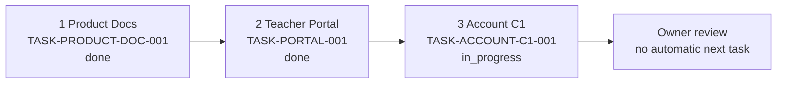
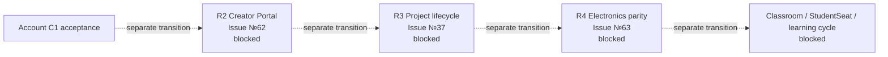
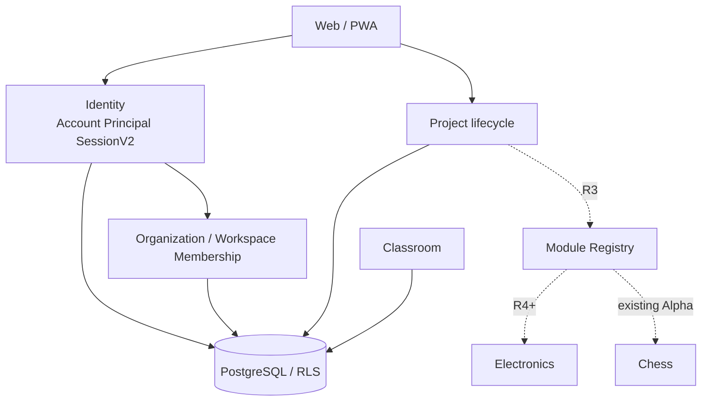

# Карта проекта ASA Lab

Человекочитаемое представление [`project-map.yaml`](project-map.yaml).

Связанные источники:

- [`../delivery/EXECUTION_MANIFEST.yaml`](../delivery/EXECUTION_MANIFEST.yaml) — единственная executable queue;
- [`../delivery/DEVELOPMENT_PROGRAM_V1.md`](../delivery/DEVELOPMENT_PROGRAM_V1.md) — текущая программа и owner-gated roadmap;
- [`QUALITY_MAP.md`](QUALITY_MAP.md) — обязательные gates;
- [`viewer.html`](viewer.html) — интерактивный граф.

## Текущее состояние

```text
accepted technical Alpha baseline:
7afebdcf9441b027092ce17a37f1f89950af99c6

current_focus:
TASK-ACCOUNT-C1-001

canonical branch:
assistant/docker-linux-bootstrap
```

Функциональная полнота не заявляется. `main` пока содержит более старый baseline.

## Исполняемая очередь



После Account C1 поле `next_task` равно `null`. Coding-агент не имеет права самостоятельно выбрать Electronics или другую capability.

## Owner-gated roadmap



Roadmap arrows are not executable transitions. Каждый этап требует owner acceptance и отдельной синхронной правки manifest/map/Issue/test catalog.

## Текущий Account C1

Уже интегрировано и сохраняется:

- public entry;
- adult registration;
- Account / Profile / Principal;
- Personal Workspace;
- sessions_v2;
- login по email или username;
- legacy teacher compatibility;
- principal-aware project ownership;
- Project Hub, Electronics, Chess и Chess Online.

Оставшийся результат:

```text
educator self-attestation
→ provisional audited educator capability
→ workspaces
→ safe ActiveContext switch
→ account menu/profile
→ email verification state
→ active sessions
→ revoke one/all other sessions
→ real Chromium Account C1 evidence
```

## Архитектурные границы



Главные инварианты:

- Account, Principal, Workspace, capability и membership различаются;
- tenant/workspace context определяется сервером;
- Personal Project не требует Classroom;
- Account session не объединяется с будущей StudentSeat session;
- migrations additive-only до отдельного destructive gate;
- subject logic не импортируется в Classroom/Project Core;
- существующие педагог, классы, проекты и drafts сохраняются.

## Исторические task nodes

Старые `TASK-ELECTRONICS-SLICE-001`, `TASK-CHECKERS-LITE-001` и `TASK-ELECTRONICS-ALPHA-001` остаются в YAML/test catalog для traceability, но помечены `deprecated` и отсутствуют в `execution_queue`.

Полезные реализации уже перенесены в единую Alpha-линию. Будущее расширение Electronics выполняется по R4 / Issue №63, а не через автоматическое возобновление старой ветки.

## Quality state

- local baseline gate на `7afebdc…`: PASS;
- GitHub workflow definition: опубликован;
- GitHub hosted runner: BLOCKED до первого step, logs отсутствуют;
- текущий docs/governance head не имеет нового runtime/Playwright PASS;
- Account C1 focused tests должны быть реализованы и затем выполнены;
- старый PASS нельзя переносить на новый product SHA.

## Map protocol

### Start

- current task → `in_progress`;
- `current_focus` остаётся task;
- roadmap остаётся blocked.

### Draft review

- task → `in_review` только после focused PASS и owner-visible result;
- Project Map, Quality Map, test catalog и Nx graph синхронизированы;
- PR остаётся Draft.

### After acceptance

- owner определяет convergence/merge action;
- task может стать `done` только после принятого gate;
- отдельный governance transition решает, активировать ли R2;
- coding-агент останавливается.

## Канонические порты

```text
Web  http://127.0.0.1:4610
API  http://127.0.0.1:4611
E2E  http://127.0.0.1:4612
```

Запрещены `3000`, `3100`, `5173`. Чужие процессы и контейнеры не останавливаются.
