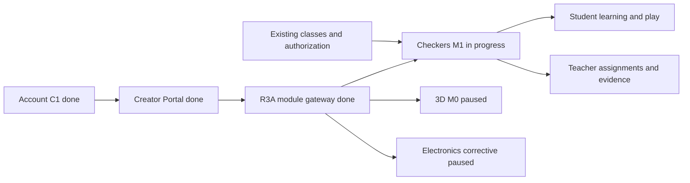

# Карта проекта ASA Lab

Source: [`project-map.yaml`](project-map.yaml)

Execution: [`../delivery/EXECUTION_MANIFEST.yaml`](../delivery/EXECUTION_MANIFEST.yaml)

State of record: [`../execution/current.yaml`](../execution/current.yaml)

## Current focus

Rendered from the control plane. Do not edit these values here independently;
`pnpm control-plane:check` fails when they drift.

```text
TASK-CHECKERS-M1-001
Issue #98
branch agent/checkers-education-m1
status in_progress
checkpoint market_and_product_contract
execution lease codex-checkers-m1
```

The owner activated an independent educational Russian-draughts system. 3D PR
#95 and Electronics PR #92 remain open and Draft/paused; neither is merged or
reported complete. Chess remains a separate subject module and is not modified.



The active product loop is:

```text
student enters Checkers
→ continue learning or assigned work
→ solve a position or play a legal Russian-draughts game
→ receive evidence-based review and progress
→ teacher sees exact attempt/game/move evidence
→ authorised classmates may play with predefined reactions only
```

The module owns its rule, learning, bot and safe-interaction data. Project Core
remains subject-neutral. Child-to-child free-form chat, direct messages, public
profiles and unrestricted public matchmaking are prohibited.

## Quality gate

See [`QUALITY_MAP.md`](QUALITY_MAP.md) and
[`../testing/active-task-tests.yaml`](../testing/active-task-tests.yaml). The
focused gate covers official rules, project lifecycle, curriculum/assignments,
bot calibration, class safety and desktop/tablet/mobile journeys.

## Ports

```text
Web  127.0.0.1:4610
API  127.0.0.1:4611
E2E  127.0.0.1:4612
```
