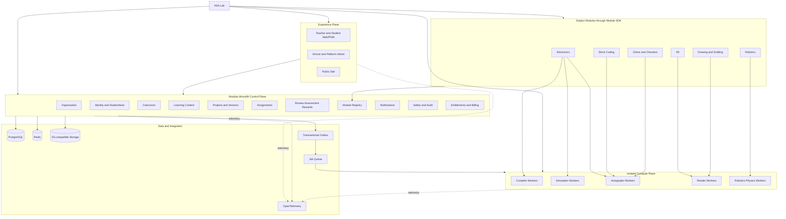
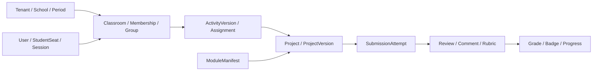
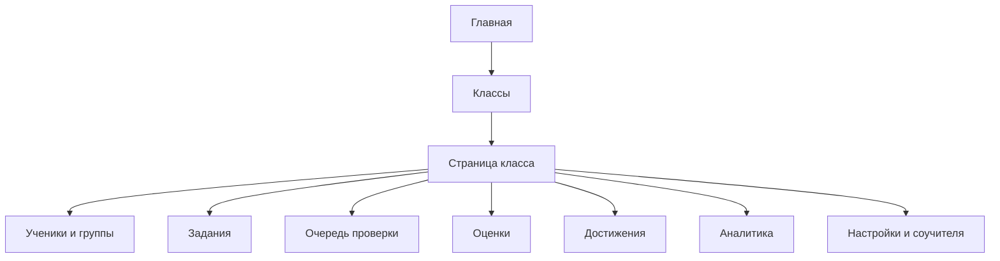
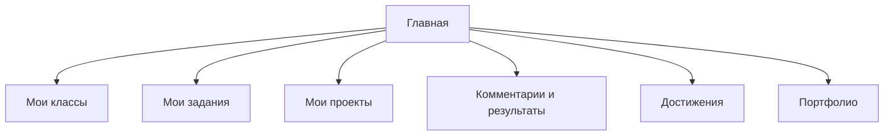
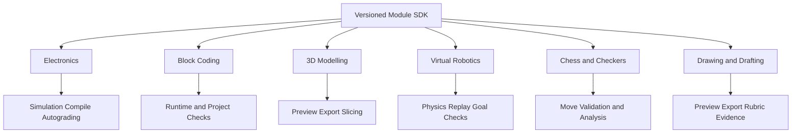
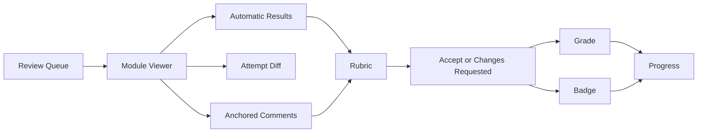
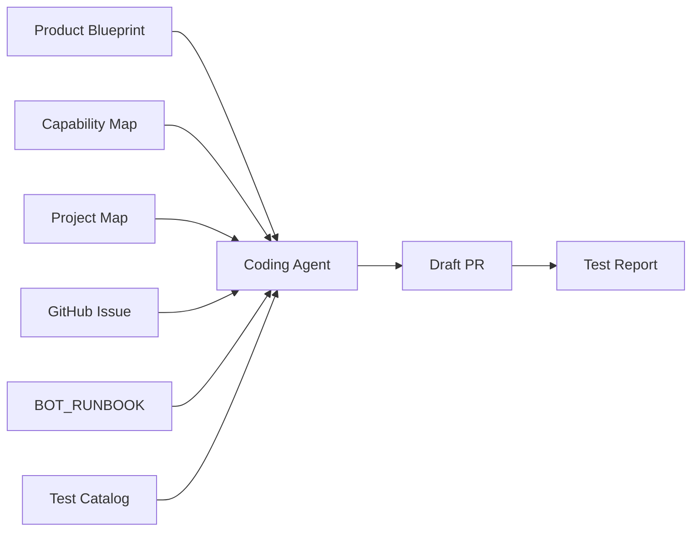

# Карта проекта ASA Lab

Эта страница — человекочитаемое представление [`project-map.yaml`](project-map.yaml). Она отвечает на вопросы:

1. какую конечную образовательную систему мы строим;
2. из каких контуров она состоит;
3. какие задачи и capabilities зависят друг от друга;
4. какая задача активна;
5. что coding-агент должен делать следующим.

Продуктовая карта возможностей находится в [`../product/CAPABILITY_MAP.md`](../product/CAPABILITY_MAP.md), а её машиночитаемый источник — [`../product/CAPABILITY_MAP.yaml`](../product/CAPABILITY_MAP.yaml). Для Obsidian-подобного режима архитектуры и задач откройте [`viewer.html`](viewer.html). Карта проверок находится в [`QUALITY_MAP.md`](QUALITY_MAP.md).

## Текущий фокус

```text
TASK-CI-001            done
TASK-GOV-001           done
TASK-ARCH-001          done
TASK-BOOT-001          done
TASK-ENV-001           deprecated
TASK-TEN-001           deprecated
TASK-CLS-001           deprecated
        ↓
TASK-PRODUCT-DOC-001   ← текущий фокус: Product Blueprint и Capability Map
        ↓
TASK-MVP-001           Teacher Portal v0.1
        ↓
TASK-SEAT-001          StudentSeat и кабинет ребёнка
        ↓
TASK-MOD-001           Module Registry и универсальные проекты
        ↓
TASK-ACT-001           Задания и immutable submissions
        ↓
TASK-REVIEW-001        Комментарии, review, оценки и badges
        ↓
TASK-ELEC-001          Первый полный electronics learning cycle
```

Текущая задача: [Issue №19 — Product Blueprint and Capability Map](https://github.com/spikeal8-maker/asa-lab/issues/19). Следующая продуктовая задача после принятия документации: [Issue №18 — Teacher Portal v0.1](https://github.com/spikeal8-maker/asa-lab/issues/18).

## 1. Определение платформы



## 2. Основной образовательный цикл

```mermaid
flowchart LR
    C1[Teacher creates classroom]
    C2[Teacher issues StudentSeats]
    C3[Teacher assigns ActivityVersion]
    C4[Student opens subject module]
    C5[Project autosave and checkpoints]
    C6[Submit immutable ProjectVersion]
    C7[Automatic checks]
    C8[Teacher review and comments]
    C9[Return or accept]
    C10[Rubric grade and badge]
    C11[Progress updated]

    C1 --> C2 --> C3 --> C4 --> C5 --> C6 --> C7 --> C8 --> C9 --> C10 --> C11
    C9 -->|changes requested| C4
```



## 3. Classroom Core



Classroom Core владеет образовательным процессом, но не предметным payload. Электроника, sprites, шахматные ходы и 3D meshes остаются внутри соответствующих модулей.

## 4. Кабинет педагога



## 5. Кабинет ученика



## 6. Предметные среды



## 7. Проверка работы



## 8. Продуктовая релизная карта

```mermaid
flowchart LR
    P0["Foundation"]
    P1["Teacher Portal"]
    P2["Child Access"]
    P3["Modules Projects Assignments"]
    P4["Review Assessment Rewards"]
    P5["Electronics"]
    P6["Simulation and Arduino"]
    P7["Additional Modules"]
    P8["Pilot Hardening"]
    P9["Commercial and Multi-school"]

    P0 --> P1 --> P2 --> P3 --> P4 --> P5 --> P6 --> P7 --> P8 --> P9
```



### Foundation

Репозиторий, architecture rules, migrations, contracts, identity/tenant foundation.

### Teacher Portal

Вход педагога, React-кабинет, classroom lifecycle, owner membership, RLS и audit.

### Child Access

StudentSeat, карточки/QR, вход без email, Student Dashboard.

### Modules, Projects and Assignments

Module Registry, Project envelope, immutable versions, ActivityVersion, Assignment и SubmissionAttempt.

### Review, Assessment and Rewards

Комментарии, module anchors, changes requested, rubric, grade, badge и progress.

### Electronics

Редактор схем, save/reload, assignment submission, teacher viewer и basic autograding.

### Simulation and Arduino

Rust/WASM simulation, instruments, compiler workers и Arduino runtime.

### Additional Modules

Scratch-подобное блочное программирование, 3D, робототехника, шахматы, шашки, рисование и черчение.

## 9. Управление coding-агентами



Рабочий цикл:

```text
ORIENT
→ verify capability IDs and dependencies
→ PLAN user flow and non-goals
→ IMPLEMENT one vertical slice
→ VERIFY
→ UPDATE capability/project/quality maps
→ DRAFT PR
→ REVIEW
→ MERGE
→ NEXT TASK
```

## 10. Карты, работающие вместе

| Карта | Отвечает на вопрос | Источник истины |
|---|---|---|
| Product Capability Map | Что должна уметь конечная платформа | `docs/product/CAPABILITY_MAP.yaml` |
| Project Knowledge Graph | Что реализуем сейчас и какие задачи зависят друг от друга | `project-map.yaml` |
| Quality Map | Чем доказывается готовность | `QUALITY_MAP.md` + `test-catalog.yaml` |
| C4 Architecture Model | Как устроены системы и deployment | `docs/architecture/structurizr/workspace.dsl` |
| Nx Project Graph | Как фактически зависит код | `nx-project-graph.json` |

## 11. Обязательное правило актуальности

Карта меняется в том же Pull Request, если PR:

- добавляет или меняет capability;
- меняет пользовательский flow;
- добавляет приложение, bounded context, worker, data store или предметный модуль;
- меняет архитектурную зависимость;
- добавляет ADR, фазу, task, test registry или exit gate;
- начинает, блокирует, завершает или заменяет задачу;
- переносит ответственность между модулями;
- меняет путь нормативного документа.

Задача не получает статус `done`, пока её user flow, capability boundary, exit gate и test IDs не подтверждены фактическими командами.
