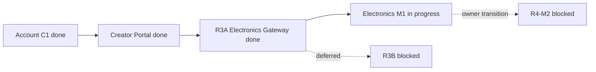

# Карта проекта ASA Lab

Source: [`project-map.yaml`](project-map.yaml)  
Execution: [`../delivery/EXECUTION_MANIFEST.yaml`](../delivery/EXECUTION_MANIFEST.yaml)  
State of record: [`../execution/current.yaml`](../execution/current.yaml)

## Current focus

Rendered from the control plane. Do not edit these values here — change
[`current.yaml`](../execution/current.yaml) and re-render, or
`pnpm control-plane:check` will fail.

```text
TASK-ELECTRONICS-M1-001
Issue #63
branch agent/module-boundary-separation
status in_progress
checkpoint post_merge_physical_alignment_corrective
execution lease assistant-stabilisation
```

The owner activated a post-merge corrective pass on the existing module-boundary
branch. It aligns owner SVG pin anchors and breadboard footprints and verifies
the live LED operating-state sweep without activating R4-M2.



R3A verified the existing server-side Module Registry, manifest/provider
registration, shared Editor Host and module-neutral personal Project lifecycle.
It does not declare full R3 completion; R3B remains blocked/deferred.

The isolated subject implementation roots are `modules/electronics`,
`modules/chess` and `modules/chess-live`. Portal and project lifecycle remain in
their own shared packages and contexts; the former `contexts/electronics` and
`contexts/chess` paths are no longer canonical module locations.

Electronics M1 is converging without new features: one fail-closed owner
catalog, one exact runtime SHA, one Compose project and one real-editor owner
flow. The current corrective checkpoint covers ordinary-LED runtime states and
zoom-stable wire/terminal presentation. R4-M2 remains blocked.

Draft persistence is now ordered. The saved indicator is derived from which
document the server is known to hold rather than set by whichever request
happened to finish, so an edit made while a save is in flight can no longer be
reported as saved and then lost by a checkpoint taken straight after it.

The canonical owner runtime assets live in `main`, delivered as their own
reviewable unit rather than inside the product pull request. Membership is the
value of a `runtimePath` key, compared as an exact path. `pnpm assets:check` fails
if a named file is absent, is not an SVG, does not hash to the value recorded
beside it, disagrees between source and runtime hashes, carries embedded raster,
a script or an external reference, escapes the asset root, or if the runtime tree
holds a file neither manifest declares.

Two manifests declare owner art, and both are checked. `owner-catalog/manifest.json`
names the 662 assets the editor loads; `owner-audit/manifest.json` records the 697
files imported from the owner archives, including the reference photographs and the
candidate drawings that document where the artwork came from. A file declared by
either is legitimate, its recorded hash is verified either way, and the two must
agree wherever they describe the same file. Reading the catalog alone once reported
35 declared, hash-pinned owner files as undeclared dead weight, which is why the
check reads both.

## Quality gate

See [`QUALITY_MAP.md`](QUALITY_MAP.md) and
[`../testing/active-task-tests.yaml`](../testing/active-task-tests.yaml).
Only focused tests run before owner visual acceptance; the final full matrix is
intentionally not active.

## Ports

```text
Web  127.0.0.1:4610
API  127.0.0.1:4611
E2E  127.0.0.1:4612
```
