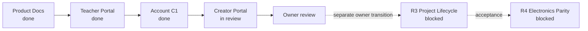
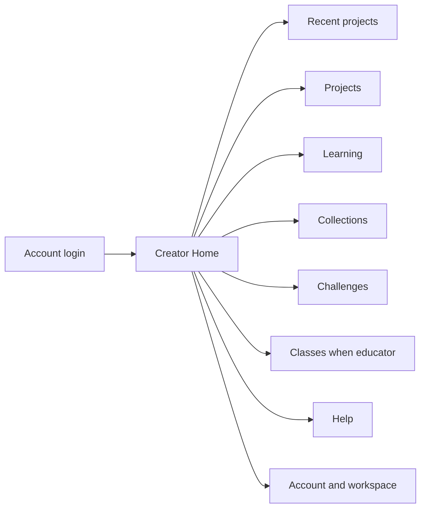
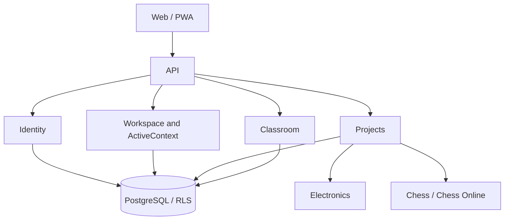

# Карта проекта ASA Lab

Source: [`project-map.yaml`](project-map.yaml)  
Execution: [`../delivery/EXECUTION_MANIFEST.yaml`](../delivery/EXECUTION_MANIFEST.yaml)

## Current focus

```text
TASK-CREATOR-PORTAL-001
Issue #62
branch agent/r2-creator-portal
status in_review
```



## R2 visible flow



## Preserved architecture



R2 changes the Portal experience. It does not create a second identity/workspace/session model and does not start R3 or R4.

## Quality gate

See [`QUALITY_MAP.md`](QUALITY_MAP.md) and [`../testing/active-task-tests.yaml`](../testing/active-task-tests.yaml).

```bash
python tools/run_task_tests.py --task TASK-CREATOR-PORTAL-001
```

## Ports

```text
Web  127.0.0.1:4610
API  127.0.0.1:4611
E2E  127.0.0.1:4612
```
