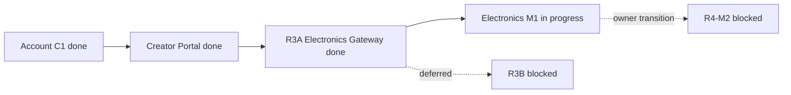

# Карта проекта ASA Lab

Source: [`project-map.yaml`](project-map.yaml)  
Execution: [`../delivery/EXECUTION_MANIFEST.yaml`](../delivery/EXECUTION_MANIFEST.yaml)

## Current focus

```text
TASK-ELECTRONICS-M1-001
Issue #63
branch agent/r4-electronics-m1
status in_review
checkpoint m1_led_visual_corrective
sole executor coding_bot
assistant role read_only_reviewer
```



R3A verified the existing server-side Module Registry, manifest/provider
registration, shared Editor Host and module-neutral personal Project lifecycle.
It does not declare full R3 completion; R3B remains blocked/deferred.

Electronics M1 is converging without new features: one fail-closed owner
catalog, one exact runtime SHA, one Compose project and one real-editor owner
flow. The current corrective checkpoint covers ordinary-LED runtime states and
zoom-stable wire/terminal presentation. R4-M2 remains blocked.

Draft persistence is now ordered. The saved indicator is derived from which
document the server is known to hold rather than set by whichever request
happened to finish, so an edit made while a save is in flight can no longer be
reported as saved and then lost by a checkpoint taken straight after it.

## Quality gate

See [`QUALITY_MAP.md`](QUALITY_MAP.md) and
[`../testing/active-task-tests.yaml`](../testing/active-task-tests.yaml).
Only focused tests run before owner visual acceptance; the final full matrix is
intentionally not active.

## Ports

```text
Web  127.0.0.1:4610
API  127.0.0.1:4611
E2E  127.0.0.1:4612
```
