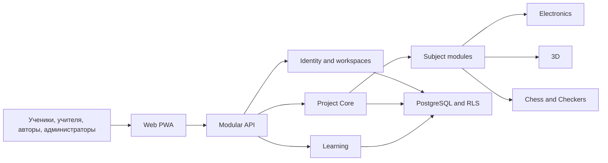

# Карта проекта ASA Lab

Структурный источник: [`project-map.yaml`](project-map.yaml).

Каталог программы: [`../delivery/EXECUTION_MANIFEST.yaml`](../delivery/EXECUTION_MANIFEST.yaml).

Живое состояние: [`docs/execution/current.yaml`](../execution/current.yaml).

```bash
pnpm agent:context --list
pnpm agent:context --scope <lane>
```

## Назначение карты

Карта фиксирует устойчивые связи: приложения, bounded contexts, хранилища,
модули, документы, этапы программы и зависимости результатов. Она не отвечает
на вопросы «кто сейчас работает», «какой checkpoint последний» и «что уже
принял владелец» — эти ответы живут только в control plane.



## Граница состояния

- `project-map.yaml` — архитектура и программа;
- `EXECUTION_MANIFEST.yaml` — каталог ожидаемых результатов;
- `current.yaml` — задача, lane, status, checkpoint, revisions и blockers;
- GitHub Actions и локальный вывод — фактические результаты gates;
- owner acceptance — отдельный факт, не выводимый из зелёного CI.

`python tools/validate_project_map.py` отклоняет поля live-state внутри карты и
проверяет структурное соответствие каталогу программы.

## Пользовательские пути Account и StudentSeat

Account → личная Главная → проекты / Знания / Моё обучение / Профиль.
Профиль разделяет восемь областей настроек; author/educator подключаются отдельными
серверными командами в «Возможностях», не сохранением имени. «Курсы и задания»
доступны автору; «Классы» — только при staff actions. Account learner остаётся
в «Моём обучении», даже если одновременно преподаёт в другом контексте.

StudentSeat → код класса + личный ключ → Моё обучение / Мои учебные работы /
Мой учебный профиль / Помощь. Общий код не является личным credential.
Связь существующего runtime: [ADR независимого контекста](../architecture/ADR-ACCESS-A-INDEPENDENT-CONTEXT.md).

## Порты разработки

```text
Web  127.0.0.1:4610
API  127.0.0.1:4611
E2E  127.0.0.1:4612
```
