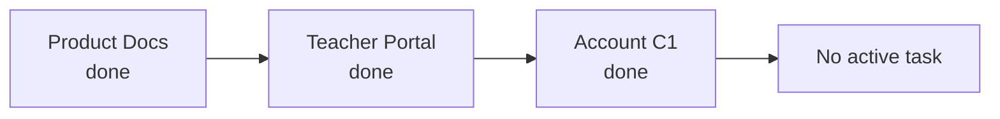
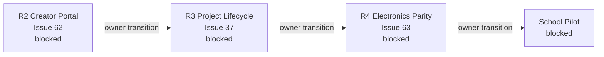
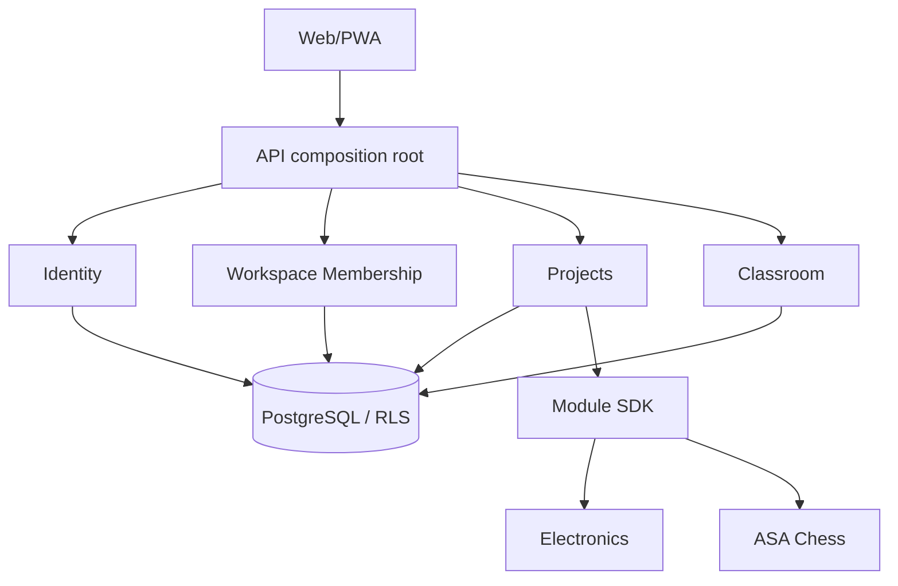

# Карта проекта ASA Lab

Человекочитаемое представление [`project-map.yaml`](project-map.yaml).

Источники:

- [`../delivery/EXECUTION_MANIFEST.yaml`](../delivery/EXECUTION_MANIFEST.yaml);
- [`../delivery/DEVELOPMENT_PROGRAM_V1.md`](../delivery/DEVELOPMENT_PROGRAM_V1.md);
- [`QUALITY_MAP.md`](QUALITY_MAP.md);
- [`viewer.html`](viewer.html).

## Каноническое состояние

```text
main:                    e01ac85095ddaabef19ed618964deac3aa5b2406
verified implementation: 35c06c42012672b9b4cb2626b85ba1f21b973bc0
PR #70:                  merged
Account C1:              done
current_focus:            null
```

Функциональная полнота всей платформы не заявляется.

## Завершённая executable queue



Coding-агент не выбирает следующий этап самостоятельно.

## Blocked roadmap



Roadmap arrows не являются executable transitions.

## Что находится в `main`

- public entry и adult registration;
- Account / Profile / Principal;
- Personal Workspace и `sessions_v2`;
- login по email или username;
- educator self-attestation и AuditEvent;
- workspace list и ActiveContext switching;
- account profile и active session management;
- legacy teacher compatibility;
- principal-aware project ownership;
- Project Hub, Electronics, ASA Chess и Chess Online;
- PostgreSQL/RLS/additive migrations;
- Docker deployment, persistence и backup/restore.

## Quality state

```text
Account gate:       28/28 PASS
Regression:         298/298 PASS
Playwright:         9/9 PASS
Browser errors:     0
Docker lifecycle:   PASS
Persistence:        PASS
Backup/restore:     PASS
Hosted Actions:     BLOCKED before first step
```

Exact-SHA local evidence относится к `35c06c4…`; merge commit `e01ac850…` содержит этот commit вторым родителем.

## Архитектурные границы



Инварианты:

- Account, Principal, Workspace, capability и membership различаются;
- tenant/workspace/principal context определяется сервером;
- Personal Project не требует Classroom;
- migrations не переписываются после применения;
- subject logic не переносится в Project/Classroom Core;
- будущие R2/R3/R4 требуют отдельной активации.

## Старые PR и ветки

Их аудит выполняется отдельно по категориям:

```text
contained
superseded
still valuable
obsolete
```

Старые PR не merge и не удаляются автоматически.

## Порты

```text
Web  http://127.0.0.1:4610
API  http://127.0.0.1:4611
E2E  http://127.0.0.1:4612
```

Запрещены `3000`, `3100`, `5173`.
