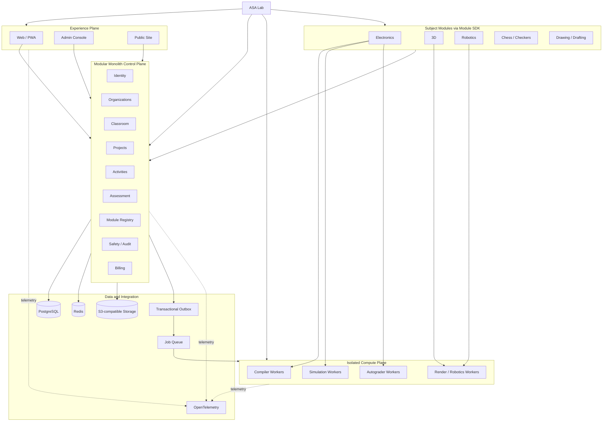
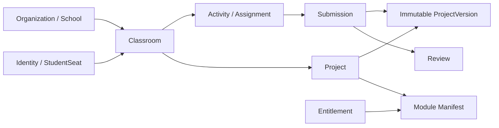
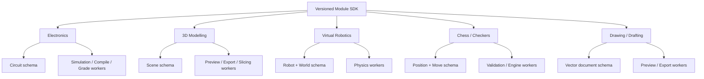
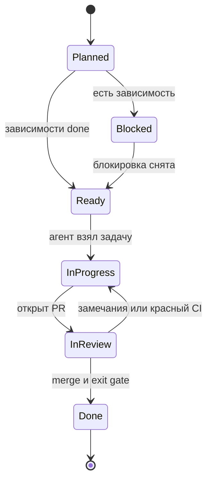

# Карта проекта ASA Lab

Эта страница — человекочитаемое представление [`project-map.yaml`](project-map.yaml). Она отвечает на четыре вопроса:

1. из каких частей состоит платформа;
2. какие части зависят друг от друга;
3. какая фаза и задача активны;
4. что coding-агент должен делать следующим.

Для Obsidian-подобного режима с поиском, фильтрами, масштабированием и карточкой узла откройте [`viewer.html`](viewer.html).

## Текущий фокус

```text
TASK-CI-001      подтвердить зелёный Architecture CI
        ↓
TASK-ARCH-001    принять и объединить Architecture Foundation PR №1
        ↓
TASK-BOOT-001    выполнить Bootstrap-итерацию
        ↓
TASK-TEN-001     tenant context
        ↓
TASK-CLS-001     педагог создаёт класс
        ↓
TASK-SEAT-001    StudentSeat и вход без email
        ↓
TASK-MOD-001     Module SDK и Project envelope
        ↓
TASK-ACT-001     первое задание и immutable submission
        ↓
TASK-ELEC-001    первая рабочая электронная схема
```

## 1. Карта платформы



## 2. Classroom Core и проекты



## 3. Подключаемые учебные среды



## 4. Дорожная карта

```mermaid
flowchart LR
    P0["0 Foundation"] --> P1["1 Tenancy & Identity"]
    P1 --> P2["2 Classroom Core"]
    P2 --> P3["3 Module SDK & Projects"]
    P3 --> P4["4 Activities & Assessment"]
    P4 --> P5["5 Electronics Editor"]
    P5 --> P6["6 Simulation Core"]
    P6 --> P7["7 Arduino"]
    P7 --> P8["8 Autograding & Instruments"]
    P8 --> P9["9 Pilot Hardening"]
    P9 --> P10["10 Commercial Foundation"]
    P10 --> P11["11 Multi-school Scale"]
    P11 --> P12["12 New Subject Modules"]
```



## 5. Поток задачи для coding-агента



## 6. Три карты, работающие вместе

| Карта | Для чего | Источник истины |
|---|---|---|
| Project Knowledge Graph | Устройство, задачи, документы, фазы и зависимости | `project-map.yaml` |
| C4 Architecture Model | Система, контейнеры и deployment | `docs/architecture/structurizr/workspace.dsl` |
| Nx Project Graph | Фактические импорты исходного кода | автоматически из Nx metadata |

Nx-граф появляется после Bootstrap. Он показывает, как код зависит от кода. `project-map.yaml` дополнительно показывает назначение узла, фазу, статус и следующую задачу.

## 7. Обязательное правило актуальности

Карта меняется в том же Pull Request, если PR:

- добавляет или удаляет приложение, bounded context, worker, data store или предметный модуль;
- меняет архитектурную зависимость;
- добавляет ADR, фазу или exit gate;
- начинает, блокирует, завершает или заменяет задачу;
- переносит ответственность между модулями;
- меняет путь исходного кода или нормативного документа.

Задача не получает статус `done`, пока её exit gate не подтверждён командами и тестами.
