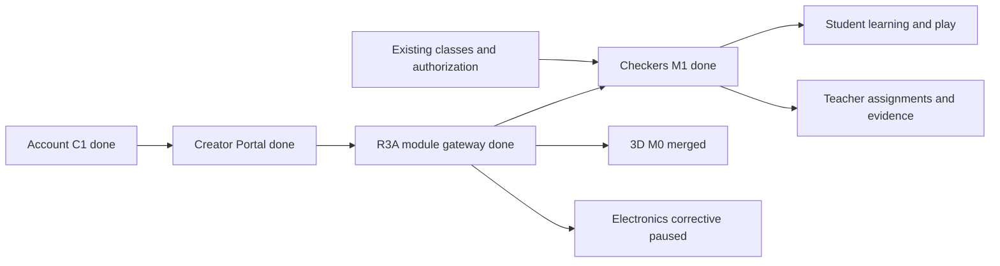

# Карта проекта ASA Lab

Source: [`project-map.yaml`](project-map.yaml)

Execution: [`../delivery/EXECUTION_MANIFEST.yaml`](../delivery/EXECUTION_MANIFEST.yaml)

State of record: [`../execution/current.yaml`](../execution/current.yaml)

## Current focus

Rendered from the control plane. Do not edit these values here independently;
`pnpm control-plane:check` fails when they drift.

```text
TASK-ADMIN-AUTH-STABILITY-001
Issue #135
branch main
status in_progress
checkpoint production_restart_verified_max_secret_pending
execution direct_main
```

## Parallel ASA Learning M0 lane

The owner accepted `LRN-M0-001 — Current Learning Architecture Audit` and
`LRN-M0-002 — Learner Identity ADR`. `LRN-M0-003 — Status Divergence Trace` is
now the only active Learning Work Queue item in parallel with the unchanged
primary Admin/Auth task. M0-004 and M1-M7 are not activated; M0-003 authorizes
diagnostic documentation and read-only evidence only, not migrations, product
runtime, UI/Gradebook, OpenAPI or Quiz Engine changes.

The CURRENT repository already contains course, direct-assignment, quiz,
attempt/result and gradebook implementations. Therefore `CTX-CONTENT`,
`CTX-ACTIVITIES` and `CTX-ASSESSMENT` are no longer labelled as future-only;
M0 exists to document and reconcile their parallel sources of truth before any
new architecture is selected.

The owner activated an independent educational Russian-draughts system. 3D M0
is preserved in `main` after PR #95 and remains outside the Checkers writable
scope. Electronics PR #92 stays paused; Chess remains a separate subject module.



The active product loop is:

```text
student enters Checkers
→ continue learning or assigned work
→ solve a position or play a legal Russian-draughts game
→ receive evidence-based review and progress
→ teacher sees exact attempt/game/move evidence
→ authorised classmates may play with predefined reactions only
```

The module owns its rule, learning, bot and safe-interaction data. Project Core
remains subject-neutral. Child-to-child free-form chat, direct messages, public
profiles and unrestricted public matchmaking are prohibited.

## Pilot readiness lane

A cross-cutting lane under `PHASE-PILOT`, added after load measurement showed
that throughput is not the constraint and abuse resistance is. Sign-in hashing
ran synchronously, so a single client sending 38 requests per second stopped the
whole process; nothing about that was visible from outside, because the API had
no metrics and no request log.

These tasks stay `planned` until the owner promotes one. Only the first two have
code; the rest are recorded so the queue reflects what is known, not to claim
progress.

```text
TASK-PERF-BASELINE-001    measurement tooling and recorded availability budget
TASK-AUTH-HARDENING-001   non-blocking hashing, attempt ceilings, no timing disclosure
TASK-OBSERVABILITY-001    runtime metrics, request log, readiness that separates busy from broken
TASK-WEB-BOOTSTRAP-001    render without the Electronics catalog and split the catalog
TASK-ASSET-DELIVERY-001   compression and immutable caching scoped to hashed filenames
TASK-E2E-GATE-001         repair the drifted specs and place them in the gate
TASK-SCALE-PREP-001       pool guards, covering indexes, chunk split, multi-instance readiness
```

The budget lives in [`../testing/performance-budget.json`](../testing/performance-budget.json)
and is enforced by `pnpm perf:runtime:check` and `pnpm perf:web:check`. Its
thresholds come from the school scenario — 300 learners signing in over 30
seconds is 10 sign-ins per second — rather than from whatever the current build
happens to score.

Two runtime settings look arbitrary in the code and are not: the pool is capped
at ten connections, and password hashing is bounded to half the libuv thread
pool. `node tools/explain-runtime-limits.mjs` reproduces the measurements behind
both, so they can be re-checked on other hardware rather than taken on trust —
raising the pool lowers throughput and worsens the tail, and unbounded
asynchronous hashing frees the event loop while starving static file serving.

### Covering indexes: examined, nothing to add

Thirty-eight foreign keys have no index whose leading columns match them, which
reads like an obvious gap. It is not one here, and the check is recorded so the
question does not get reopened from the same list:

- every hot read is already served. Classroom access goes through
  `(tenant_id, classroom_id, user_id)`, which is a unique index; the live chess
  poll goes through `(tenant_id, game_id, sequence)`; checkers reads go through
  the primary key. The uncovered keys are for lookups the product never makes;
- `audit_events` is written and never read by the application, so an index on it
  would cost writes and return nothing;
- the usual second argument — cascading deletes scanning children — does not
  apply either: there is no `DELETE` anywhere in the application and no
  `ON DELETE CASCADE` in any migration.

Indexes slow writes and take space. They are added when a query needs one, with
the query named.

## Quality gate

See [`QUALITY_MAP.md`](QUALITY_MAP.md) and
[`../testing/active-task-tests.yaml`](../testing/active-task-tests.yaml). The
focused gate covers official rules, project lifecycle, curriculum/assignments,
bot calibration, class safety and desktop/tablet/mobile journeys.

## Ports

```text
Web  127.0.0.1:4610
API  127.0.0.1:4611
E2E  127.0.0.1:4612
```
