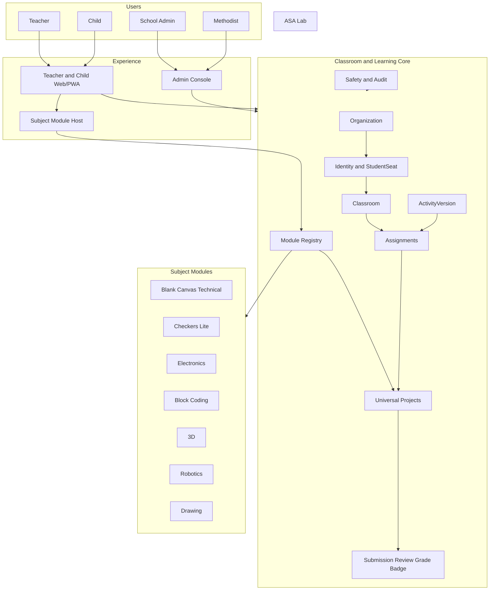
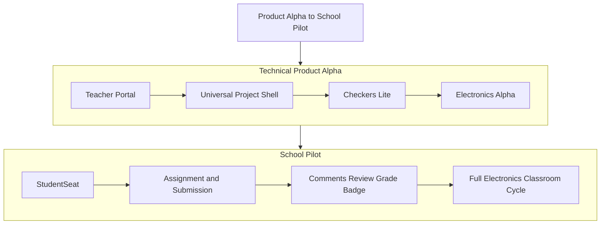
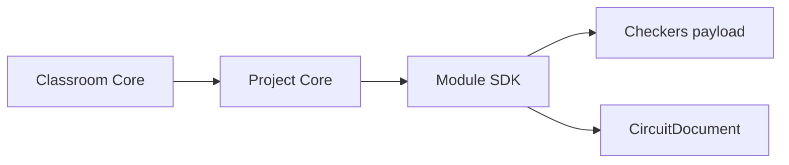
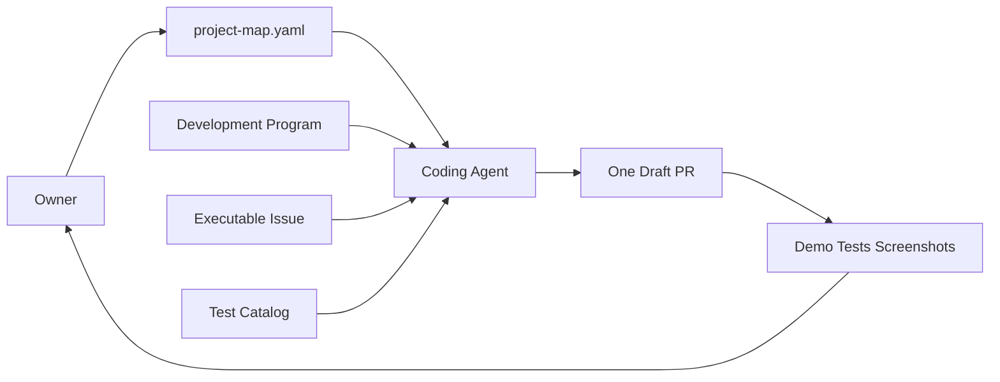

# Карта проекта ASA Lab

Человекочитаемое представление [`project-map.yaml`](project-map.yaml).

Дополнительные источники:

- [`../product/PRODUCT_BLUEPRINT.md`](../product/PRODUCT_BLUEPRINT.md) — конечный продукт;
- [`../product/CAPABILITY_MAP.md`](../product/CAPABILITY_MAP.md) — capabilities;
- [`../delivery/DEVELOPMENT_PROGRAM_V1.md`](../delivery/DEVELOPMENT_PROGRAM_V1.md) — последовательность реализации;
- [`../delivery/LOCAL_PORT_POLICY.md`](../delivery/LOCAL_PORT_POLICY.md) — локальные порты;
- [`QUALITY_MAP.md`](QUALITY_MAP.md) — чем подтверждается готовность;
- [`viewer.html`](viewer.html) — интерактивный Obsidian-подобный граф.

## 1. Текущий фокус

```text
Foundation                         done
        ↓
TASK-PRODUCT-DOC-001              in_review — Issue 19 / PR 21
        ↓
TASK-PORTAL-001                   blocked — Issue 18 / PR 22
        ↓
TASK-PROJECT-SHELL-001            blocked — Issue 24
        ↓
TASK-CHECKERS-LITE-001            blocked — Issue 25
        ↓
TASK-ELECTRONICS-ALPHA-001        blocked — Issue 26
        ↓
TASK-SEAT-001                     blocked — Issue 7
        ↓
TASK-ACT-001                      blocked — Issue 8
        ↓
TASK-REVIEW-001                   blocked — Issue 20
        ↓
TASK-ELEC-001                     blocked — Issue 6
```

Current focus берётся только из `project-map.yaml`. Бот не выбирает более позднюю задачу.

## 2. Конечная система



## 3. Главный образовательный цикл

```mermaid
flowchart LR
    C1[Teacher creates classroom]
    C2[Teacher issues StudentSeat]
    C3[Teacher assigns ActivityVersion]
    C4[Child opens subject module]
    C5[Project autosave]
    C6[Immutable submission]
    C7[Automatic checks]
    C8[Teacher comment]
    C9[Changes requested]
    C10[Child resubmits]
    C11[Accept grade badge]
    C12[Progress updated]

    C1 --> C2 --> C3 --> C4 --> C5 --> C6 --> C7 --> C8 --> C9 --> C10 --> C11 --> C12
```



## 4. Два delivery tracks



Technical Alpha даёт работающий продукт до полной школьной workflow. School Pilot подключает детей, задания и оценивание.

## 5. Результат каждого этапа

| Этап | Что можно открыть и показать |
|---|---|
| Product Docs | В GitHub видна одна очередь, Issues, capability и quality maps |
| Teacher Portal | Педагог входит, создаёт класс, reload сохраняет класс |
| Project Shell | Педагог создаёт project, выбирает module, сохраняет draft и checkpoint |
| Checkers Lite | Доска, legal move, validation, save/reload и preview |
| Electronics Alpha | Source/resistor/LED/wire, netlist, DC calculation и diagnostics |
| StudentSeat | Учитель выдаёт карточку, ребёнок входит без email и открывает свой проект |
| Assignment | Учитель назначает, ребёнок сдаёт immutable version, очередь показывает попытку |
| Review | Comment, return, resubmit, rubric, grade, badge |
| Electronics Classroom | Полный электронный учебный цикл внутри класса |

## 6. Module/Project boundary



Classroom/Project Core знают:

```text
moduleKey
moduleVersion
schemaVersion
ProjectDraft
ProjectVersion
preview
diagnostics envelope
```

Они не знают:

```text
resistor
wire
LED
checker piece
sprite
3D mesh
```

## 7. Канонические порты

| Server | URL |
|---|---|
| Web development | `http://127.0.0.1:4610` |
| API development | `http://127.0.0.1:4611` |
| Same-origin E2E | `http://127.0.0.1:4612` |

Запрещены `3000`, `3100`, `5173`. Занятый порт не является разрешением остановить чужой процесс.

## 8. Управление coding-агентом



Владелец не пересказывает задачу вручную. Достаточно команды:

```text
Прочитай current_focus, Development Program и связанную Issue. Выполни только её.
```

## 9. Обязательный цикл задачи

```text
ORIENT
→ confirm current_focus and dependency
→ read exact Issue and referenced sections
→ CAPABILITY CHECK
→ PLAN up to 25 lines
→ IMPLEMENT one user flow
→ VERIFY all required test IDs
→ UPDATE maps
→ DRAFT PR
→ evidence and review
→ merge
→ next task ready
```

## 10. Scope freeze

После начала task запрещено добавлять:

- следующую capability;
- unrelated infrastructure;
- новый framework;
- Docker/Redis/MinIO без фактического использования;
- дополнительную большую документацию;
- будущие роли, страницы или модули.

Новая идея оформляется новой Issue после текущего merge.

## 11. Evidence before merge

Каждый product PR содержит:

```text
MILESTONE
USER_FLOW with PASS/FAIL/BLOCKED
DEMO_URLS
PORTS
Playwright report
screenshots
contract/migration/security reports
all required test IDs
commit SHA
clean working tree
NEXT_ALLOWED_TASK
```

`NOT_RUN` и `BLOCKED` не закрывают exit gate. Manual smoke не заменяет automated E2E.

## 12. Карты, работающие вместе

| Карта | Вопрос |
|---|---|
| Product Blueprint | Зачем и для кого строим? |
| Capability Map | Что должна уметь платформа? |
| Development Program | В каком практическом порядке реализуем? |
| Project Map | Какая задача активна и от чего зависит? |
| Quality Map | Чем доказываем готовность? |
| Nx Graph | Как фактический код зависит от кода? |

Машиночитаемым источником задач и статусов остаётся `project-map.yaml`.