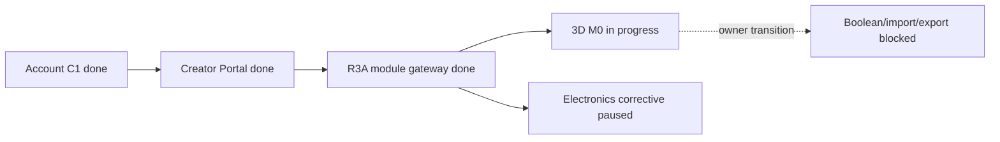

# Карта проекта ASA Lab

Source: [`project-map.yaml`](project-map.yaml)

Execution: [`../delivery/EXECUTION_MANIFEST.yaml`](../delivery/EXECUTION_MANIFEST.yaml)

State of record: [`../execution/current.yaml`](../execution/current.yaml)

## Current focus

Rendered from the control plane. Do not edit these values here independently;
`pnpm control-plane:check` fails when they drift.

```text
TASK-3D-M0-001
Issue #94
branch agent/three-d-m0
status in_progress
checkpoint foundation_vertical_slice
execution lease codex-three-d-m0
```

The owner activated a narrow ASA-native 3D foundation. Existing Electronics
PR #92 remains open and Draft, but its corrective task is paused rather than
reported complete. The 3D task depends on the completed module-neutral R3A
gateway, not on unfinished Electronics-specific behaviour.



M0 is deliberately one vertical slice:

```text
create 3D project
→ shared Editor Host
→ lazy WebGL 2 workplane
→ add and transform one box
→ undo/redo
→ save through Project Core
→ reload the identical validated scene
```

The document is pure versioned JSON in millimetres. Three.js runtime objects,
meshes, WASM objects and binary files do not enter Project Core JSON. Three.js
is loaded only for the 3D editor. The worker protocol is established for a
later Manifold boolean milestone, but OCCT, STEP, physics, AR, collaboration,
Codeblocks, WebGPU and any parity claim remain out of scope.

## Quality gate

See [`QUALITY_MAP.md`](QUALITY_MAP.md) and
[`../testing/active-task-tests.yaml`](../testing/active-task-tests.yaml).
The focused gate covers the domain contract, Project Core integration, bundle
isolation and the desktop/tablet/mobile save-reload journey.

## Ports

```text
Web  127.0.0.1:4610
API  127.0.0.1:4611
E2E  127.0.0.1:4612
```
