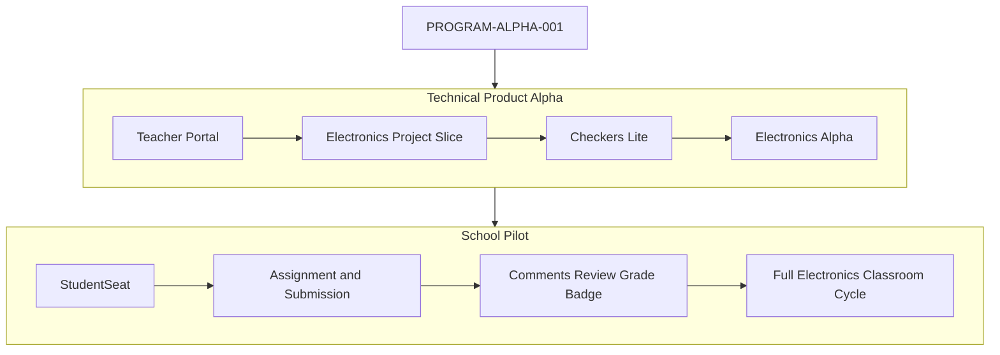
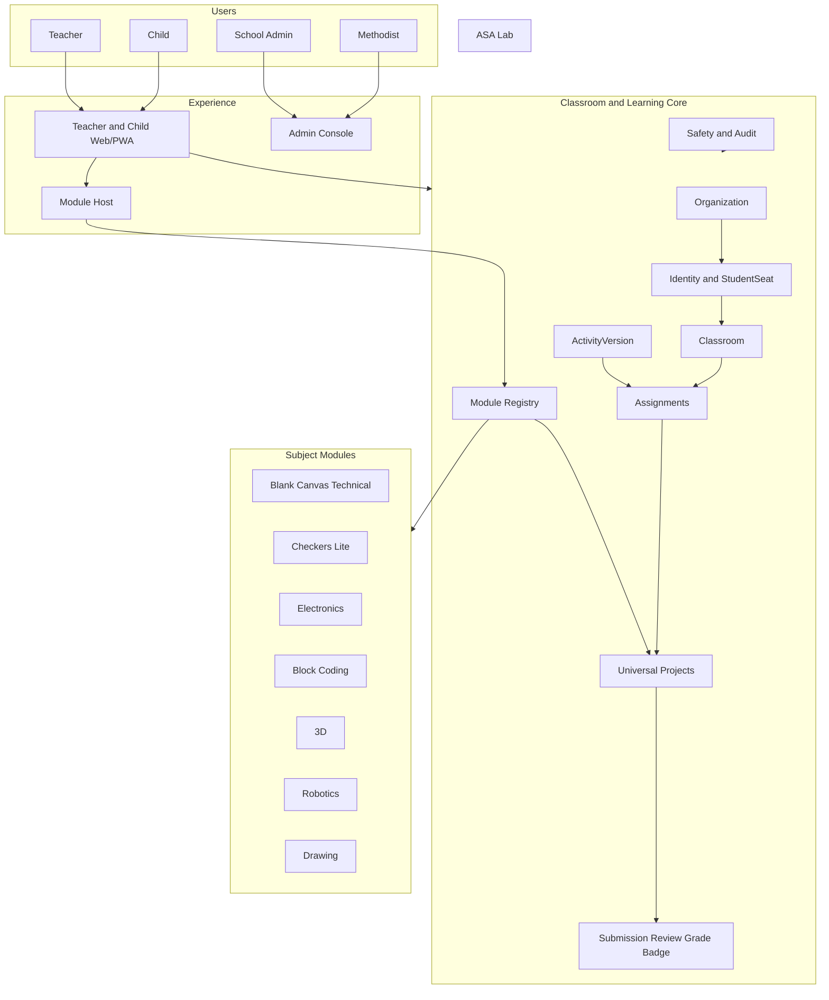
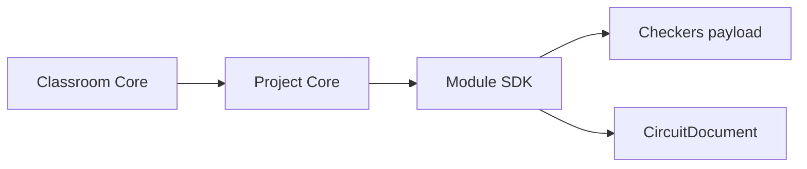
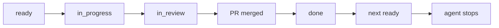

# Карта проекта ASA Lab

Человекочитаемое представление [`project-map.yaml`](project-map.yaml).

Связанные источники:

- [`../delivery/EXECUTION_MANIFEST.yaml`](../delivery/EXECUTION_MANIFEST.yaml) — точный task contract, stages, branches, tests и map nodes;
- [`../delivery/DEVELOPMENT_PROGRAM_V1.md`](../delivery/DEVELOPMENT_PROGRAM_V1.md) — человекочитаемый путь;
- [`../product/CAPABILITY_MAP.md`](../product/CAPABILITY_MAP.md) — продуктовые возможности;
- [`QUALITY_MAP.md`](QUALITY_MAP.md) — чем доказывается готовность;
- [`viewer.html`](viewer.html) — интерактивный Obsidian-подобный граф.

## 1. Что является порядком выполнения

Только `delivery_stage` из Execution Manifest и `execution_queue` из `project-map.yaml`.

`architecture_horizon`/`phase` — архитектурная группировка, не execution order. Technical Alpha намеренно проверяет Electronics Project Slice (внутри него — Project Shell) до полного StudentSeat/Assignment workflow.

## 2. Текущий фокус и очередь

```mermaid
flowchart LR
    DOC[1 Product Docs<br/>TASK-PRODUCT-DOC-001<br/>done]
    PORTAL[2 Teacher Portal<br/>TASK-PORTAL-001<br/>done]
    PROJECT[3 Electronics Project Slice<br/>TASK-ELECTRONICS-SLICE-001<br/>in_progress]
    CHECKERS[4 Checkers Lite<br/>TASK-CHECKERS-LITE-001<br/>blocked]
    EALPHA[5 Electronics Alpha<br/>TASK-ELECTRONICS-ALPHA-001<br/>blocked]
    SEAT[6 StudentSeat<br/>TASK-SEAT-001<br/>blocked]
    ACT[7 Assignment Submission<br/>TASK-ACT-001<br/>blocked]
    REVIEW[8 Review Grade Badge<br/>TASK-REVIEW-001<br/>blocked]
    EFULL[9 Electronics Classroom<br/>TASK-ELEC-001<br/>blocked]

    DOC --> PORTAL --> PROJECT --> CHECKERS --> EALPHA --> SEAT --> ACT --> REVIEW --> EFULL
```



Текущий `current_focus` всегда берётся из YAML. Более поздний узел не выбирается при блокировке текущего.

## 3. Два delivery tracks



## 4. Конечная система



## 5. Главный образовательный цикл

```mermaid
flowchart LR
    C1[Teacher creates class]
    C2[Teacher issues StudentSeat]
    C3[Teacher assigns ActivityVersion]
    C4[Child opens module]
    C5[Project autosave]
    C6[Immutable submission]
    C7[Automatic checks]
    C8[Teacher comment]
    C9[Changes requested]
    C10[Child resubmits]
    C11[Accept grade badge]
    C12[Progress updated]

    C1 --> C2 --> C3 --> C4 --> C5 --> C6 --> C7 --> C8 --> C9 --> C10 --> C11 --> C12
```



## 6. Module/Project boundary



Core знает только:

```text
moduleKey
moduleVersion
schemaVersion
ProjectDraft
ProjectVersion
preview/diagnostics envelope
```

Core не знает `resistor`, `wire`, `LED`, checker piece, sprite или 3D mesh.

## 7. Что показывает каждый этап

| Delivery stage | Видимый результат |
|---|---|
| Product Definition | Одна очередь, Issues, maps и validators |
| Teacher Portal | Login, classroom create/list, reload, logout |
| Electronics Project Slice | Create project, build a circuit from the owner’s SVG components, see the DC result, save/reload, immutable checkpoint |
| Checkers Lite | Board, legal move, diagnostic, preview |
| Electronics Alpha | Source/resistor/LED/wire, netlist, DC result |
| StudentSeat | Child credential, login without email, own dashboard |
| Assignment | ActivityVersion, assignment, exact immutable submission |
| Review | Anchored comment, revision, grade, badge |
| Electronics Classroom | Полный электронный учебный цикл |

## 8. Map protocol



### Start

- current task → `in_progress`;
- `current_focus` остаётся task;
- реальные `map_nodes` → `in_progress`.

### Draft PR

- task → `in_review`;
- next task остаётся `blocked`;
- paths/nodes/edges отражают код;
- Quality Map, test catalog и Nx graph синхронизированы.

### After merge

- обязательный map-only transition;
- task → `done`;
- next → `ready` после dependency check;
- `current_focus` → next;
- validators PASS;
- агент останавливается.

## 9. Карты, работающие вместе

| Источник | Вопрос |
|---|---|
| Product Blueprint | Зачем и для кого строим? |
| Capability Map | Что должна уметь платформа? |
| Execution Manifest | Какой точный task/branch/tests/map contract? |
| Development Program | Как выглядит путь человеку? |
| Project Map | Что активно и от чего зависит? |
| Quality Map | Чем доказана готовность? |
| Nx Graph | Как фактически связан код? |

## 10. Канонические порты

```text
Web  http://127.0.0.1:4610
API  http://127.0.0.1:4611
E2E  http://127.0.0.1:4612
```

Запрещены `3000`, `3100`, `5173`. Занятый порт не является разрешением остановить чужой процесс.

## 11. Команда coding-агенту

```text
Прочитай AGENTS.md, current_focus и соответствующий entry в EXECUTION_MANIFEST.yaml. Открой указанную Issue и выполни только её. Следующую задачу не начинай.
```
