# Карта качества ASA Lab

Эта карта связывает Product Blueprint, Development Program, Project Map, executable Issues и стабильные test IDs.

## 1. Источники

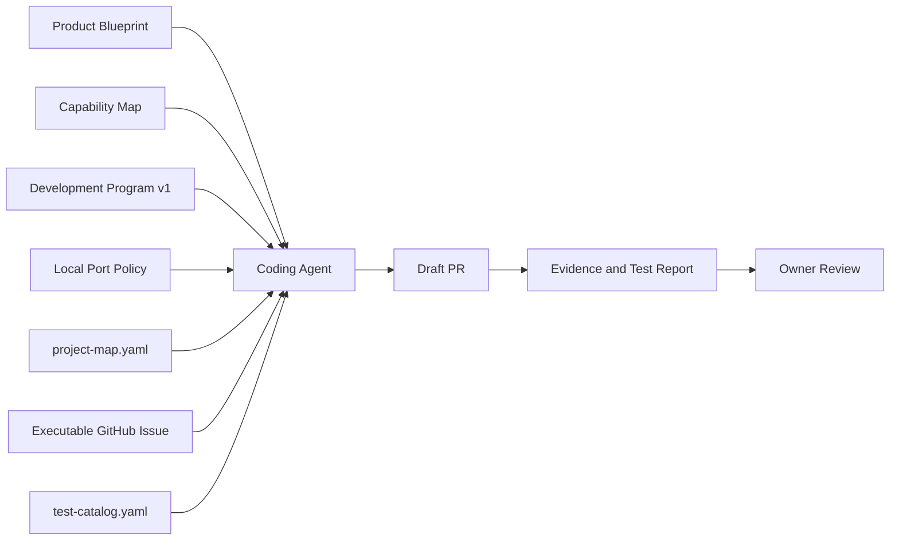

## 2. Каноническая очередь

```mermaid
flowchart LR
    DOC[TASK-PRODUCT-DOC-001]
    PORTAL[TASK-PORTAL-001]
    PROJECT[TASK-PROJECT-SHELL-001]
    CHECKERS[TASK-CHECKERS-LITE-001]
    EALPHA[TASK-ELECTRONICS-ALPHA-001]
    SEAT[TASK-SEAT-001]
    ACT[TASK-ACT-001]
    REVIEW[TASK-REVIEW-001]
    EFULL[TASK-ELEC-001]

    DOC --> PORTAL --> PROJECT --> CHECKERS --> EALPHA --> SEAT --> ACT --> REVIEW --> EFULL
```

## 3. Обязательные governance gates

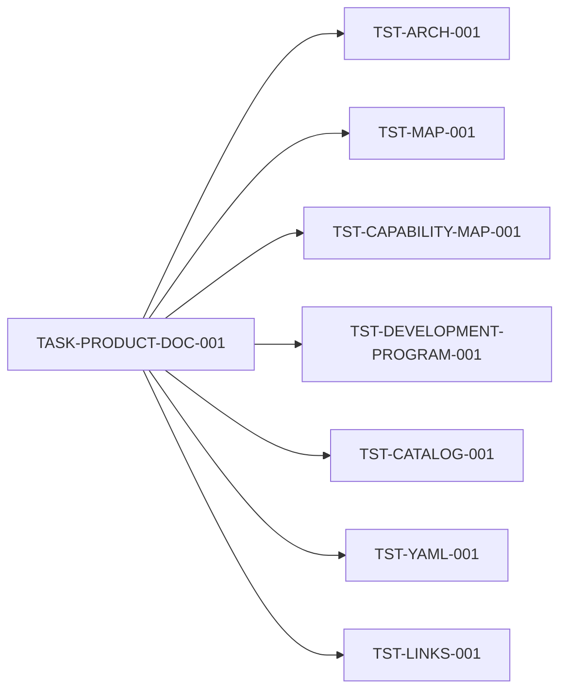

`TASK-PRODUCT-DOC-001` не закрывается, пока `TST-DEVELOPMENT-PROGRAM-001` не подтверждает:

- два delivery tracks;
- точную очередь из девяти задач;
- ссылки на Issues №19, №18, №24, №25, №26, №7, №8, №20, №6;
- порты `4610/4611/4612`;
- наличие Development Program и Port Policy.

## 4. Общий gate каждой code-задачи

```mermaid
flowchart TB
    TASK[Current product task]
    MAP[TST-MAP-001]
    CAP[TST-CAPABILITY-MAP-001]
    PROGRAM[TST-DEVELOPMENT-PROGRAM-001]
    FORMAT[TST-FORMAT-001]
    LINT[TST-LINT-001]
    TYPE[TST-TYPE-001]
    BOUNDARY[TST-BOUNDARY-001]
    BUILD[TST-BUILD-001]
    CONTRACT[TST-CONTRACT-001]
    UNIT[TST-UNIT-001]
    TENANT[TST-TENANT-001]
    AUTHZ[TST-AUTHZ-001]
    SECRET[TST-SECRET-001]
    DEP[TST-DEPENDENCY-001]
    PORT[TST-PORTS-001]
    START[TST-STARTUP-001]
    A11Y[TST-A11Y-001]

    TASK --> MAP
    TASK --> CAP
    TASK --> PROGRAM
    TASK --> FORMAT
    TASK --> LINT
    TASK --> TYPE
    TASK --> BOUNDARY
    TASK --> BUILD
    TASK --> CONTRACT
    TASK --> UNIT
    TASK --> TENANT
    TASK --> AUTHZ
    TASK --> SECRET
    TASK --> DEP
    TASK --> PORT
    TASK --> START
    TASK --> A11Y
```

Точный набор определяется `required_for` в `test-catalog.yaml`.

## 5. Teacher Portal gate

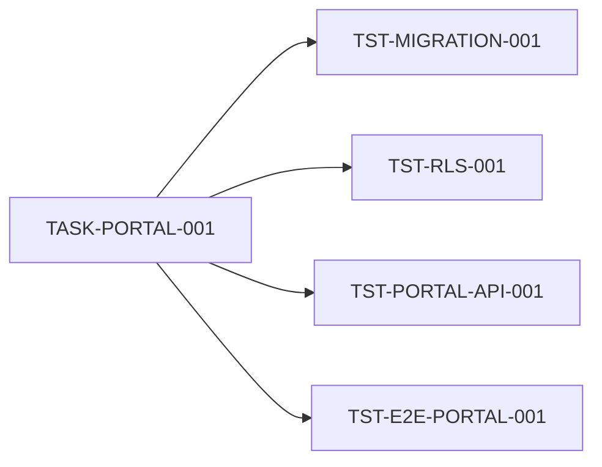

Наблюдаемый flow:

```text
site opens
→ teacher login
→ dashboard
→ empty classes
→ create classroom
→ owner membership + AuditEvent
→ reload persists
→ logout
```

Дополнительно:

- API использует только runtime DB URL;
- idempotency conflict проверяется;
- cross-tenant users/sessions/classrooms/audit matrix PASS;
- clean PowerShell startup PASS;
- ports 4610/4611/4612 PASS.

## 6. Universal Project Shell gate

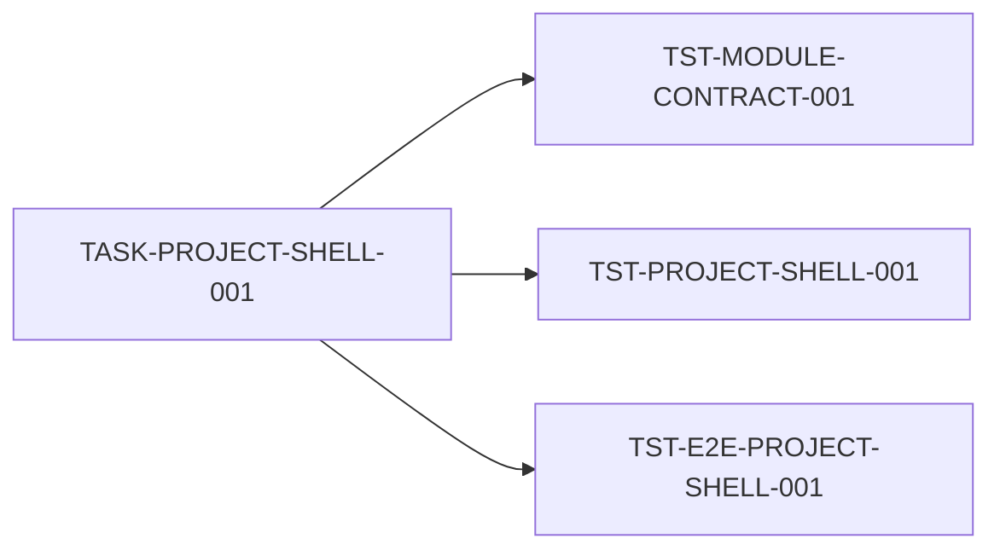

Flow:

```text
create project
→ choose module
→ save draft
→ reload restores
→ optimistic conflict protected
→ immutable checkpoint
```

## 7. Checkers Lite gate

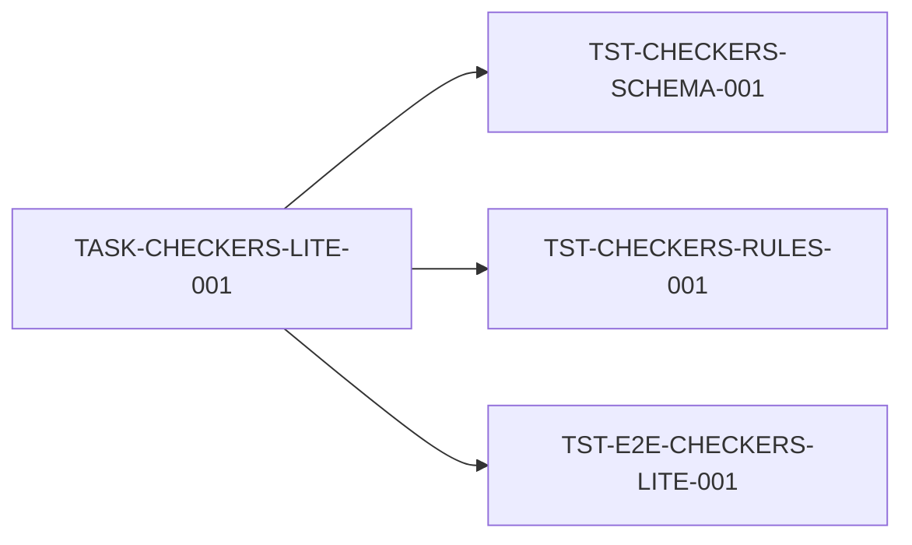

Flow:

```text
module selected
→ board rendered
→ legal move
→ invalid move diagnostic
→ save/reload
→ preview
```

Gate доказывает отсутствие предметных imports в Classroom/Project Core.

## 8. Electronics Alpha gate

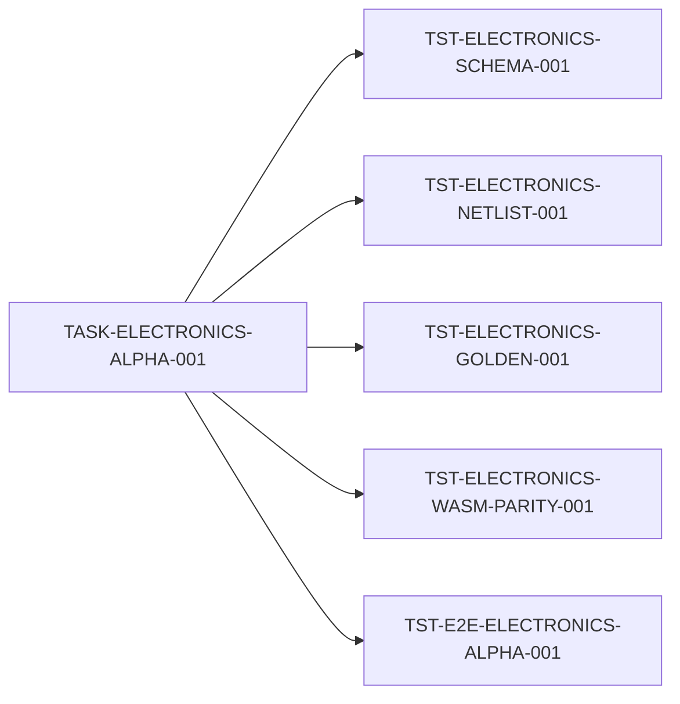

Flow:

```text
source + resistor + LED + wire
→ validation
→ deterministic netlist
→ native/WASM DC calculation
→ diagnostics
→ save/reload
```

Unsupported topology must fail explicitly; fake numerical success запрещён.

## 9. StudentSeat gate

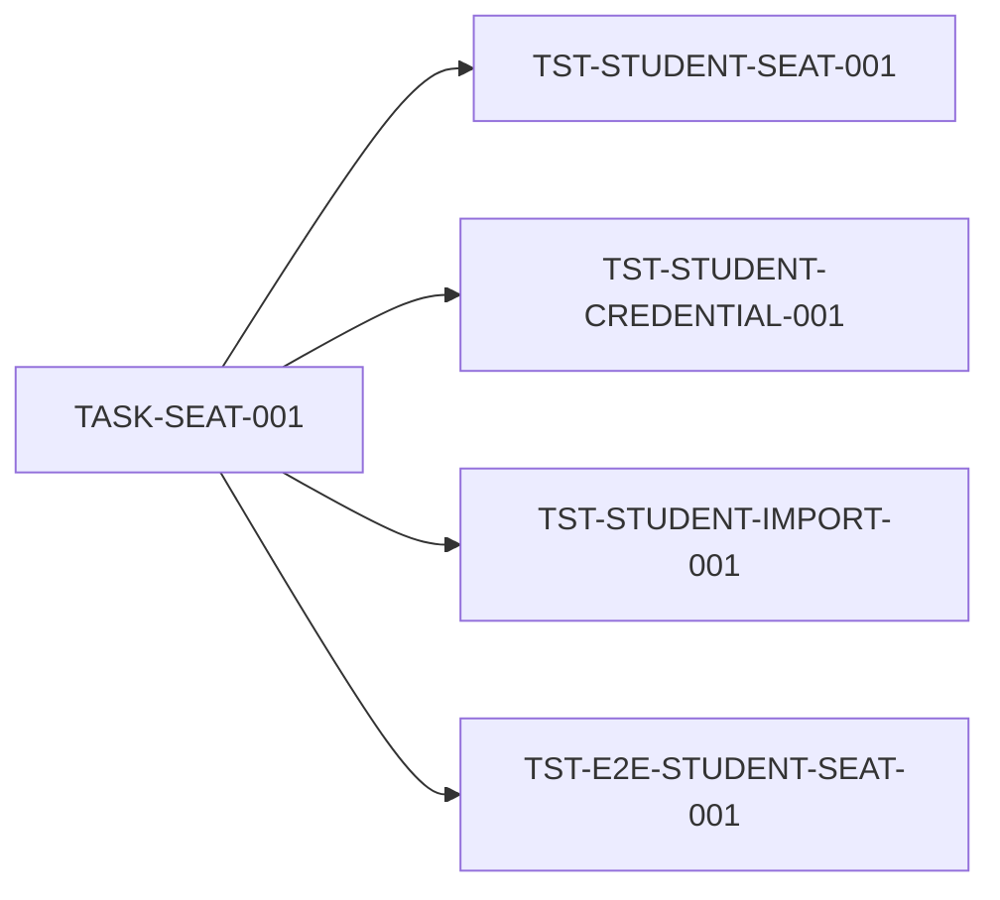

Flow:

```text
teacher creates/imports seat
→ one-time card
→ child login without email
→ child dashboard/project
→ reset revokes old session
```

## 10. Assignment and Submission gate

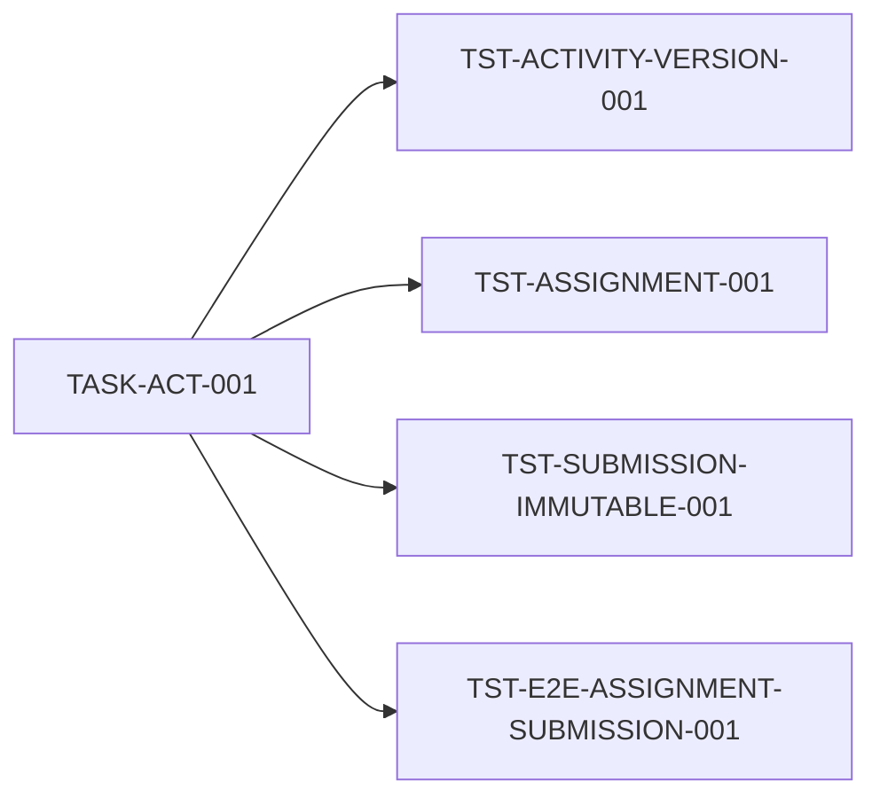

Flow:

```text
publish ActivityVersion
→ assign class
→ child opens starter project
→ save
→ submit immutable ProjectVersion
→ teacher queue sees exact attempt
```

## 11. Review, Grade and Badge gate

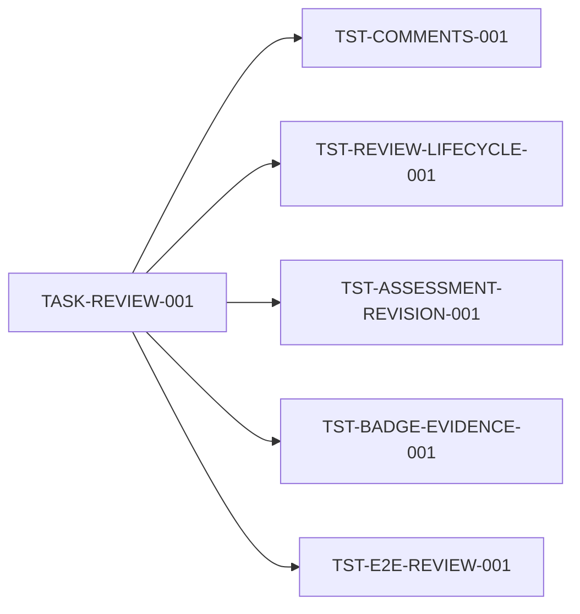

Flow:

```text
anchored comment
→ request changes
→ resubmit
→ compare attempts
→ accept
→ rubric/grade
→ badge/progress
```

## 12. Full Electronics Classroom gate

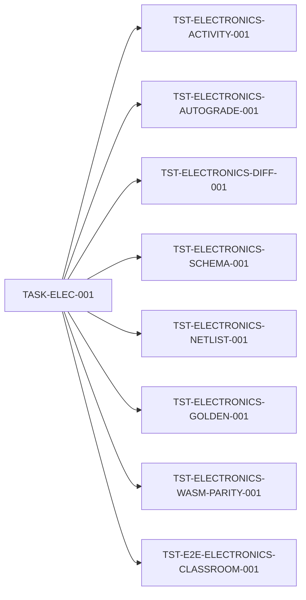

Flow:

```text
teacher assigns electronics task
→ child builds and validates circuit
→ immutable submission
→ public checks
→ anchored feedback
→ revision
→ accept/grade/badge
```

## 13. Evidence required before Ready for review

Каждый UI/product PR предоставляет:

- commit SHA;
- `python tools/run_task_tests.py --task <TASK-ID>` output;
- exact demo URLs;
- Playwright report;
- screenshot основного состояния;
- screenshot error/diagnostic state, если применимо;
- migrations/contracts reports;
- clean working tree;
- statement that next capability is absent from diff.

## 14. Правила результата

- `PASS` — команда реально запущена и exit code 0.
- `FAIL` — команда реально запущена и завершилась ошибкой.
- `BLOCKED` — отсутствует обязательная среда; не считается успехом.
- `NOT_RUN` — команда не запускалась; не считается успехом.
- Draft PR допустим с честными статусами.
- Ready/merge допустимы только при полном обязательном PASS.
- Manual browser smoke не заменяет automated E2E.
- Изменение user flow, test IDs или exit gate обновляет Issue, Project Map, Quality Map и test catalog до реализации.