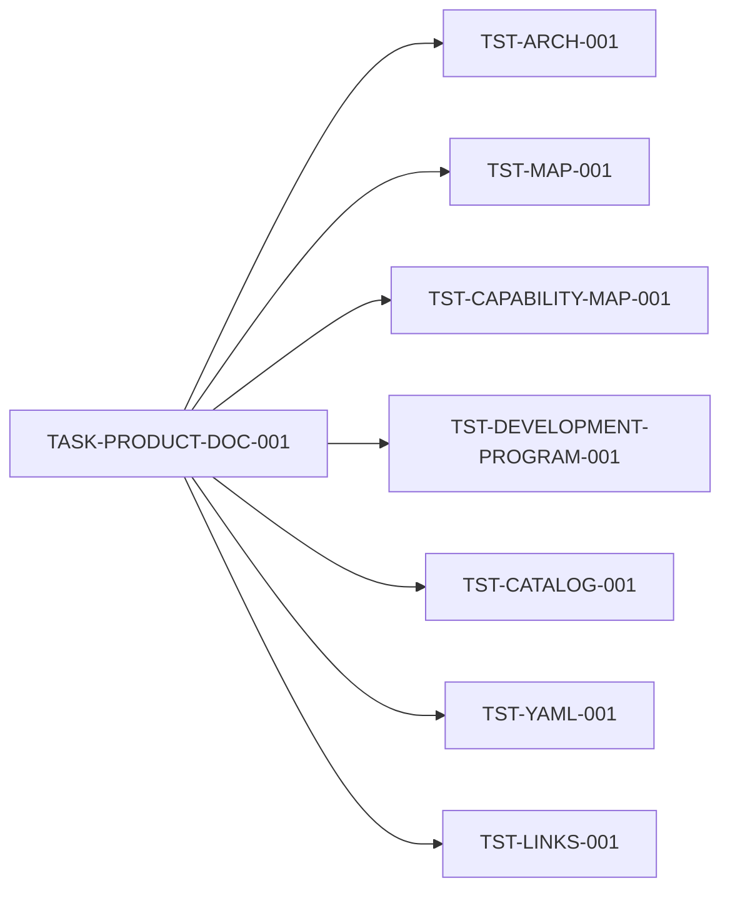

# Карта качества ASA Lab

Эта карта отвечает на вопрос: **чем доказана готовность каждого delivery stage**.

Источники:

- [`../delivery/EXECUTION_MANIFEST.yaml`](../delivery/EXECUTION_MANIFEST.yaml) — test profiles и task-specific tests;
- [`../testing/test-catalog.yaml`](../testing/test-catalog.yaml) — команды и `required_for`;
- [`project-map.yaml`](project-map.yaml) — task status/current focus;
- [`../delivery/DEVELOPMENT_PROGRAM_V1.md`](../delivery/DEVELOPMENT_PROGRAM_V1.md) — видимые результаты;
- GitHub Issue — acceptance конкретного flow.

`tools/validate_delivery_program.py` разворачивает profiles manifest и требует **точного совпадения** с `required_for` test catalog. Бот не может сократить gate после начала задачи.

## 1. Каноническая очередь

```mermaid
flowchart LR
    DOC[TASK-PRODUCT-DOC-001]
    PORTAL[TASK-PORTAL-001]
    PROJECT[TASK-PROJECT-SHELL-001]
    CHECKERS[TASK-CHECKERS-LITE-001]
    EALPHA[TASK-ELECTRONICS-ALPHA-001]
    SEAT[TASK-SEAT-001]
    ACT[TASK-ACT-001]
    REVIEW[TASK-REVIEW-001]
    EFULL[TASK-ELEC-001]

    DOC --> PORTAL --> PROJECT --> CHECKERS --> EALPHA --> SEAT --> ACT --> REVIEW --> EFULL
```



## 2. Test profiles

### product_docs

```text
TST-ARCH-001
TST-MAP-001
TST-CAPABILITY-MAP-001
TST-DEVELOPMENT-PROGRAM-001
TST-CATALOG-001
TST-YAML-001
TST-LINKS-001
```

### code_common

```text
TST-MAP-001
TST-CAPABILITY-MAP-001
TST-DEVELOPMENT-PROGRAM-001
TST-FORMAT-001
TST-LINT-001
TST-TYPE-001
TST-BOUNDARY-001
TST-BUILD-001
TST-CONTRACT-001
TST-UNIT-001
TST-SECRET-001
TST-DEPENDENCY-001
TST-PORTS-001
TST-STARTUP-001
TST-A11Y-001
```

### tenant_storage

```text
TST-MIGRATION-001
TST-TENANT-001
TST-RLS-001
TST-AUTHZ-001
```

### module_runtime

```text
TST-MODULE-CONTRACT-001
TST-AUTHZ-001
```

### assessment_common

```text
TST-COMMENTS-001
TST-REVIEW-LIFECYCLE-001
TST-ASSESSMENT-REVISION-001
TST-BADGE-EVIDENCE-001
```

### electronics_kernel

```text
TST-ELECTRONICS-SCHEMA-001
TST-ELECTRONICS-NETLIST-001
TST-ELECTRONICS-GOLDEN-001
TST-ELECTRONICS-WASM-PARITY-001
```

Profiles являются машиночитаемыми в Execution Manifest. Эта страница — визуальное представление.

## 3. Product Documentation gate



Gate подтверждает Product Blueprint, Capability Map, Execution Manifest, Development Program, Port Policy, точную очередь, Issues, task/test mapping и карты.

## 4. Teacher Portal gate

Profiles: `code_common + tenant_storage`.

Task tests:

```text
TST-PORTAL-API-001
TST-E2E-PORTAL-001
```

Flow:

```text
site opens
→ login
→ empty classrooms
→ create classroom
→ owner membership + AuditEvent
→ reload persists
→ logout
```

Дополнительно: runtime DB URL only, idempotency conflict, users/sessions/classrooms/audit isolation, clean PowerShell startup, canonical ports and accessibility.

## 5. Universal Project Shell gate

Profiles: `code_common + tenant_storage + module_runtime`.

Task tests:

```text
TST-PROJECT-SHELL-001
TST-E2E-PROJECT-SHELL-001
```

Flow:

```text
create project
→ choose module
→ save draft
→ reload restores
→ optimistic conflict protected
→ immutable checkpoint
```

## 6. Checkers Lite gate

Profiles: `code_common + module_runtime`.

Task tests:

```text
TST-CHECKERS-SCHEMA-001
TST-CHECKERS-RULES-001
TST-E2E-CHECKERS-LITE-001
```

Flow: board → legal move → diagnostic → save/reload → preview. Gate также доказывает отсутствие subject imports в Core.

## 7. Electronics Alpha gate

Profiles: `code_common + module_runtime + electronics_kernel`.

Task test:

```text
TST-E2E-ELECTRONICS-ALPHA-001
```

Flow: source/resistor/LED/wire → validation → netlist → native/WASM DC result → diagnostic → save/reload.

Unsupported topology обязана завершаться diagnostic, а не fake numerical success.

## 8. StudentSeat gate

Profiles: `code_common + tenant_storage`.

Task tests:

```text
TST-STUDENT-SEAT-001
TST-STUDENT-CREDENTIAL-001
TST-STUDENT-IMPORT-001
TST-E2E-STUDENT-SEAT-001
```

Flow: create/import seat → one-time card → child login without email → dashboard/project → reset revokes old session.

## 9. Assignment and Submission gate

Profiles: `code_common + tenant_storage + module_runtime`.

Task tests:

```text
TST-ACTIVITY-VERSION-001
TST-ASSIGNMENT-001
TST-SUBMISSION-IMMUTABLE-001
TST-E2E-ASSIGNMENT-SUBMISSION-001
```

Flow: publish immutable ActivityVersion → assign → child work/save → exact ProjectVersion submission → teacher queue.

## 10. Review, Grade and Badge gate

Profiles: `code_common + tenant_storage + assessment_common`.

Task test:

```text
TST-E2E-REVIEW-001
```

Flow: anchored comment → request changes → resubmit → compare → accept → rubric/grade → badge/progress.

## 11. Full Electronics Classroom gate

Profiles: `code_common + module_runtime + assessment_common + electronics_kernel`.

Additional tests:

```text
TST-TENANT-001
TST-RLS-001
TST-ELECTRONICS-ACTIVITY-001
TST-ELECTRONICS-AUTOGRADE-001
TST-ELECTRONICS-DIFF-001
TST-E2E-ELECTRONICS-CLASSROOM-001
```

Flow: assign electronics → child circuit → public checks → immutable submission → anchored review → revision → grade/badge.

## 12. Map and evidence gate

Каждая product-code task должна изменить или подтвердить:

```text
project-map.yaml
PROJECT_MAP.md
QUALITY_MAP.md
nx-project-graph.json
```

`TST-DEVELOPMENT-PROGRAM-001` проверяет наличие map artifacts в product-code diff.

Текущее состояние: `TASK-PORTAL-001` — `in_review` (Draft PR №22, ветка `agent/task-mvp-001-teacher-portal`), гейт — 21 обязательный test ID из Issue №18, подтверждённый локальным прогоном `python tools/run_task_tests.py --task TASK-PORTAL-001`.

В Draft PR task имеет `in_review`, next task остаётся `blocked`. После merge отдельный map transition переводит current task в `done`, next в `ready` и сдвигает `current_focus`.

## 13. Правила результата

- PASS — команда фактически завершилась exit 0;
- FAIL — команда фактически упала;
- BLOCKED — обязательная среда отсутствует;
- NOT_RUN — команда не запускалась.

`BLOCKED` и `NOT_RUN` не закрывают gate. Manual browser smoke не заменяет Playwright. Screenshot не заменяет assertion. Test ID нельзя удалить из `required_for` ради зелёного отчёта.

Единый запуск:

```bash
python tools/run_task_tests.py --task <TASK-ID>
```
