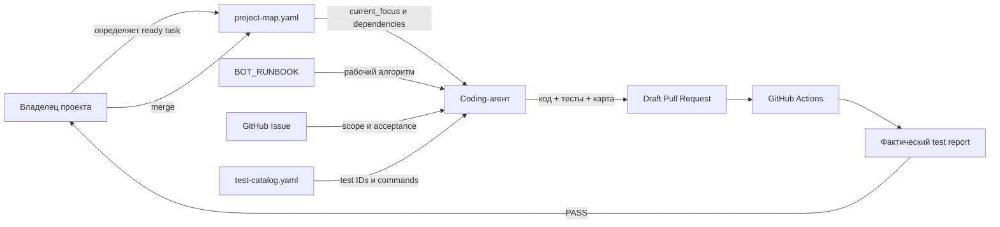
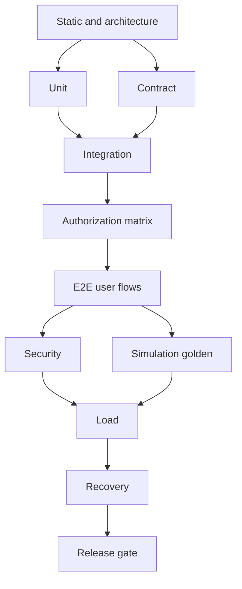
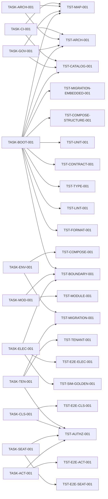

# Карта качества и тестов ASA Lab

Эта карта дополняет основную карту проекта. Она показывает, как coding-агент, задачи и Pull Requests связаны с обязательными проверками.

## Тестовые уровни

## Связь ближайших задач и проверок

## Правила

- Основная карта отвечает на вопрос «что строим и в каком порядке».
- Эта карта отвечает на вопрос «чем доказываем готовность».
- `test-catalog.yaml` является источником истины для test IDs и команд.
- Изменение задачи, которое меняет критерии готовности, должно обновить каталог тестов и эту карту в том же PR.
- `PASS` допускается только при фактически запущенной команде.
- `NOT_RUN` и `BLOCKED` отображаются явно и не позволяют закрыть обязательный exit gate.
- Текущий режим — local-first verification: обязательный gate доказывается локальным запуском `python tools/run_task_tests.py --task <TASK-ID>`; узел `GitHub Actions` информационен, пока действует внешний billing-blocker.
