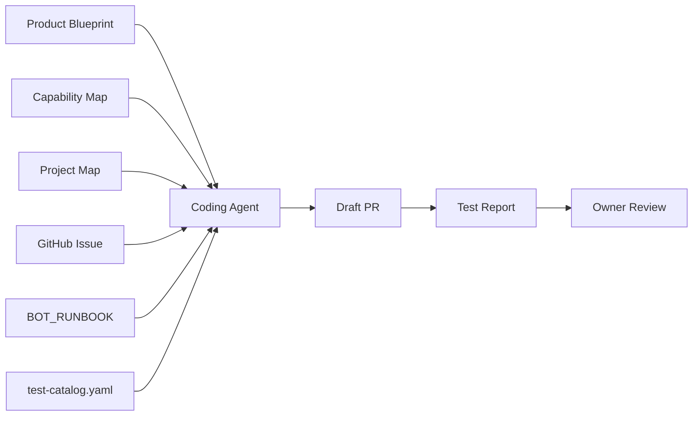
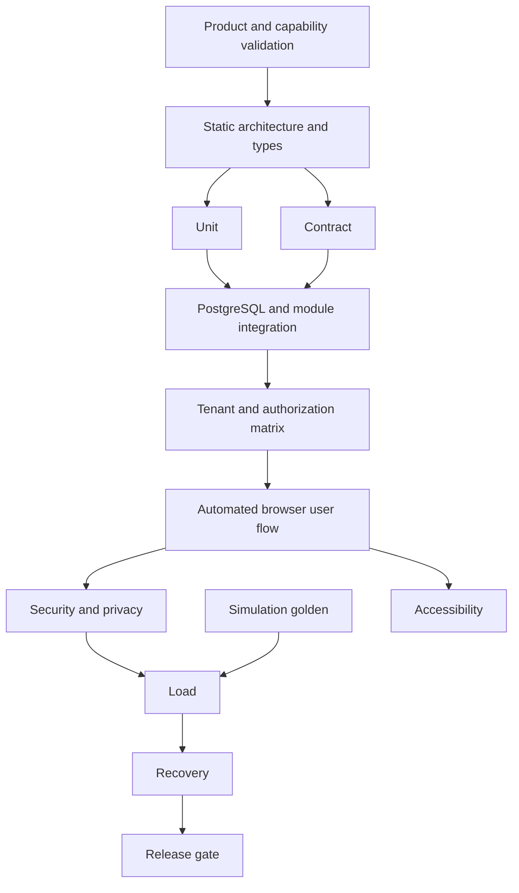
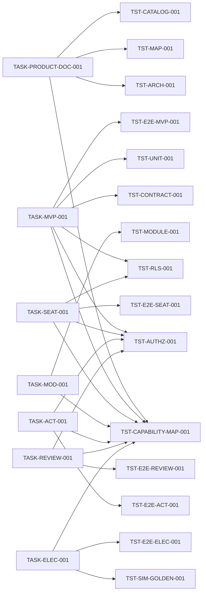

# Карта качества и тестов ASA Lab

Эта карта дополняет Product Capability Map и Project Map. Она показывает, чем доказывается готовность каждой задачи и пользовательского сценария.

## 1. Контур управления качеством



## 2. Тестовые уровни



## 3. Активная последовательность задач и gates



## 4. Product documentation gate

`TASK-PRODUCT-DOC-001` завершена только когда:

- `PRODUCT_BLUEPRINT.md` существует и не противоречит architecture baseline;
- `CAPABILITY_MAP.yaml` парсится;
- capability IDs уникальны;
- dependencies существуют и не содержат циклов;
- каждый capability входит в release slice;
- Classroom Core, Module Platform и Assessment спецификации существуют;
- AGENTS.md делает продуктовые документы нормативными;
- Project Map и README содержат актуальные ссылки.

Команда:

```text
python tools/run_task_tests.py --task TASK-PRODUCT-DOC-001
```

## 5. Teacher Portal gate

`TASK-MVP-001` должна доказать:

```text
site opens
→ teacher login
→ dashboard rendered
→ empty classroom state
→ classroom created
→ owner membership created
→ AuditEvent created
→ page reload
→ classroom remains
→ logout
```

Дополнительно:

- tenant isolation через runtime DB role и RLS;
- server-derived tenant context;
- idempotency;
- automated Playwright E2E со screenshot;
- React/Vite и NestJS/Fastify baseline;
- accessibility critical path.

## 6. StudentSeat gate

`TASK-SEAT-001` должна доказать:

```text
teacher creates seats
→ prints/downloads access cards
→ child logs in without email
→ sees own class and assignments
→ reset revokes old session
→ another child cannot access the seat
```

## 7. Module and project gate

`TASK-MOD-001` должна доказать:

- два dummy modules зарегистрированы;
- Classroom Core не меняется при подключении второго модуля;
- project schemas versioned;
- autosave/checkpoint/version lifecycle работает;
- old fixture migration проходит;
- Nx boundaries запрещают предметные imports в Core.

## 8. Assignment and submission gate

`TASK-ACT-001` должна доказать:

```text
teacher publishes ActivityVersion
→ assigns class
→ child opens starter project
→ works and saves
→ submits immutable ProjectVersion
→ teacher sees exact attempt
```

## 9. Review and rewards gate

`TASK-REVIEW-001` должна доказать:

```text
teacher opens submission
→ leaves anchored comment
→ requests changes
→ child resubmits
→ teacher accepts
→ fills rubric
→ grade finalized
→ badge awarded
→ progress updated
```

## 10. Electronics gate

`TASK-ELEC-001` должна доказать не только editor, но полный образовательный цикл:

```text
teacher assigns circuit task
→ child builds source resistor LED circuit
→ save and reload
→ submit
→ deterministic checks
→ teacher viewer and comment
→ accepted result
```

## 11. Правила

- Product Blueprint отвечает на вопрос «зачем и для кого строим».
- Capability Map отвечает на вопрос «что должна уметь платформа и какие зависимости обязательны».
- Project Map отвечает на вопрос «что реализуем сейчас и в каком порядке».
- Эта карта отвечает на вопрос «чем доказываем готовность».
- `test-catalog.yaml` является единственным источником test IDs и команд.
- Product Issue без capability IDs не получает статус `ready`.
- Изменение capability, user flow или exit gate обновляет Product/Project/Quality maps в том же PR.
- `PASS` допускается только при фактически запущенной команде.
- `NOT_RUN` и `BLOCKED` не закрывают обязательный exit gate.
- Ручной browser smoke не заменяет автоматизированный E2E, если E2E является критерием.
- Текущий режим local-first: `python tools/run_task_tests.py --task <TASK-ID>`; GitHub Actions остаётся информационным до отдельного решения.
